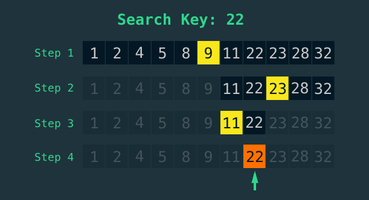

# **Qidirish algoritmlari. Binary Search**


Algoritmlar asosan qidirish va saralash algoritmlaridan tashkil topadi.

Qidirish algoritmlari.

Eng sodda qidirish algoritmi – bu linear search.

Linear searchda biror ro'yxat ichida har bir elementni bittalab ko'rib chiqadi va qidirilayotgan element bilan solishtiradi.

M:

```bash
[1, 2, 3, 4, 5, 6, ..., 20, ..., 30, ..., 40, ..., 50, ..., ..., 99]
```

Berilgan ro'yxatdan 30 sonini qidirish kerak bo'lsin.

Linear searchda qidirish ro'yxat boshidan boshlanadi.

* Avval, 1 ni olib tekshiriladi. 30 ga teng emasmi? Keyingi elementga o'tiladi
* 2 ni olib tekshiriladi. 30 ga teng emas. Keyingi elementga o'tadi
* 3 ni olib tekshiriladi. 30 ga teng emas. Keyingi elementga o'tadi.
* …
* 30 ni olib tekshiriladi. 30 ga teng. Qidirilayotgan element topildi. Qidirish to'xtatiladi.


Bu qidiruvning kamchiligi, agar ro'yxatdagi oxirigi element qidirilayotgan bo'lsa, ro'yxatning har bir elementi bittalab tekshirib chiqishga to'g'ri keladi. Ro'yxat elementlari kam bo'lganda bu qidiruv tez ishlashi mumkin, lekin katta hajmdagi ro'yxatdan qidirishda bu qidiruv yaramaydi.

Bu qidiruv o'rniga yaxshiroq algoritmdan foydalanish mumkin. Masalan, binary search.

Binary searchning ishlashi.

Faraz qilaylik, lug'atdan N harfidan boshlanuvchi so'zni qidiryapmiz. Buning uchun, albatta, lug'atni boshidan ochmaymiz, chunki N harfi lug'atning o'rtalarida bo'lishini bilamiz. Lug'atni tahminan o'rtalarini ochamiz, masalan, S harfidagi so'zlar chiqyapti. N harfi S harfidan oldin kelishini bilamiz, shu sababli, lug'atning ikkinchi yarmini tashlab yuboramizda, birinchi yarmidan N harfini qidirishni davom ettiramiz. Chunki, qolgan ikkinchi yarmida N harfi yo'qligi aniq. Birinchi yarmining ham yarmini ochib qaraymiz. Misol uchun, G harfi chiqdi. N harfi G harfidan keyin. Demak, keyingi ochilgan qismning birinchi yarmini tashlab yuborib, qidirishni qolgan ikkinchi yarimdan davom ettiramiz. Bu jarayon so'z topilguncha davom etadi:




Endi yuqorida lug’atdan qidirishni qadamba-qadam tahlil qilamiz

N ta elementdan iborat A ro'yxat berilgan: [A ~0~ , A ~1~ , A ~2~ , …, A ~N-1~ ]. T biz ro'yxat ichidan qidirayotgan qiymat. Bizga T ning indeksi kerak.


1. Pastki chegara va yuqori chegarani, ya'ni qidiruv oralig'ini belgilab olamiz. Pastki chegara L=0, yuqori chegara H=N-1
2. Chegaralarni tekshirib olamiz. L>H ekanligini tekshiramiz
3. O'rtada turgan qiymatning indeksini topamiz. m=(L+H)/2
4. Agar A ~m~ =T bo'lsa, m ni qiymatini qaytaramiz. Dastur to'xtaydi
5. Agar A ~m~ <T bo'lsa, L = m+1 qilamiz va 2-qadamga qaytamiz
6. Agar A ~m~ >T bo'lsa, H=m-1 qilamiz va 2-qadamga qaytamiz


Algoritmlarda qadamlarni o'lchash.

Masalan, linear searchdagi qadamlarni o'lchab ko'raylik:

* N ta elementdan iborat ro'yxat uchun:
  * Maksimum qadamlar soni N ga teng

Binary search uchun:

* N ta elementdan iborat ro'yxat uchun:
  * Maksimum qadamlar soni log ~2~ (N) ga teng


**! Eslatma.** Logarifm bu darajaning teskarisi degani.

M: log ~2~ (4) = 2, log ~2~ (8) = 3, log ~2~ (16) = 4

Ya'ni binary searchda qidiruvning har bir qadamida ro'yxat o'lchami (elementlar miqdori) 2 martadan kamayib kelyapti. Bu degani, darajaning teskari ko'rinishida elementlar soni kamayadi degani.

Masalan, agar ro'yxatda elementlar soni 16 ta bo'lsa, binary searchda eng ko'p qadam uzog'i 4 ta bo'ladi degani.

Yoki, ro'yxatda 2048 ta element bor bo'lsa, linear search eng maksimum 2048 qadamda qidirilayotga elementni topsa, binary searchda maksimum (log ~2~ (2048)=11)
11 ta qadam bo'ladi.

**! Eslatma:** Binary Searchda ro'yxat elementlari tartiblangan bo'lishi kerak
