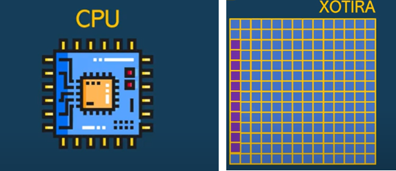

# Algoritmlar. Big O


Oldingi darsda linear search va binary search algoritmlarini ko'rgan edik. Bu darsda esa algoritmlarni baholashni ko'ramiz. Undan avval esa linear search va binary search algoritmlari asosida yozilgan kodlarni ko'raylik:

Linear search:

```php
function lenear_search($list, $item) {
	for ($i = 0; $i < count($list); $i++) {
		if ($list[$i] == $item) {
			return $i;
		}
	}
}
```

Binary search:

```php
function binary_search($list, $item) {
	$low = 0;
	$high = count($list) - 1;
	while ($low <= $high) {
		$mid = (int)(($low + $high) / 2);
		$guess = $list[$mid];
		if ($guess > $item) {
			$high = $mid - 1;
		} else {
			$low = $mid + 1;
		}
	}
	return null;
}
```


Binary searchning kamchiligi, u faqat tartiblangan ro'yxatlar bilan ishlaydi.

Endi bu ikkala algoritmlarni baholashni ko'ramiz.

Kompyuterimizda ikkita asosiy resurs bo'ladi: CPU (protsessor) va xotira.




Biz algoritm yaratayotgan paytimizda, kompyuterning mana shu ikkala resursidan qanchalik samarali foydalanish mumkinligini o'ylashimiz kerak. Faraz qilaylik, qidiruv algoritmi asosida yozilgan kodga elementi qidiriladigan ro'yxat yuqoridagi rasmdagiday, xotirada joylashadi. Ro'yxatni mevalar ro'yxati deb olaylik va bu ro'yxatdan behi yoki olma degan mevani qidir deb protsessorga beraylik.

Agar qidiruv kodi linear search algoritmi asosida yozilgan bo'lsa u quyidagicha ishlaydi: protsessor xotiradagi ro'yxatning har bir elementini olib ko'rib chiqadi. Agar qidirilayotgan meva 20-o'rinda turgan bo'lsa, protsessor xotiraga 20 marta murojaat qilishiga to'g'ri keladi.

Agar binary search algoritmi asosida yozilgan kodni ishlatsak, protsessor xotiraga uzog'i bilan 7 marta murojaat qiladi (binary search-ning ishlashini oldingi darsda ko'rgan edik).

Endi kompyuterning protsessorining kuchini hisoblashni ko'raylik. Yangi kompyuter olishda kompyuter protsessorining chastotasi (base clock speed) yozilgan bo'ladi. Masalan, 2.4 GHz, 2.3 GHz va h.k. Bu nima degani? Hz-ni bu yerda marta deb olsak bo'ladi. Ya'ni, masalan, F=2.5 GHz chastota degani protsessor sekundiga 2.5 * 10­^9^ Hz = 2.5 miliard marta amal bajarad degani. Shunda bitta amal uchun T = 1/F = 0.4*10^9^ s = 0.4 ns vaqt ketar ekan. Yuqoridagi algoritmlarimizdan birortasi ishlaganda, agar u 100 marta xotiraga murojaat qilsa, bu degani qidiruv uchun 100 * 0.4 ns = 40 ns vaqt ketadi. Bu son juda kichik vaqtni anglatadi. Lekin juda katta ma'lumotlar bilan ishlaganda, masalan 1.5 miliard foydalanuvchi ichidan (Google-da tahminan shuncha foydalanuvchi bor) bittasini topish kerak bo'lib qolsa, 2.5 GHz chastotali kompyuter linear search algoritmni ishlatib T*N = 0.4ns * 1.5 * 10^9^ = 0.6s vaqt sarflaydi. Binary searchda esa T * log~2~N = 0.4ns * 30 = 12 ns vaqt sarflanadi (ikkala holatda ham eng yomon holat uchun ko'rilyapti). Yuqoridagi ikkala algoritmlarning sarflagan vaqtlarini hisoblasak natija 50 milion chiqyapti. Bu degani binary search juda katta hajmdagi ma'lumotlar bilan ishlaganda 50 milion mart tez ishlayapti (bu natija elementlar soniga qarab boshqacha ham bo'lishi mumkin).

Yuqorida ikkita algoritmni 2.5 GHz chastotaga ega bo'lgan protsessorli kompyuterda solishtirib ko'rdik. Algoritmlarni bunday solishtirish uchun algoritmlar va ma'lumotlar tuzilmasida maxsus me'zon bor. Bu me'zon Big O (katta O) deyiladi.


 **Big O – algoritmning tezligini o'lchash uchun me'zon (o'lchov birligi – amallar soni)** .

Bu yerdagi O – Order Complexity-dagi O dan olingan. Big O algoritmning eng yomon holatdagi tezligini o'lchab beradi. Aslida, yana eng yaxshi holat va o'rtacha holatlar uchun ham me'zonlar mavjud. Lekin, mutaxasislar aynan Big O-ni asosiy o'lchov sifatida olishgan.

Linear search uchun Big O – O(n). Binary search uchun – O(log~2~n)

Turli xil algoritmlar uchun Big O:

* Binary Search – O(log~2~n)
* Linear Search – O(n)
* Quicksort Algorithm – O(n*log~2~n)
* Slow sorting Algorithm – O(n ^2^ )
* Traveling Salesperson – O(n!)

Bu ro'yxatda eng tez algoritm binary search hisoblanadi.
