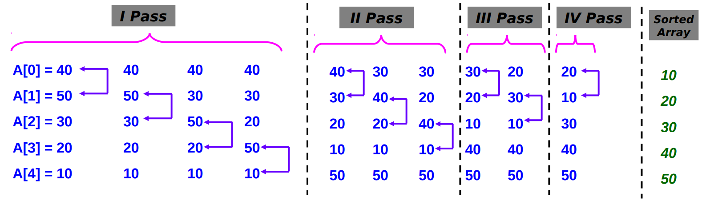

# Pufakli saralash (Bubble sort)

Eng sodda saralash algoritmi bo'lib, ikkita elementni solishtirgan holda, ularni saralaydi. Saralash paytida, ikkala elementni solishtirib, noto'g'ri tartiblangan bo'lsa, ularning o'rnini almashtirib qo'yadi. Bu algoritmning tezligi katta hajmli ma'lumotlar uchun mos kelmaydi. Algoritmning o'rtacha va eng yomon holatdagi vaqt sarfi O(n^2) ga teng. Bu yerda n saralanayotgan elementlar soni.

Kod:

```php
<?php

function bubbleSort(&$data)
{
    $len = count($data);

    for ($i = 0; $i < $len; ++$i) {
        for ($j = 0; $j < $len - $i - 1; ++$j) {

            if ($data[$j] > $data[$j + 1]) {
                $temp = $data[$j];
                $data[$j] = $data[$j + 1];
                $data[$j + 1] = $temp;
            }
        }
    }
}

$data = [1, 4, 6, -7, 234, 0, -4, -6, 44, 65, 12, -98, -84, 78]; // 14

bubbleSort($data);
```


