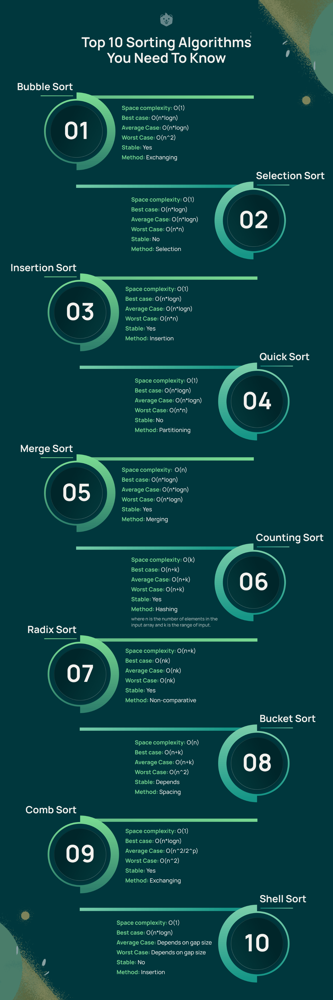
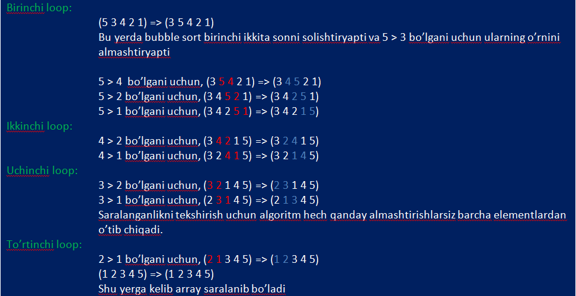
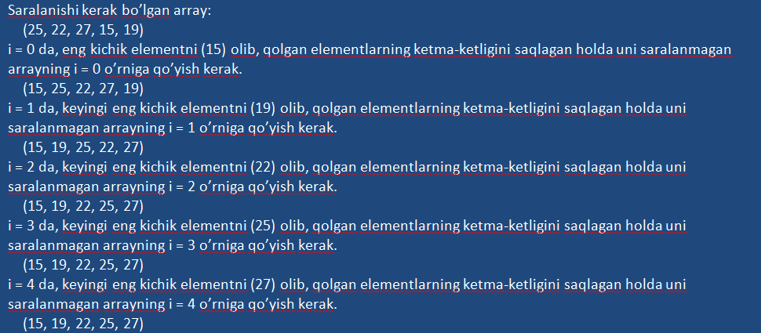
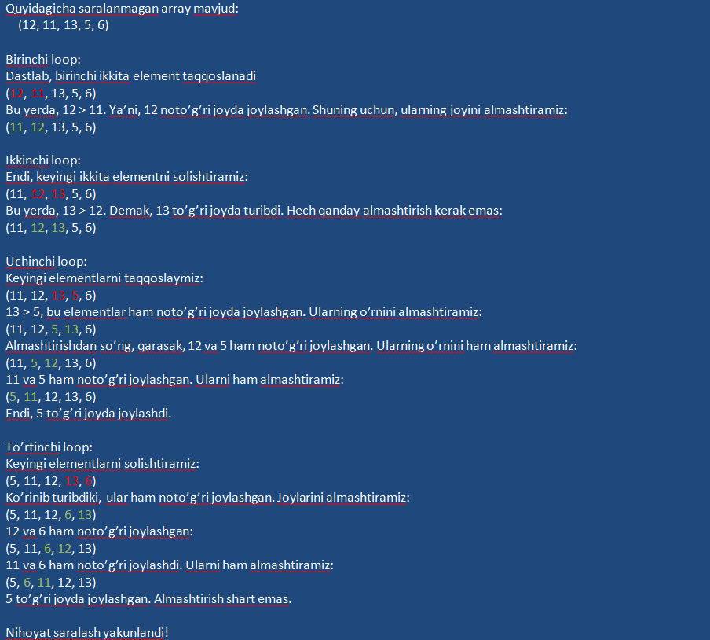
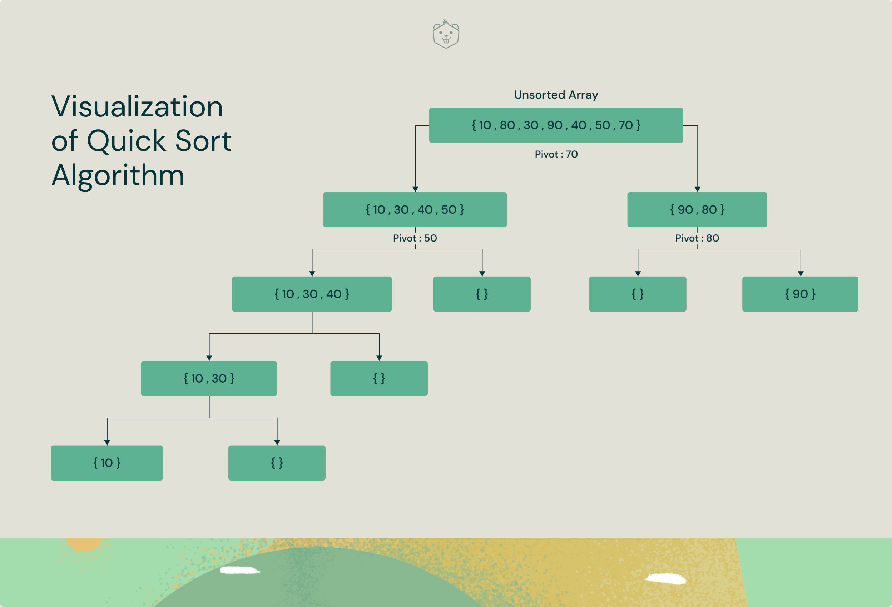

# Eng mashhur 10 ta saralash algoritmi



1. **Bubble Sort**


Bubble sort algoritmining asosiy g'oyasi yonma-yon elementlar kerakli tartibda turmagan bo'lsa, ularning o'rnini almashtirishga asoslangan.

Agar berilgan arrayni o'sish tartibida saralash kerak bo'lsa, bubble algoritmi ishni bu arrayning birinchi va ikkinchi elementlarini o'zgaro taqqoslashdan boshlaydi. Birinchi element ikkinchisidan katta bo'lsa, ularning o'rnini almashtiradi. Keyin, ikkinchi va uchinchi elementlar ustida ham xuddi shu amalni bajaradi va ishni shunday davom ettirib ketaveradi (arrayni saralab bo'lgunicha).

**Bubble Sort algoritmiga oid oddiy misol.**

Bubble sort algoritmini yaxshiroq tushunish uchun oddiy bir misol ko'raylik:



Endi, PHP dasturlash tilidagi misolni ko'ramiz:

```php
<?php

function BubbleSort(array &$data)
{
    $len = count($data);

    for ($i = 0; $i < $len - 1; ++$i) {
        for ($j = 0; $j < $len - $i - 1; ++$j) {
            if ($data[$j] > $data[$j + 1]) {
                $temp = $data[$j];
                $data[$j] = $data[$j + 1];
                $data[$j + 1] = $temp;
            }
        }
    }
}

$array = [5, 3, 4, 2, 1];
bubbleSort($array);

echo '<pre>';
print_r($array);
echo '</pre>';
```

Vaqt sarfi:

* Eng yomon holat: O(n^2)
* O'rtacha holat: O(n*logn)
* Eng yaxshi holat: O(n*logn)

Xotira sarfi: O(1)


Ishlatilish holatlari:

* Computer Science talabalariga saralash algoritmi tushunchasini tanishtirishda foydalaniladi.
* Kompyuter grafikasida deyarli saralangan arraylardagi juda kichik xatolarni aniqlashda juda keng qo'llaniladi.


2. **Selection Sort**


Selection sort - bu berilgan arrayni ikki qismga ajratib saralovchi algoritm. Bunda ajratilgan arrayning chap tomoni saralangan, o'ng tomoni esa saralanmagan bo'ladi.

Dastlab, saralangan deb hisoblanadigan chap qism bo'sh, saralanmagan o'ng tomon esa saralanishi kerak bo'lgan arrayning o'zi bo'ladi. Har bir loopda (takrorlanishda) saralanmagan qismdan eng kichik elementni olib, saralangan tomonning oxiridan qo'shib boramiz. Shunday qilib, saralangan arrayni yaratamiz.

Bu algoritmni yaxshiroq tushunish uchun oddiy misolni ko'raylik:



PHP tilidagi kod:

```php
<?php

function SelectionSort(array &$data)
{
    $len = count($data);

    for ($i = 0; $i < $len; ++$i) {
        $low = $i;
        for ($j = $i + 1; $j < $len; ++$j) {
            if ($data[$j] < $data[$low]) {
                $low = $j;
            }

            if ($data[$i] > $data[$low]) {
                $temp = $data[$low];
                $data[$low] = $data[$i];
                $data[$i] = $temp;
            }
        }
    }
}

$array = [25, 22, 27, 15, 19];

SelectionSort($array);

echo '<pre>';
print_r($array);
echo '</pre>';
```

Vaqt sarfi:

* Eng yomon holat: O(n^2)
* O'rtacha holat: O(n*logn)
* Eng yaxshi holat: O(n*logn)

Xotira sarfi: O(1)


Ishlatilish holatlari:

* Saralanuvchi ro'yxat kichik bo'lganda ishlatiladi
* Xotira hajmi kichik bo'lganda ishlatiladi. Chunki, bu algoritm saralash paytida o'rin almashtirishlar sonini minimal ko'rinishda bajaradi.


3. **Insertion Sort**


Insertion Sort algoritmi xuddi qarta o'yini donalarini saralashday ishlaydi. Saralanadigan ro'yxat virtual holda saralangan va saralanmagan qismlarga bo'linadi. Har bir takrorlanishda (loopda) saralangan qismga kiritilgan element o'zining optimal o'rnini topishi kerak bo'ladi. Yoki boshqacha aytganda, saralanmagan qismdan olingan elementlar saralangan qismda o'ziga kerakli joyga joylashtirib boriladi.

Insertion Sort algoritmini tushunish uchun misol:



PHP tilidagi kod:

```php
<?php

function InsertionSort(array &$data)
{
    $len = count($data);

    for ($i = 0; $i < $len; ++$i) {
        $x = $data[$i];

        $j = $i - 1;
        while ($j >= 0 && $data[$j] > $x) {
            $data[$j + 1] = $data[$j];
            $j = $j - 1;
        }

        $data[$j + 1] = $x;
    }
}

$array = [12, 11, 13, 5, 6];

InsertionSort($array);

echo '<pre>';
print_r($array);
echo '</pre>';
```


Vaqt sarfi:

* Eng yomon holat: O(n^2)
* O'rtacha holat: O(n*logn)
* Eng yaxshi holat: O(n*logn)

Xotira sarfi: O(1)

Ishlatilish holatlari:

* Agar ro'yxat deyarli saralangan bo'lsa, algoritm barqaror va juda tez ishlaydi.
* Juda kichik o'lchamli ro'yxatlar (masalan, 30 ta elementli) bilan ishlashda juda samarali.


4. **Quick Sort**


Quick Sort bo'l va hukmronlik qil (devide and conquer) turdagi algoritm hisoblanadi. Bu algoritmga ko'ra avval saralanishi kerak bo'lgan ro'yxatdan bitta element tanlab olinadi va shu element bo'yicha ro'yxat qismlarga ajratib chiqib ro'yxatni saralaydi.



Quick Sort algoritmning ishlash qadamlari quyidagicha bo'ladi:

* **Element tanlash**: tayanch sifatida bitta element tanlanadi (misol uchun, oxirgi elementni)
* **Qismga ajratish**: ro'yxatni ikki qismga ajratamiz. Tanlab olgan elementimizdan kichik elementlarni chap tomondagi ro'yxatga, kattalarini o'ng tomondagi ro'yxatga joylashtiramiz.
* **Quicksortni rekursiv holda ishlatish**: har bir qism uchun yuqoridagi ikki qadamni qaytadan takrorlab chiqamiz.

PHP tilidagi kod:

```php

```
