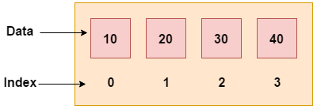
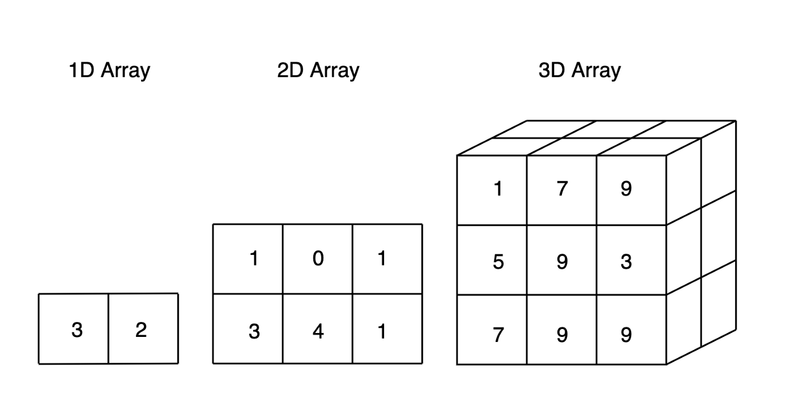
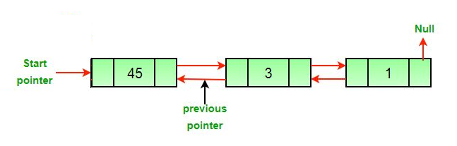
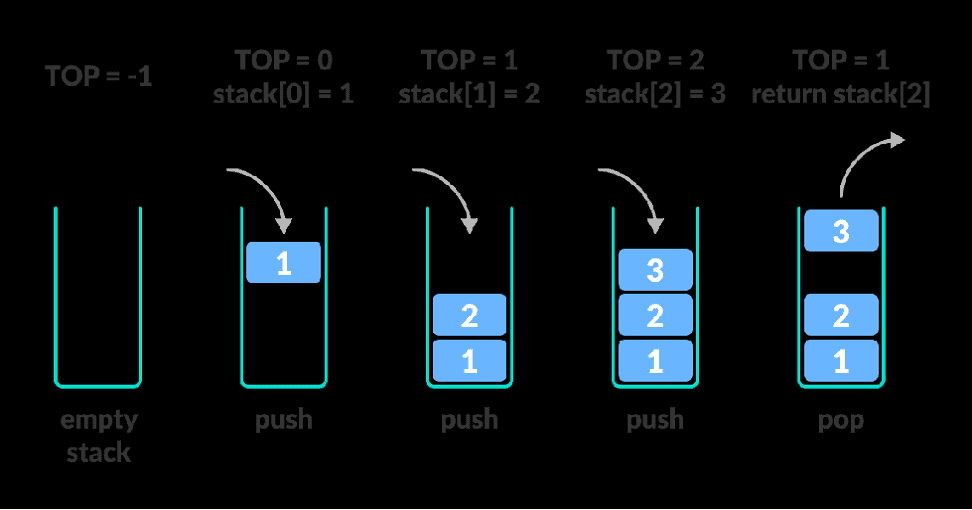
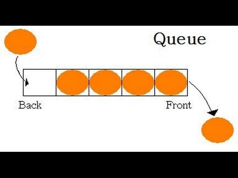
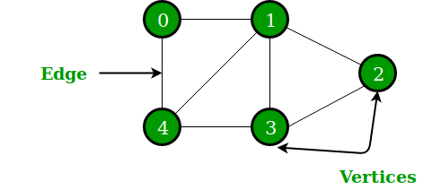
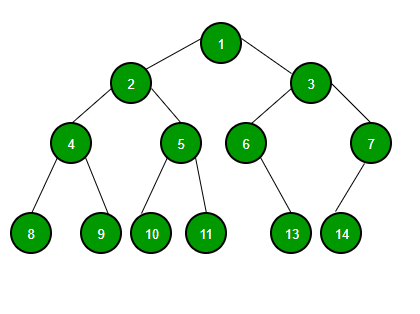
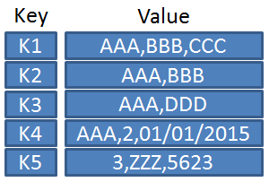

# **Ma'lumotlar tuzilmasi va algoritmlar.**

**Kirish**

Kompyuter – ma'lumotlarga ishlov beruvchi electron qurilma.

Kompyuterning asosiy vazifasi ma'lumotlarni o'qish, ularning ustida turli amallar bajarish va saqlash

Kompyuterning asosiy tarkibiy qismi – protsessor, xotira (HDD, SSD, RAM, bulut xotira va h.k) va kirish/chiqish qurilmalari.

Kompyuterning asosiy “ozuqasi” – bu ma'lumot.

Dastur – qo'yilgan muammoga yechim topish uchun, kompyuterga qaysi amallarni qanday ketma-ketlikda bajarishni aytib turuvchi ko'rsatmalar to'plami.

Bevosita dastur yaratish jarayoni dasturlash deyiladi. Dastur yaratuvchi mutaxasis dasturchi deyiladi.

Dastur qanchalik murakkab bo'lmasin, biz uni bir nechta sodda muammolarga bo'lib olamiz va har bir muammoga qadam-baqadam yechim taklif qilamiz. Bu algoritm deyiladi.

Algoritm – muammoning qadam-baqadam yechimi.

Bir muammo uchun bir nechta yechim berilishi mumkin. Ya'ni bir muammo uchun har xil algoritm taklif qilsa bo'ladi.

Algoritmga oddiy misol osh pishirish jarayoni:

1. Qozonga yog' quying
2. Go'shtni qovuring
3. Piyozni qovuring
4. Sabzini qovuring
5. Suv soling
6. Qaynating
7. Va h.k

Ma'lumotlar – kompyuter xotirasida saqlanuvchi matn, rasm, video, audio, dasturlar, jadvallar va boshqa axborotlar.

Ma'lumotlar tuzilmasi – ma'lumotlardan samarali foydalanish uchun tartibga solishning o'ziga xos usuli. Ya'ni, biror masala bilan ishlashda shu masalaga to'g'ri keladigan qulay ko'rinishdagi ma'lumot kerak bo'ladi. Ma'lumotning shu qulay holatga keltirilgan shakli ma'lumot tuzilmasi hisoblanadi.

Ma'lumotlar tuzilmasi va algoritmlar – dasturlashning asosi hisoblanadi.

Fanning muhimligi

* Bitta muammoga bir nechta yechim bo'lishi mumkin
* Mavjud ma'lumotlar tuzilmasi va algoritmlardan xabardor bo'lish eng samarali yechimni
  topishda yordam beradi.
* Algoritmning samaradorligi uning tezligi va qancha xotira egallashi bilan o'lchanadi (time and space complexity)
* Katta loyihalarda bevosita kod yozish jarayoni 20-30% ni tashkil qiladi xolos
* Aksar vaqt kompaniya resurlslarini (serverlar, hisoblash quvvati va boshqalarni) tejash uchun eng optimal algoritmlarni loyihalashga sarflanadi
* Shuning uchun katta kompaniyalar ishga olishda aynan algoritmlar va ma'lumotlar tuzilmasini qanchalik bilishini tekshiradi (dasturlash tili va turli frameworklar ikkilamchi hisoblanadi).
* Agar dasturchi faqat dasturlash tili va biror frameworkni bilsayu, algoritm va ma'lumotlar tuzilmasini bilmasa, loyihada u faqat 20-30%ida qatnasha oladi.

Algoritmlar va ma'lumotlar tuzilmasi qayerda ishlatiladi:

* Tasavvur qiling siz ustida ishlayotgan dasturning millionlab foydalanuvchisi bor

  * Bank, onlayn qidiruv, ijtimoiy tarmoq, rasmlar uchun bulut xizmati, yangi super o'yin, electron kutubxona va hokazo
* Ma'lumotlar har soniyada yangilanib turadi
* Siz har bir mijoz haqida minglab ma’lumotlarni saqlab borishingiz kerak va kerak bo'lgan ma'lumotlarni bir zumda topib
  berishingiz kerak.

Ma'lumotlar tuzilmasi (yuzaki tanishuv)

1. Array (ro'yxat)

2. 2-3-N o'lchamli ro'yxat

3. Linked list (bog'langan ro'yxat). Ma'lumotlar o'zidan oldingi va o'zidan keyingi ma'lumotlarga bog'lanadi. M: galereyadagi rasmlar ro'yxati yoki playerdagi musiqalar ro'yxati

4. Stack

5. Queue

6. Graph (graflar). Xaritalarda ishlatilishi mumkin:

7. Tree (shajara). Kompyuterda papkalarning joylashuvi:

8. Hash jadvallar (kalit-qiymat ko'rinishidagi ma'lumotlar – lug'at)

9. Heap. Shajaraga o'xshaydi. Farqi heapda ma'lumotlar o'sish yoki kamayish tartibida bo'ladi.

Algoritmlar

Aksar muammolar ma'lumotlarni tartiblashga va qidirishga borib taqaladi

Biz o'rganadigan aksar algoritmlar ham aynan Tartiblash va Qidirish (Sorting and Searching) algoritmi haqida bo'ladi.

Bundan tashqari Dynamic Programming va Greedy Algorithmslarni ham ko'ramiz
