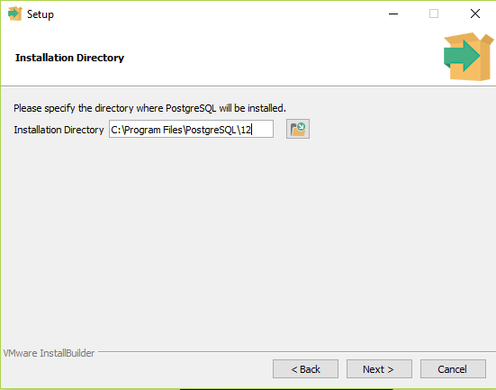

# 1-Bo'lim

### 1- dars. Asosiy tushunchalar

Ma'lumotlar bazasi (MB) nima?

> MB - bu qandaydir darajada o'zaro bog'langan va biror saqlovchida saqlanadigan ma'lumotlar to'plami.

Masalan, MB biror bir txt, sql yoki json qisqartmali faylda saqlanishi mumkin.

Odatda, ma'lumotlarni biror saqlovchida shunchaki saqlanib turishidan bizga foyda yo'q. Biz ular ustida amal bajarib o'zimizga kerakli bo'lgan ma'lumotni olishimiz, o'chirishimiz, o'zgartirishimiz yoki yangi ma'lumotni unda saqlashimiz kerak bo'ladi. Bu amallarni esa to'g'ridan to'g'ri qo'lda qilib bo'lmaydi. Buning uchun biz **ma'lumotlar bazasini boshqarish tizimi**dan (ing, **Database Management System** - **DBMS** - **MBBT**) foydalanamiz.

MBBT MB-dagi ma'lumotlarni boshqarish MB tilidan foydalanadi (kursda `SQL` tilini ishlatamiz).

Amaliyotga o'tishdan avval biroz nazariya ham o'tib ketaylik.

MBBT-ning bir qancha turlari mavjud:

* **Fayl-serverli**: Microsoft Access
* **Kliyent-server**: MySQL, PostgreSQL, ...
* **Ichki o'rnatilgan (Built-in)**: SQLite

**Fayl-serverli** MBBT-larda MB markazlashgan fayl-serverda joylashadi. Ma'lumotlarni boshqarish kliyent kompyuterlaridan turib amalga oshiriladi. Bu turdagi MBBT-ning afzalligi, u fayl tizimiga katta yuklanish tashlamaydi. Kamchiligi esa, lokal tarmoqqa yuklanish tushirishidir. Shu sababli, u ishonchlilik, xavfsizlik, har doim murojaat qila bilish imkoniyatlarida muammoga duch kelishi mumkin.

Yuqorida keltirilgan kamchiliklar sababli, fayl-serverli MBBT yuqori yuklanishda ishlay olmaydi.

**Kliyent-server**li MBBT-da MB va MBBT serverda joylashadi. Ularni kliyent tomonidan masofadan turib boshqarish imkoni mavjud bo'ladi. Kliyent tomonidan berilgan so'rovlar MBBT tomonida ishga tushiriladi.

Hozirda kliyent-serverli MBBT-lar eng ko'p ishlatiladigan MBBT turi hisoblanadi. Chunki, bu turdagi MBBT yuqori yuklanishda katta hajmdagi ma'lumotlar bilan yaxshi ishlay oladi. Bundan tashqari, u ishonchli va ancha xavfsiz ham.

Lekin, kliyent-server MBBT-larning ham kamchiligi bor. Bu ularni barcha qurilmalarga ham o'rnatib, ishlatib bo'lmasligidir. Chunki, ba'zi qurilmalarda xotira hajmi kichik, protsessori kuchsiz bo'lishi mumkin. Bunday holatlarda esa bizga ichki o'rnatilgan MBBT-lar qo'l keladi.

**Ichki o'rnatilgan** MBBT. Ayrim hollarda, qurilmalar ishlash tezligini oshirish uchun yoki boshqa sabab tufayli katta hajmli MB-ning kichik bir qismini o'zida saqlab turishi kerak bo'ladi. Aynan shu holatlarda ichki o'rnatilgan MBBT-dan foydalaniladi.

Kursimizda Kliyent-serverli MBBT-ni o'rganamiz. Kliyent-serverli MBBT-larga misol qilib quyidagilarni keltirish mumkin:

* MySQL
* PostgreSQL
* Oracle
* MS SQL

Bu MBBT-larning barchasi **relatsion MBBT** bo'lib, ularning barchasi SQL (Structured Query Language) tilidan foydalanadi.

Relatsion MBBT-lar paydo bo'lishidan oldin relatsion bo'lmagan MBBT-lar (m: iyerarxik) ishlatilgan. 1970-yillarga kelib, relatsion MBBT-lar paydo bo'ldi. 2010-yillarga kelib esa matematik izlanishlar natijasida zamnaviy relatsion bo'lmagan MBBT-lar yaratildi. Google kompaniyasi o'zining qidirish tizimida ishlatgan algoritmlari yordamida ancha samarali bo'lgan MBBT yaratish mumkinligini ko'rsatdi.  Yangi turdagi MBBT-da SQL tili ishlatilmadi. Shu sababli uning nomi **NoSQL** deb nomlandi. `MongoDB` MBBT-ni NoSQL MBBT turiga misol qilib keltirish mumkin. MongoDB MBBT json ko'rinishiga o'xshash ko'rinishda saqlanuvchi ma'lumotlar bilan ishlaydi.

Relatsion MBBT-ni relatsion bo'lmagan MBBT-dan ustunlik yoki kamchilik joyi yo'q va aksincha. Ikkala turdagi MBBT-ning o'zining afzalligi va kamchiligiga qarab ishlatiladigan joyi bor.

### 2-dars. Relatsion model va SQL.

Relatsion MBBT-ning asosini relatsion algebra tashkil qiladi. Relatsion algebrani maktabda ham, institutda ham o'tmaganmiz. Relatsion algebraning paydo bo'lganiga unchalik ko'p vaqt ham bo'lgani yo'q (taxminan, 70-yillarda).

Relatsion algebra munosabatlar (jadvallar) o'rtasida amallar bajarishni belgilab beradi: birlashtirish, kesishish, ayirish, bog'lash va shu kabi amallar. Bu amallarning barchasi SQL tili yordamida bajariladi.

Albatta, kursda relatsion algebraning o'zi o'tilmaydi).

Relatsion MBBT-da ba'zi tushunchalar.

* Jadval - munosabat
* Ustun - atribut
* Qator - yozuv (record)
* Natijaviy to'plam - SQL so'rov natijasi. M: `SELECT phone, address FROM users LIMIT 10`

**SQL - Structured Query Language.**

SQL - bu protsedurali yoki umumiy maqsadli til emas. SQL yordamida biror dastur, o'yin yoza olmaymiz. U MB-da ma'lumotlar ustida amal bajarishda ishlatiladi. SQL-ni ishlatish uchun boshqa biror bir dasturlash tili kerak bo'ladi. M: Python, C#, Java va h.k.

SQL tili turli tipdagi so'rovlardan tashkil topgan:

* DDL (Data Defenition Language) - CREATE, ALTER, DROP
* DML (Data Manipulation Language) - SELECT, INSERT, UPDATE, DELETE
* TCL (Transaction Control Language) - COMMIT, ROLLBACK, SAVEPOINT
* DCL (Data Control Language) - GRANT, REVOKE, DENY

Barcha SQL ishlatuvchi MBBT-lar o'zining SQL dialektiga ega. Ya'ni turli MBBT-larda har xil ko'rinishda SQL so'rov ishlatilishi mumkin (lekin asosiy so'rovlar bir xil. 90% SQL so'rovlar barcha MBBT-larda deyarli bir xil sintaksisda ishlatiladi.). Lekin, barcha MBBT-lar **ANSI SQL-92** standartida ishlaydi.

Turli MBBT-larda ishlatiluvchi SQL dialektlar:

* **PL/pgSQL** - PostgreSQL
* **PL/SQL** - Oracle
* **T-SQL** - MS SQL

### 3-dars. Nega PostgreSQL-dan foydalanish kerak?

PostgreSQL-ning afzalliklari

* **Tekin** (Open Source)
* O'rnatish va o'rganish uchun oson
* Tranzaksiyali MBBT hisoblanadi (MySQL-da tranzaksiylalilik bilan muammolar mavjud).
* Doimiy rivojlanishda
* MySQL bilan solishtirganda o'zining afzallik va kamchiliklari bor.
* Har qanday holatda, SQL dialektikasi 90% da boshqa MBBT-larga mos keladi.

### 4-dars. PostgreSQL-ni o'rnatish.

[PostgreSQL](https://www.postgresql.org/https://)-ning rasmiy saytiga o'tilib, [download](https://www.postgresql.org/download/https://) tugmasi bosiladi. Kerakli operatsion tizimni tanlab yuklab olish sahifasiga o'tiladi. So'ng [Download the installer](https://www.enterprisedb.com/downloads/postgres-postgresql-downloadshttps://) havolasi bosiladi. Ochilgan oynadan, kerakli versiya tanlanib dastur yuklab olinadi:


Kursda PostgreSQL-ning windows operatsion tizimga mo'ljallangan 12.8 versiyasini ishlatamiz.

O'rnatish ketma-ketligi:

1. O'rnatuvchi faylni ishga tushiramiz va ochilgan oynadan next tugmasini bosamiz:


2. O'rnatiladigan papka tanlanadi:



3. Kerakli tool-lar tanlanadi, next tugmasi bosiladi:


4. Keyingi oynadan ma'lumotlarimiz saqlanadigan papka tanlanab, next tugmasini bosamiz:


5. Ochilgan oynada ma'lumotlar xavfsizligi uchun parol teriladi:


6. Port oynasida postgresql foydalanadigan port yoziladi. Odatiy holda postgresql 5432 portidan foydalanadi:


7. Keyingi oynadan interfeys tili tanlanadi:


8. O'rantishni boshlash uchun yakuniy oyna. Next tugmasi bosilgandan so'ng chiqqan oynada yana next tugmasini bosib o'rnatish boshlanadi:


9. O'rnatish oynasi:


10. Finish tugmasini bosib PostgreSQL-ni o'rnatish yakunlanadi:


PostgreSQL MBBT o'rnatildi. Endi uni ishlatib ko'rsak ham bo'ladi. MBBT-dagi baza va jadvallarni ko'rish, ma'lumotlar ustida amallar bajarishni qulay qilish uchun bizga interfeys kerak bo'ladi. PostgreSQL MBBT-ni ochish uchun o'zining PgAdmin nomli dasturi bor. Bundan tashqari boshqa bir qancha dasturlardan ham foydalanish mumkin. Kursda DBeaver dasturidan foydalanamiz. Chunki undan foydalanish (men uchun) ancha qulay hisoblanadi. DBeaver dasturini o'zining rasmiy [sayt](https://dbeaver.io/download/https://)idan yuklab olish mumkin.

DBeaver-ni o'rnatgandan so'ng uni ochib PostgreSQL MBBT-ga bog'lanamiz:

1. Dasturni ochamiz:


2. Dasturda yangi bog'lanish yaratish uchun "bog'lanish" menyusini tanlaymiz:


3. Ochilgan oynadan PostgreSQL-ni tanlaymiz:


4. Keyin PostgreSQL uchun sozlamalar to'g'rilanadi.


* Agar masofadan bog'lanilsa, host-ga serverning IP manzili, lokal ishlansa localhost qo'yiladi.
* Agar aynan bitta MB-ga ulanayotgan bo'linsa, database-ga MB nomi (odatiy holda postgres turadi).
* Odatiy holda PostgreSQL 5432 port-ni ishlatadi. Agar port o'zgartirilgan bo'lsa, port sozlamasiga o'zgargan port qo'yiladi.
* PostgreSQL-da default user postgres hisoblanadi (user sozlamasida ham shu user nomi turadi). Agar boshqa foydalanuvchi yaratilgan bo'lsa, shu foydalanuvchi nomi user sozlamasiga kiritiladi.
* Locale client qismida PostgreSQL-ning kerakli versiyasi tanlanadi.
* SSH, Porxy, SSL va boshqa sozlamalar ham mavjud. Hozircha yuqoridagilar eng minimal sozlamalar hisoblanadi.

Yaratilgan barcha MB-lar ko'rinishi uchun sozlamalardagi PostgreSQL bo'limida 'barcha MB-lar ko`rsatish' tugmasini belgilab qo'yish kerak bo'ladi:


5. Bog'lanish tugaganidan so'ng DBeaver-ning o'ng tomonidagi ro'yxatda yangi bog'lanish paydo bo'ladi:


### 5-dars. Asosiy tiplar.

Amaliyotga o'tishdan avval, yana ozroq nazariya bilan ishlaymiz. Chunki, ma'lumotlar bilan ishlashdan oldin, ma'lumot o'zi nima, ma'lumot tipi nima ekanligini bilishimiz kerak.

Asosiy ma'lumot tiplarini bir nechta turga bo'lish mumkin:


1. **Butun tip**.
   1. **smallint**. -32768 va 32767 oraliqdagi sonlarni yozishda ishlatiladi.
   2. **integer**. Eng ko'p qo'llaniladigan butun tip.
   3. **bigint**. Eng katta hajmli butun tip. Katta hajmli butun sonlarni ifodalashda ishlatiladi
2. **Haqiqiy tip**
   1. **decimal/numeric**. Xotirada o'zgaruvchan joyni egallaydi. Asosan pul miqdorini ifodalashda ishlatiladi. Chunki, bu tip hisob kitoblarda aniq qiymatni beradi.
   2. **real/float4**. Ilmiy hisob kitoblarda ishlatiladi.
   3. **double precision / float8 / float**.
3. **Integral tip**.
   1. **smallserial**. autoincrement bilan ishlaydi. Ya'ni har safar keyin sonni kiritganda oldingisidan birga ko'p bo'lib yoziladi.
   2. **serial**. smallserial bilan bir xil. Farqi maksimal miqdori smallserialdan kattaroq bo'ladi.
   3. **bigserial**. smallserial va serial bilan bir xil. Farqi maksimal miqdori smallserial va serialdan kattaroq bo'ladi.
4. **Character** (belgilar).
   1. **char**. aniq uzunlikdagi belgilar ketma-ketligini ifodalashda ishlatiladi. Masalan, char uzunligini 5 deb  berib unga 6 ta belgi o'rnatilsa, xatolik yuz beradi. Agar, 4 ta belgi berilsa, ortib qolgan uzunlik probellar bilan to'ldiriladi.
   2. **varchar**. O'zgaruvchan uzunlikdagi belgilar ketma-ketligi. Masalan, agar varcharni 10 ta belgi uzunligi qilib berib unga 5 ta belgi berilsa, uning uzunligi 5 ga teng bo'ladi. Agar 10 ta belgi uzunligidagi varcharga 11 ta belgi o'rnatilsa xatolik yuz beradi (xuddi char kabi).
   3. **text**. Katta o'lchamdagi matnlarni saqlash uchun ishlatiladi
5. **Logical** (mantiqiy)
   1. **Boolean / bool**. True va false qiymatni qabul qiladi.
6. **Temporal**. Kun va vaqtni ifodalashda ishlatiladi.
   1. **date.** M.a 4713 yildan boshlab sanani ko'rsatadi.
   2. **time**
   3. **timestamp**
   4. **interval**
   5. **timestamptz**
7. PostgreSQL ishlatadigan boshqa tiplar:
   1. **Arrays**
   2. **JSON**
   3. **XML**
   4. **Maxsus tiplar**. M: geometrik tip
   5. **Custom tiplar** (foydalanuvchi o'zi uchun yaratadigan tip)
   6. **NULL**. Ma'lumot mavjud emasligini bildiruvchi tip.

### 6 - dars. MB yaratish.

PostgreSQL-da ikki xil usulda MB yaratish mumkin: vizual va SQL so'rov yordamida.

**Vizual ko'rinishda MB yaratish.**

Vizual ko'rinishda MB yaratishda PostgreSQL uchun o'rnatilgan interfeys dasturdan foydalaniladi. Bizda DBeaver dasturi o'rnatilgandi. DBeaver-dan foydalanib MB yaratamiz:

1. Chap tomonda ochilgan bog'lanish ustiga sichqonchaning o'ng tugmasini bosib, ochilgan menyudan **Create->Database** tanlanadi:


2. Ochilgan oynada MB nomi, foydalanuvchi, kerakli kodirovka tanlanadi (bu eng minimal sozlash):


Shundan so'ng dasturning chap tomonidagi MB-lar ro'yxatiga yangi ochgan MB-miz qo'shiladi:


Rasmda ko'rganingizdek, jadvallar sxema bo'limidagi public ichida joylashgan. Bu yerda sxemalar turli xildagi foydalanuvchilar bilan ishlaganda foydalaniladi. Odatda, jadvallar public sxemasi ichida joylashadi va bu sxemaga barcha foydalanuvchilar murojaat qilishlari mumkin. Agar, qaysidir jadvallarga murojaatni cheklash kerak bo'lsa, shu jadvallar boshqa bitta sxema ichiga olinadi va bu sxemaga murojaat qilish uchun cheklovlar o'rnatiladi (rollar, permission-lar yordamida).

**SQL yordamida MB ochish.**

So'rov yordamida MB yaratishda (so'rov bilan boshqa amallarni ham bajarishda ham) so'rovni yozib ishga tushiradigan editor muhitini ochib olish kerak:


Rasmda ko'rib tuganingizdek, **SQL editor** muhitini `F3` tugmasini bosib ham ochish mumkinligi ko'rsatilgan.

SQL Editor muhitida MB yaratish so'rovini yozib `Ctrl+Enter` tugmalari yordamida ishga tushiramiz:


Agar chap oynadagi postgres bog'lanishini tanlab, `F5` tugmasi yordamida ro'yxatni yangilasak qo'shagan MB-mizni ko'ramiz:


### 7 - dars. Jadval yaratish.

Endi jadval yaratishni ko'ramiz. Avval, yangi MB ochib olamiz: `create database postgre_lessons`.

So'ng yaratgan MB-mizni tanlab turib, F3 tugmasini bosamiz va SQL editor-ni ochib olamiz. Endi, bemalol SQL so'rovlarni yozsak bo'ladi.

**Jadval yaratish.**

Jadval yaratish

```bash
create table jadval_nomi (ustun_nomi tipi boshqa_sozlamalar)
```

so'rovi yordamida amalga oshiriladi.

Ikkita jadval yaratamiz. Birinchisi kitoblar (books), ikkinchisi nashriyotlar (publishers):

```bash
create table publishers
(
        id integer primary key,
	org_name varchar(128) not null,
	address text not null,
	phone varchar(14)
);

create table books
(
	id integer primary key,
	title text not null,
	isbn varchar(32) not null
);
```

Yuqorida berilgan publishers jadvalini yaratish so'rovni tahlil qilaylik:

* `create table jadval_nomi` jadval yaratadi
* qavs ichida berilganlar esa yaratilayotgan jadvalning ustunlari (`id`, `org_name` kabilar) hisoblanadi
* ustun nomalari yonidan ustun tipi beriladi (m: `integer`, `varchar`, `text`)
* `not null` ustunga ma'lumot kiritish majburiy ekanligini bildiradi
* `id` ustuni yonidagi `primary key` ushbu ustun shu jadvalning takrorlanmas identifikatori ekanligini bildiradi.

> Jadval yaratishda, agar ko'rsatilmasa, barcha jadvallar standart holda public sxemasi ichiga tushadi.


**Jadvalni o'chirish.**

Jadvalni o'chirish so'rovi:

```bash
drop table jadval_nomi;
```

Masalan:

```bash
drop table publishers;
drop table books;
```

Jadvalni vizual ko'rinishda ham yaratish mumkin. Buning uchun:

1. Kerakli sxema(bizda public)dagi tables ustiga sichqonchaning o'ng tugmasini bosib ochilgan menyudan **create table** tanlanadi:


2. Jadval nomi beriladi va create column tugmasi bosilib, so'ng ochilgan oynadan qo'shilayotgan ustun ma'lumotlari to'ldiriladi:


### 8 - dars. Jadvalga ma'lumot qo'shish.

Yaratgan jadvallarimizga ma'lumot kiritish vaqti keldi. Jadvalga ma'lumot qo'shish quyidagi sintaksis bilan bajariladi:

```bash
insert into jadval_nomi values (ustun_1_qiymati, ustun_2_qiymati, ustun_3_qiymati);
```

Misol uchun, oldingi darsda yaratgan books jadvalimizga ma'lumot qo'shaylik:

```bash
insert into books values (1, 'Avlodlar dovoni', '1311141515');
insert into books values (2, 'Humoyun va Akbar', '8787877171');
```

Agar birdaniga bir nechta yozuv qo'shmoqchi bo'lsak har bir so'rovni nuqtali vergul bilan ajratib keyingi so'rovni ketidan yozib ketishimiz mumkin (yuqoridagi misoldagiday).

Yoki values-dan keyin birdaniga bir nechta yozuvni ham berib yuborishimiz mumkin:

```bash
insert into books values 
    (1, 'Avlodlar dovoni', '1311141515'),
    (2, 'Humoyun va Akbar', '8787877171');

insert into publishers values
	(1, 'G''afur G''ulom nashriyoti', 'Kichik halqa yo''li', '+998330000000'),
	(2, 'Hilol nashr', 'Katta halqa yo''li', '+998331234567');
```

Publishers jadvaliga ma'lumot qo'shishda ko'rib turganingizdek, bitta tirnoqli qavs ichida *o'* harfini yozganda uning apostrifini qabul qilishi uchun yonidan yana bitta apostrif qo'yiladi (ekranlashtirish deyiladi: `'o''rdak'`).

Jadvaldagi ma'lumotlarni `SELECT` operatori yordamida olib ko'rishimiz mumkin:


Bu so'rovni tilimizga `books jadvalidan barcha maydonlarni tanlab ol` deb tarjima qilsak bo'ladi. So'rovdagi `*` barcha ustunlarni bildiradi.

Endi ikkita jadval ma'lumotini birlashtirib ko'ramiz. Misol uchun, *'Avlodlar dovoni'* kitobini *G'afur G'ulom nashriyoti* chop etgan bo'lsin. Ya'ni, shu kitob *G'afur G'ulom nashriyoti*ga tegishli.

Proyekt bilan ishlash jarayonida, ko'pgina hollarda jadval ma'lumotlar o'zgaro bo'langan bo'ladi. O'zimizdagi ikkita jadval misolida oladigan bo'lsak, `books` jadvalidagi biror kitob `publishers` jadvalidagi bitta nashriyotga bog'langan bo'ladi. Ya'ni, bitta kitob birorta nashriyotga tegishli bo'ladi. Endi savol paydo bo'ladi: qanday qilib nashriyot va kitobni bog'lashimiz mumkin? Axir, ular alohida jadvallarda joylashgan. Buning yo'li juda oson! Jadvallarni ularning id-lari yordamida bog'laymiz. Jadvallarni bog'lash uchun **tashqi kalit**lardan foydalaniladi.

Ishni ikkala jadvalni o'chirib qaytadan yaratishdan boshlaylik:

```bash
drop table books;

drop table publishers;

create table publishers
(
	id serial not null,
	org_name text not null,
	address text not null,
	phone varchar(13),
	constraint pk_publishers primary key (id)
);

create table books
(
	id serial not null,
	publisher_id int4 not null,
	title varchar(255) not null,
	isbn varchar(32) not null,
	constraint pk_books primary key (id),
	constraint fk_books foreign key (publisher_id) references publishers(id)
);

```

Yuqoridagi script-larni tahlil qilaylik. Jadvallarni o'chirib bo'lganimizdan so'ng, birinchi bo'lib `publishers` jadvalini yaratamiz. Jadval yaratishni oldingisidan biroz boshqa amalga oshiramiz. Identifikator ustuni (`id`)ni `serial` tipida e'lon qilamiz. Bunda identifikator qiymati har safar yangi yozuv kiritilganda o'z-o'zidan bittaga oshib ketaveradi. Shu bilan birga unga oldingi safardagiday o'zidan keyin `primary key` berib o'tirmaymiz. Bu ishni oxirgi qatorda (`constraint pk_publishers primary key (id)`) amalga oshiramiz. Qolgan ustunlar oldigiday qoladi.

Keyin esa, `books` jadvalini yaratamiz. `Books` jadvalini yaratish ham oldingisidan farq qiladi. Bu jadvalda ham identifikator xuddi `publishers`-dagiday amalga oshiriladi. Bundan tashqari, `books`-dagi har bir kitobni publishers jadvalidagi biror nashriyotga bog'lash uchun `books`-dan `publishers`-ga havola(link) o'rnatamiz. Ya'ni, `books` jadvaliga bitta ustun qo'shib, shu ustunni `pulishers` jadvalining identifiketor(`id`)iga bog'laymiz (`constraint fk_books foreign key (publisher_id) references publishers(id)`).

Endi, yana qaytadan ma'lumotlarni kiritib chiqamiz:

```bash
insert into publishers values
(1, 'G''afur G''ulom nashriyoti', 'Kichik halqa yo''li', '+998901234567'),
(2, 'Sharq nashriyoti', 'Katta halqa yo''li', '+998711235278'),
(3, 'Ilm-ziyo', 'Amir Temur k. 122', '+998715846396'),
(4, 'Hilol nashr', 'Farg''ona yo''li ko''chasi', '+998851258975');

insert into books values
(1, 1, 'Kichkina Shahzoda', '125484844'),
(2, 2, 'Nur va soyalar', '848454644'),
(3, 2, 'Avlodlar dovoni', '2659548441'),
(4, 3, 'Tom soyerning sarguzashtlari', '656288489'),
(5, 1, 'Mehrobdan chayon', '9879746541'),
(6, 3, 'O''n besh yoshli kapitan', '332554848'),
(7, 2, 'Raqamli qal''a', '979786445'),
(8, 2, 'Molxona', '2323546546'),
(9, 1, 'Sariq devni minib', '21221514548'),
(10, 4, 'Baxtiyor oila', '32365994549');
```

`Books` jadvalini ochib qaralsa, undagi publisher_id ustunidagi sonlar orqali kitob qaysi nashriyotga tegishli ekanini topish mumkin. Masalan, Identifikatori 3 ga teng bo'lgan *"Nur va soyalar"* kitobini 2 identifikatorga ega nashriyot nashr qilgan. `Publishers` jadvaliga qarasak 2-identifikatorda *"Sharq nashriyoti"* turibdi:

`books` jadvali:


`publishers` jadvali:


Darsni xulosa qiladigan bo'lsak, `B` jadvalni `A` jadvalga bog'lash uchun `A` jadvalning bo'glanadigan ustuniga `primary key` berish kerak (odatda bu ustun identifikator - `id` ustuni bo'ladi. Chunki shu ustun doimo takrorlanmas - `unique` bo'ladi). `B` jadvalning `A` jadvaldagi bog'lanish ustuniga havola ko'rsatadigan ustuniga esa `foreign key` (**tashqi kalit**) beriladi.

### 9 - dars. One to One relationship.

MB bilan ishlashda jadvallarning turli xildagi bog'lanishlari mavjud bo'ladi. Ulardan biri - **One to One Relationship** (**Birga bir bog'lanish**). **One to One Relationship (OOR)**-ga bitta kishida bitta pasport bo'lishini misol qilib keltirish mumkin. Ya'ni, `people` jadvalidagi bitta yozuvga `passports` jadvalidagi faqat bitta yozuv bog'lana olishi mumkin.

Endi, shu misolni amalda ko'ramiz. Avval, `people` va `passports` jadvallarini yaratib olamiz:

```bash
create table people
(
	id serial not null,
	first_name varchar(64) not null,
	last_name varchar(64) not null,
	constraint pk_people primary key (id)
);

create table passports
(
	id serial not null,
	person_id int4 not null,
	serial_number varchar(9) not null,
	constraint pk_passports primary key (id),
	constraint fk_passports foreign key (person_id) references people(id)
);
```

Keyin, jadvallarni ma'lumot bilan to'ldiramiz:

```bash
insert into people values
(1, 'Kamol', 'Kamolov'),
(2, 'Jamol', 'Jamolov'),
(3, 'Salom', 'Salomov');

insert into passports values
(1, 1, 'AA1234567'),
(2, 2, 'AB1234567'),
(3, 3, 'AA7654321');
```

Ko'rib turganingizdek `people` jadvalidagi bitta yozuvga `passports` jadvalidagi bitta yozuv bog'langan xolos.

OOR bog'lanish eng sodda bog'lanish hisoblanadi.

### 10 - dars. One to Many Relationship.

**One to Many Relationship (OMR)** eng ko'p uchraydigan bog'lanish hisoblnadi. Hayotimizda ham bu bo'lanishni ko'p uchratamiz. Misol uchun, bitta kishining bir nechta farzandi, bitta mashina brendining bir qancha markada chiqargan mashinalari va h.k bo'lishi mumkin. 8-darsda misol sifatida ko'rgan nashriyot va kitoblar ham OMR-ga misol bo'ladi.

OMR-ni tushunish uchun 8-darsdagi misolni qaytadan ko'rib chiqishingiz mumkin.

### 11 - dars. Many to Many Relationship.

**Many to Many Relationship (MMR)** - oldingi bog'lanishlarga nisbatan biroz murakkab bog'lanish hisoblanadi. **MMR**-ni tushunish uchun yana misol ko'raylik.

Ma'lumki, hozirda ijtimoiy tarmoqlar ancha ommalashdi. Bitta kishi bir nechta ijtimoiy tarmoqda sahifa ochishi mumkin. Mana shu holat MMR-ga oddiy misol bo'la oladi. Ya'ni, misol uchun, `social_networks` jadvalidagi *facebook* qatori `users` jadvalidagi bir nechta foydalanuvchiga bog'lanishi mumkin, va aksincha, `users` jadvalidagi *Salom* degan foydalanuvchi `social_networks` jadvalidagi bir nechta ijtimoiy tarmoqqa bog'lanishi mumkin.

MMR-da jadvallarni bog'lash har doimgiday `primary key` va `foreign key`-lardan foydalaniladi. Qolgan bog'lanishlardan farqi bu bog'lanishda ikkita jadvalni bog'lash uchun uchinchi jadvaldan foydalaniladi.

MMR-ni amaliy ko'rish uchun tepadagi ijtimoiy tarmoq misolimizni olamiz.

Avval, ikkala jadvallarni yaratib olamiz:

`users` jadvali:

```bash
create table users
(
	id serial not null,
	first_name varchar(64) not null,
	last_name varchar(64) not null,
	constraint pk_users primary key (id)
);
```

`social_networks` jadvali:

```bash
create table social_networks
(
	id serial not null,
	social_network varchar(64) not null,
	url varchar(255) not null,
	constraint pk_social_networks primary key (id)
);
```

`user_socials` jadvali:

```bash
create table user_socials
(
	user_id int4 not null,
	social_id int4 not null,
	constraint pk_user_social primary key (user_id, social_id),
	constraint fk_user_socials_user_id foreign key (user_id) references users(id),
	constraint fk_user_socials_social_id foreign key (social_id) references social_networks(id)
);
```

Ko'rib turganingizdek, `users` va `social_networks` jadvallarida hech qanday `foreign key` ustuni yo'q. Bu ikkala jadvalni faqatgina `user_socials` jadvali bo'glab turibdi. `user_socials` jadvalidagi `user_id` va `social_id` bog'lovchi ustunlar esa `foreign key` bilan yaratilgan.

Endi jadvallarga ma'lumot kiritamiz:

```bash
insert into users values
(1, 'Kamol', 'Kamolov'),
(2, 'Salom', 'Salomov'),
(3, 'Jamol', 'Jamolov');

insert into social_networks values
(1, 'Facebook', 'facebook.com'),
(2, 'Instagram', 'instagram.com'),
(3, 'Tik Tok', 'tiktok.com');

insert into user_socials values
(1, 1),
(1, 3),
(2, 1),
(2, 2),
(3, 1),
(3, 2),
(3, 3);
```

`user_socials` jadvalini ochib ko'rsangiz `users` va `social_networks` jadvallari `id`-lari yordamida bog'langanini ko'rasiz:


