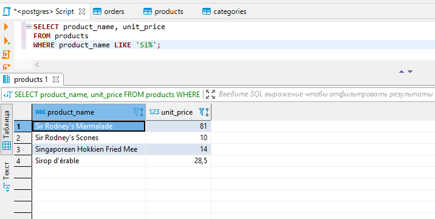

# 2-Bo'lim

### 1-Dars. SELECT operatori.

Oldingi bo'limda biz MB, MBBT, SQL tili, MB yaratish, jadval yaratish kabi tushunchalar bilan tanishgan edik. Ikkinchi bo'limda esa asosiy so'rovlarni o'rganishni davom ettiramiz. Oldingi bo'limdan farqli ravishda, ushbu bo'limda so'rovlarni o'rganish uchun oldindan yaratilgan **northwind** MB-dan foydalanamiz.

Bu MB-ni ushbu [havola](./sources/northwind.sql)dan yuklab olib ishga tushirishingiz mumkin.

Jadvaldan kerakli ma'lumotlarni olish uchun `SELECT` operatoridan foydalaniladi. Asosiy sintaksisi quyidagicha:

```bash
SELECT ustun1, ustun2, ..., ustunN FROM jadval_nomi
```

Masalan:


Misolda keltirilgan `*` barcha ustunlarni olishni anglatadi. Lekin doim ham `*` bilan ustunlar olinmaydi. Chunki ayrim hollarda barcha ustunlar ham kerak bo'lavermaydi. Hamma ustunni olish tizimga ortiqcha va keraksiz yuklanish tushirishi mumkin. Buning oldini olish uchun esa aynan kerak bo'ladigan ustunlar olinadi:


### 2-dars. Matematik amallar

SQL tili dasturlash tillari singari matematik amallarni bajarish imkonini beradi.

SQL tilidagi matematik amallar:

* `+` - qo'shish
* `-` - ayirish
* `*` - ko'paytirish
* `/` - bo'lish
* `^` - darajaga oshirish
* `|/` - kvadrat ildiz
* va boshqa ko'plab operator va funksiyalar

PostgreSQL-ning o'zida ham yana qo'shimcha matematik amallari mavjud.

Endi, amaliyotga o'tib, matematik amallarni bajarish ko'ramiz.

Ma'lumot sifatida test MB-dagi `products` jadvali ma'lumotlaridan foydalanamiz. `Products` jadvalida bitta mahsulot narxi (`unit_price`) va do'kondagi mahsulotlar soni (`unis_in_stock`) ustunlari mavjud. `Products` jadvalidagi mahsulotlar ro'yxatini chiqarishda, yangi ustunda mahsulotning umumiy narxini ham qo'shib chiqaraylik.


Ikkinchi misol, orders jadvalida buyurtmani yetkazib berishga qancha vaqt ketagnini hisoblaylik. PostgreSQL-da vaqt usti ham matematik amallarni bajarish mumkin. Shuning uchun yetkazib berishga ketgan vaqtni jo'natilgan vaqtdan yetkazil berilgan vaqtni ayirish orqali topib olamiz:

```bash
SELECT order_id, shipped_date - order_date FROM orders;
```

### 3-dars. DISTINCT

`DISTINCT` operatori jadvaldagi takrorlanmas (unique) ma'lumotlarni olib beradi. Misol uchun, test MB-dagi `employees` jadvalidan ishchilar yashaydigan shaharlarni olishimiz kerak bo'lsin (masalan, mana shu shaharlardan ishchilarimiz bor deb saytimizda ko'rsatmoqchimiz):

```bash
SELECT city FROM employees;
```


Lekin, ko'rib turganingizdek, ba'zi shaharlar takrorlanib chiqib qoldi (chunki, ayrim ishchilar bitta shahardan). Bizga esa, faqat bittasi yetarli. Duplikat (takrorlangan) shaharlarni qanday olib tashlash mumkin? Albatta, `DISTINCT` operatori bilan!

```bash
SELECT DISTINCT city FROM employees;
```


`DISTINCT` bilan nafaqat bitta, balki bir nechta ustunlarni ham ishlatish mumkin:

```bash
SELECT DISTINCT city, country FROM employees;
```


### 4-dars. COUNT

`COUNT` operatori qatorlar sonini hisoblab beradi. Masalan, `orders` jadvalida qancha yozuv borligini bilmoqchimiz:

```bash
SELECT COUNT(*) FROM orders;
```


Bu yerda `COUNT(*)` dagi `*` o'rniga jadvaldagi birorta ustun nomini qo'shsa ham bo'ladi:

```bash
SELECT COUNT(id) FROM orders;
```

Endi, `employees` jadvalida nechta davlat borligini ko'raylik:

```bash
SELECT COUNT(id) FROM employees;
```

Lekin bu so'rov `employees` jadavalidagi davlatlar sonini emas, balki jadvaldagi barcha qatorlar sonini hisoblab beradi. Oldingi darsda ko'rganimizdek, davlatlar takrorlanib chiqqani sababli `COUNT` bizga no'to'g'ri ma'lumot chiqarib beradi. Nima qilish kerak? Albatta, `DISTINCT`-dan foydalanamiz!

```bash
SELECT COUNT(DISTINCT country) FROM employees;
```


### 5-dars. WHERE

WHERE operatori bilan olinayotgan ma'lumotni biror ustun yoki ustunlar orqali filterlar olish mumkin. Aniqroq aytganda, olinadigan ma'lumotni biror shartga ko'ra chiqarib olish hisoblanadi.

Sintaksisi:

```bash
SELECT ustun1, ustun2, ..., ustunN FROM jadval_nomi WHERE shart;
```

Bu yerdagi shart **taqqoslash operatorlari** yordamida beriladi. Quyidagicha taqqoslash operatorlari bor:

* `=` - teng
* `>` - katta
* `>=` - katta yoki teng
* `<` - kichik
* `<=` - kichik yoki teng
* `<>` yoki `!=` - teng emas

Yuqoridagilarning barchasi `boolean` tipini beradi.

Quyidagi misolni ko'ramiz: `customers` jadvalidan hamma AQSh-dan bo'lgan buyurtmachilarni tanlab olaylik:

```bash
SELECT company_name, contact_name, phone  
FROM customers
where country = 'USA';
```


Yoki, `products` jadvalidan mahsulot narxi 50 dan katta bo'lgan mahsulotlar nechta ekanligini aniqlaylik:

```bash
SELECT COUNT(*)  
FROM products
where unit_price > 50;
```


### 6-dars. AND, OR

Oldingi darsni davom ettiramiz. `WHERE` bilan filterlash paytida biz faqat bitta ustun bilan filterlayotgan edik. Lekin, agar bir nechta ustun bo'yicha filterlash kerak bo'lib qolsachi? Bu paytda `AND` va `OR` mantiqiy operatorlaridan foydalanamiz (`NOT` mantiqiy operatori ham bor. Uni keyinroq ko'ramiz).

Sintaksisi

```bash
SELECT ustun1, ustun2, ..., ustunN
FROM jadval_nomi
WHERE shart1 AND shart2 OR shart3 ...
```

`AND`-ning ishlashi. `AND` bilan shart berganda `AND` ning ikkala tomonidagi shart bir vaqtda bajarilishi kerak. Misol uchun, AQSh ning San Fransisko shtatidan bo'lgan buyurtmachilar kerak bo'lsa (ya'ni ham AQSh-dan bo'lishi kerak, ham AQSh-ning San Fransisko shtatida yashashi kerak) quyidagicha so'rov yozamiz:

```bash
SELECT * 
FROM customers 
WHERE country = 'USA' AND city = 'San Francisco';
```

`OR`-ning ishlashi. `OR` bilan shart berilganda `OR`-ning ikkala tomonidagi shartlardan bittasi bajarilsa ham filter ma'lumot qaytaradi. Masalan, `orders` jadvalidan Braziliya yoki O'zbekistondan bo'lgan buyurtmalarni saralab olaylik:

```bash
SELECT customer_id, ship_name, ship_country 
FROM orders
WHERE ship_country = 'Brazil' OR ship_country = 'Uzbekistan';
```


Natijadan ko'rinib turibdiki, bizga faqat Braziliyadan bo'lgan buyurtmalar chiqyapti. Chunki, O'zbekistondan hech qanday buyurtma bo'lmagan. Ya'ni, birinchi shart bajarilib ikkinchi shart bajarilmasa ham filter birinchi shartga tegishli ma'lumotlarni chiqarib beryapti. Bu yerda, agar ikkala tomondagi shart ham bajarilsa ikkala shart bo'yicha ham ma'lumotlarni chiqarib beradi.

Filterlashda, agar bir nechta shart ishlatilsa, ularning ayrimlarini **guruhlash** ham mumkin (**guruhlash qavs bilan amalga oshiriladi**). Guruhlaganda,  guruh ichidagi shartlar natijasi bitta shart sifatida olib ketiladi. Masalan:

```bash
SELECT * 
FROM orders
where shipped_date = '1998-04-30' and (freight > 75 or freight < 150);
```

Yuqoridagi so'rov bo'yicha, `orders` jadvalidan og'irligi 75  dan katta, 150 dan kichik va 1998-yil 30-apreldagi buyurtmalarni saralab olamiz. Bu so'rovda massani 75 va 150 orasida berish `OR` bilan bajarilyapti (ikkala shart bitta guruh qilib olingan) va ulardan qaytgan natija `AND` yordamida birinchi shart bilan birlashtirilyapti.

### 7-dars. BETWEEN

Bizga quyidagicha vazifa berildi: massasi 20 dan katta yoki teng va 40 dan kichik yoki teng bo'lgan buyurtmalarni olib berishimiz kerak. Bu vazifani `AND` operatori bilan bajarishimiz mumkin:

```bash
SELECT * 
FROM orders
WHERE freight >= 20 or freight <= 40;
```

Lekin bu vazifani `BETWEEN` operatori bilan bajarish mumkin. `BETWEEN` operatori intervalni bildiradi. Ingliz tilidan tarjima qilinganda `between` - orasida degani.

Yuqoridagi misolni `BETWEEN` bilan quyidagicha yozamiz:

```bash
SELECT * 
FROM orders
WHERE freight BETWEEN 20 and 40;
```

`BETWEEN` bilan oraliq aniqlanganda ikki tomondagi qiymat ham hisobga olinadi. Ya'ni, bizning misolda, oraliqqa 20 va 40 ham kiradi.

### 8-dars. IN, NOT IN

Faraz qilaylik, customers jadvalidan Meksika, Germaniya, AQSh va Kanadadagi buyurtmachilarni saralab olishimiz kerak. Bu vazifani OR operatori yordamida quyidagicha hal qilish mumkin:

```bash
SELECT * 
FROM customers
where country = 'Mexico' or country = 'Germany' or country = 'USA' or country = 'Canada';
```

Ko'rib turganingizdek, shartlar soni oshishi bilan so'rovning hajmi oshib ketyapti. Bu esa so'rovni o'qishni qiyinlashtiradi. Agar 10 yoki 15 ta davlat bo'yicha saralansa so'rov bundan ham katta bo'lishi aniq.

Bunday holatda biz IN operatoridan foydalanamiz. Masalan:

```bash
SELECT * 
FROM customers
where country IN ('Mexico', 'Germany', 'USA', 'Canada');
```

Oldingi so'rov bilan solishtirganda bunisi ancha soddalashdi.

`NOT IN` operatori `IN` operatorining aksi hisoblanadi. Ya'ni, `NOT IN`-da berilgan to'plamdagilarga teng bo'lmagan yozuvlarni olib beradi. Misol uchun, products jadvalidan kategoriyasi *Beverages*, *Confections*, *Produce* va *Seafood* bo'lmagan mahsulotlarni saralab olaylik:

```bash
SELECT product_name, category_id 
FROM products
WHERE category_id NOT IN (1, 3, 7, 8);
```


### 9-dars. ORDER BY

`ORDER BY` operatorlari ketma-ketligi yordamida olayotgan ma'lumotlarimizni biror ustuni bo'yicha tartiblab chiqaramiz.

Sintaksisi:

```bash
SELECT ustun1, ustun2, ..., ustunN FROM jadval_nomi ORDER BY ustunO ASC/DESC;
```

Bu yerda `ustunO` - qaysi ustun bo'yicha tartiblanayotgan bo'lsa, shu ustun nomi, `ASC/DESC` - qanaqa ko'rinishda tartiblanishi. `ASC` - ascending (o'sish), `DESC` - descending (kamayish).

Tartiblash shartini ko'rsatishda bitta ustun uchun faqat `ASC` yoki faqat `DESC` ko'rsatiladi.

Misol. `customers` jadvalidan davlatlarni kamayish tartibida saralaylik:

```bash
SELECT DISTINCT country 
FROM customers
ORDER BY country DESC;
```


Birdaniga bir nechta ustun bo'yicha ham tartiblash mumkin.

```bash
SELECT distinct country, city 
FROM customers
ORDER BY country DESC, city DESC;
```


### 10-dars. MIN, MAX, AVG, SUM

Bu darsda yozuvlardagi eng kichik (**MIN**), eng katta (**MAX**), o'rtacha (**AVG**) va umumiy yig'indi (**SUM**) qiymatlarni topuvchi funksiyalarni o'rganamiz. Bu funksiyalarni agregat funksiyalar deb ham atashadi.

Bizga Londondan kelgan buyurtmalarning eng eskisini topish vazifasi berilgan bo'lsin. Bu vazifani **ORDER BY** yordamida ham bajarsak bo'ladi:

```bash
SELECT ship_city, order_date FROM orders
WHERE ship_city = 'London'
ORDER BY order_date;
```

Lekin bu so'rov, birinchidan, biroz uzun, ikkinchidan katta hajmli jadval bo'ladigan bo'lsa, ko'p miqdordagi ma'lumotlarni tartiblanganligi sababli tezlik pasayib ketadi. Bunday muammolarni esa `MIN` funksiyasi bilan hal qilinadi:

```bash
SELECT MIN(order_date) FROM orders
WHERE ship_city = 'London';
```


**MAX** funksiyasi ham xuddi shunday ishlatiladi. Farqi, `MAX` eng katta qiymatni olib beradi:

```bash
SELECT MAX(order_date) FROM orders
WHERE ship_city = 'London';
```

**AVG** funksiyasi bir nechta yozuvlarning bitta ustuni qiymatlarining o'rtachasini olib beradi. Misol uchun, *seafood* kategoriyasiga tegishli mahsulotlarning o'rtacha narxini hisoblab ko'raylik:

```bash
SELECT AVG(unit_price) FROM products
WHERE category_id = 8;
```


**SUM** funksiyasi esa yozuvlarning bitta ustuni qiymatlarining yig'indisini beradi. Masalan, `products` jadvalidagi `category_id`-si 8 bo'lmagan barcha yozuvlarning `units_in_stock` ustuni qiymatlarining yig'indisini topaylik:

```bash
SELECT SUM(units_in_stock) FROM products
WHERE category_id = 8;
```


### 11-dars. LIKE

**LIKE** operatori jadvaldan matn ko'rinishidagi ma'lumotlarni qidirishda foydalaniladi.

`LIKE` bilan qidirishda ikkita `wildcard`-dan foydalaniladi:

* `%` - placeholder. 0, 1 yoki undan ko'p belgilarni ifodalaydi
* `_` - ostchiziq ixtiyoriy bitta belgini bildiradi.

`LIKE` bilan jadvaldan ma'lumot qidirish:

* `LIKE 'U%'` - U bilan boshlanuvchi matnlarni qidiradi.
* `LIKE '%a'` - a harfi bilan tugaydigan matnlarni didiradi.
* `LIKE '%Salom%'` - Salom so'zi qatnashgan har qanday matnni qidiradi.
* `LIKE 'S%m'` - S bilan boshlanib m bilan tugaydigan barcha matnlarni qidiradi
* `LIKE '_alo_'` - ikki chetida ixtiyoriy belgi, o'rta qismi esa *alo* bo'lgan barcha so'zlarni qidiradi.
* `LIKE '_alo%'` - birinchi belgisi ixtiyoriy belgi, undan keyin alo, undan keyin esa ixtiyoriy matn bo'lgan barcha matnlarni qidiriadi
* va hokazo

Misol. Nomi *e* harfi bilan tugaydigan barcha mahsulotlarni topaylik:

```bash
SELECT product_name, unit_price 
FROM products
WHERE product_name LIKE '%e';
```


So'rov oxir *e* harfi bilan tugaydigan barcha mahsulotlarni topib berdi.

Yoki, birinchi harfi Si bilan boshlanadigan mahsulotlarni olaylik:

```bash
SELECT product_name, unit_price 
FROM products
WHERE product_name LIKE 'Si%';
```




### 12-dars. LIMIT

Ba'zi paytlarda jadvaldan barcha qatorlarni olish shart bo'lmaydi. Faqatgina cheklangan sonini olsak, bizga yetarli bo'ladi. Jadvaldan nechta yozuvni olishni esa **LIMIT** operatori bilan beramiz.

Misol uchun, birinchi 10 ta mahsulotlar ro'yxatini olish kerak bo'lsin:

```bash
SELECT product_name, unit_price 
FROM products
LIMIT 10;
```


`LIMIT` operatorini hayotda ishlatilishiga misol qilib ma'lumotlarni pagination uchun bo'laklab jo'natishni keltirish mumkin.

### 13-dars. NULL-ga tekshirish

Oldingi bo'limda **NULL** tipi haqida ma'lumot berilgan edi. Endi, jadvaldagi `NULL` qiymatli ma'lumotlarni tekshirishni ko'ramiz.

Test MB-dagi orders jadvalni ko'radigan bo'lsak, `ship_region` ustunida ko'pchilik maydonlar `NULL` qiymatga ega.

Shu yerda bizga `ship_region` maydoni `NULL` bo'lgan barcha buyurtmalarni chiqarib berish vazifasi berildi deylik. Bu vazifani quyidagicha bajaramiz:

```bash
SELECT ship_city, ship_region, ship_country 
FROM orders
WHERE ship_region IS NULL;
```


`ship_region` maydonlari `NULL` bo'lmaganlari esa `IS NOT NULL` qilib olinadi:

```bash
SELECT ship_city, ship_region, ship_country 
FROM orders
WHERE ship_region IS NOT NULL;
```


### 14-dars. GROUP BY

`SQL` so'rovlarining tuzilmasiga kiruvchi keyingisi - guruhlash bo'lib, u `WHERE` (filterlash) va `ORDER BY` (tartiblash) operatorlari orasida yotadi. **Guruhlash** **GROUP BY** operatorlari orqali amalga oshiriladi.

Tushunish osonroq bo'lishi uchun misol ko'raylik. Bizga har bir davlatga to'g'ri keladigan va 50 kg-dan yuqori bo'lgan buyurtmalarning sonini topish vazifasi berildi. Bu vazifa, albatta, buyurtmalarni davlatlar bo'yicha guruhlash orqali amalga oshiriladi. Vazifa quyidagicha bajariladi:

```bash
SELECT ship_country, count(*) 
FROM orders
WHERE freight > 50
GROUP BY ship_country 
ORDER BY count(*)  DESC;
```


Natijadan ko'rsangiz, buyurtmalar davlatlar bo'yicha guruhlangan.

Endi, har bir kategoriyadagi mahsulotlarning umumiy narxini topaylik:

```bash
SELECT category_id, SUM(units_in_stock) 
FROM products
GROUP BY category_id 
ORDER BY SUM(units_in_stock)  DESC;
```


### 15-dars. HAVING

Oldinroq `WHERE` operatori bilan qanday qilib filter qilishni ko'rgan edik. Endi esa, so'rovda filterlash va guruhlash amalga oshirilganidan keyin, natijaviy so'rovda yana filter qo'llashni ko'ramiz. Bunda **HAVING** operatori qo'llaniladi. O'zi, aslida, `WHERE` ham, `HAVING` ham filterlash operatori hisoblanadi. Farqi, `WHERE` birlamchi filter bo'lsa, `HAVING` guruhlash amalga oshirilgandan keyin qilinadigan filter.

Misol. Umumiy narxi biror summadan yuqori bo'lgan yoki biror kategoriyaga tegishli bo'lgan mahsulotlarning umumiy narxini hisoblashimiz kerak bo'lsin. Bunda, avval, barcha mahsulotlarni guruhlab, har bir guruhdagi mahsulot narxalari yig'indisini topamiz, so'ngra, ular orasidan kerakli kategoriyani yoki narxni filterlab olamiz.

Narxi har bir kategoriyaga tegishli barcha mahsulotlarning umumiy narxi 5000-dan yuqori bo'lganlarini topamiz:

```bash
SELECT category_id, SUM(unit_price * units_in_stock) 
FROM products
WHERE discontinued <> 1
GROUP BY category_id
HAVING SUM(unit_price * units_in_stock) > 5000
ORDER BY SUM(unit_price * units_in_stock) DESC;
```


Yoki har bir kategoriyaga tegishli barcha mahsulotlarning umumiy narxini topib, ulardan bitta kerakli kategoriyani tanlab olamiz:

```bash
SELECT category_id, SUM(unit_price * units_in_stock) 
FROM products
WHERE discontinued <> 1
GROUP BY category_id
HAVING category_id = 4
ORDER BY SUM(unit_price * units_in_stock) DESC;
```


### 16-dars. UNION, INTERSECT, EXCEPT

Bu darsimizda `SQL`-dagi **UNION (birlashtirish)**, **INTERSECT (kesishish)** va **EXCEPT (tashqari)** operatorlarini ko'ramiz.

`UNION` operatori.

Vazifa: buyurtmachilar va ishchilar jadvallaridagi barcha davlatlarni chiqarish kerak. Bu qanday amalga oshiriladi? Chunki ular ikki xil jadvalda joylashgan bo'lsa:

```bash
SELECT country 
FROM customers;

SELECT country
FROM employees;
```

Bu vazifa birlashtirish (`UNION`) orqali bajarilishi mumkin:

```bash
SELECT country 
FROM customers
UNION
SELECT country
FROM employees;
```


Ko'rib turganingizdek, davlatlar ro'yxatida hech biri takroriy chiqmagan. `UNION` operatori barcha takroriy ma'lumotlarni o'zi olib tashlaydi.

Agar ikkala jadvalning barcha maydonlarini birlashtirib, davlatlarni takrorlanganlari bilan olmoqchi bo'lsak, `UNION ALL` operatoridan foydalanamiz:

```bash
SELECT country 
FROM customers
UNION ALL
SELECT country
FROM employees;
```


`INTERSECT` operatori.

Agar biz yetkazib beruvchilar (`suppliers`) jadvalidagi bilan bir xil davlatga ega bo'lgan buyurtmachilarni chiqarishimiz kerak bo'lsa, ya'ni, yuqoridagi ikkala jadvaldan davlatlari o'zaro kesishgan ma'lumotlarni olmoqchi bo'lsak, bunda `INTERSECT` operatoridan foydalanamiz:

```bash
SELECT country 
FROM customers
INTERSECT
SELECT country
FROM suppliers;
```


Natija jadvalda Spain, ya'ni, Ispaniyaning chiqishiga sabab, bu davlatda ham buyurtmachi, ham yetkazib beruvchi mavjud.

`EXCEPT` operatori.

Vazifa: buyurtmachilar bor bo'lgan, lekin yetkazib beruvchilari bo'lmagan davlatlarni topish kerak:

```bash
SELECT country 
FROM customers
EXCEPT
SELECT country
FROM suppliers;
```


Misol, uchun Argentinani oladigan bo'lsak, bu yerda buyurtmachilar bor, lekin yetkazib beruvchilar yo'q.

Agar `EXCEPT ALL` bilan qo'llanilsa, takrorlangan davlatlar ham chiqadi.
