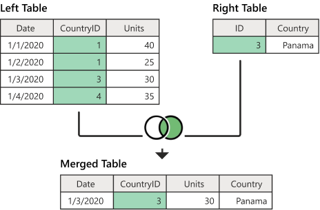

# 3-bo'lim

### 1-dars. Bog'lanishlar

Oldingi darslarda faqatgina bitta jadval ustida ishlagan edik. Lekin, haqiqiy proyektlarda, bir nechta jadvallar ustida ham amallar bajariladi.

Bundan tashqari, birlamchi (`primary key`) va tashqi (`foreign key`)larni ham ko'rgan edik, ya'ni jadvallarni o'zaro bog'lashda maydonlar yaratgan edik. Bu bo'limimizda mana shu maydonlar orqali bir nechta jadvallarni bog'lashni ko'ramiz.

Jadvallarning bir nechta usuli mavjud:

* `INNER JOIN` - ichki bog'lash
* `LEFT JOIN`, `RIGHT JOIN` (yoki `LEFT OUTER JOIN`, `RIGHT OUTER JOIN`) - chap va o'ng bog'lanish
* `FULL JOIN` - to'liq bog'lanish
* `CROSS JOIN` - kesishmali bog'lanish
* `SELF JOIN` - o'ziga bog'lanish

`JOIN`-lar bilan ishlashdan oldin chap va o'ng jadvallar nima ekanligini tushunib olaylik. Ikkita jadvalni birlashtirishda, shartli ravishda, 1-jadvalni 2-jadval bilan birlashtiramiz deymiz. Shu yerda 1-jadval chap tomondagi jadval, 2-si o'ng tomondagi jadval deyiladi. Jadvallarning joylashishi muhim hisoblanadi.

**INNER JOIN.**


Bu yerdagi `publishers` jadvali chap tomon jadvali deyiladi (chunki u 1-bo'lib kelgan), `books` jadvali esa o'ng tomon jadvali deyiladi. Bu ikki jadval orasida `INNER JOIN` qo'llanilsa, chap tomondagi jadvalning faqatgina o'ng tomondagi jadvalning `publisher_id` maydoniga mos kelgan qatorlari olinadi (bunda chap tomondagi jadvalning har bir qatoriga unga mos keluvchi o'ng tomondagi jadval ma'lumotlari qo'shiladi). Misol uchun, tepadagi rasmga qarasak, `books` jadvalidagi  1-qatorining `publisher_id`-si 1 ga teng, ya'ni, `books` jadvalining birinchi qatori `publishers` jadvalining 1-qatoriga bog'langan ma'lumot yangi jadvaldan joy olgan. Natijada, faqat `books` jadvalining `publisher_id` va `publishers` jadvalining `id` maydonlari bir xil bo'lgan ikkala jadval ma'lumotlari yangi jadvalda chiqadi.

**LEFT OUTER JOIN**.


Yuqoridagi rasmdan ko'rib turganingizdek, `INNER JOIN`-dan farqi, natijaviy jadvalda `publishers` jadvalidagi ma'lumotlarning `books` jadvalidagi `publisher_id` maydoni bilan mos kelmaganlari ham chiqyapti. Farqi, mos kelmagan `publishers` jadvali ma'lumotlarining `books` ma'lumolari chiqadigan qismi `NULL` bo'lib chiqyapti, ya'ni ma'lumot bo'sh. Haqiqatdan ham, `publishers` jadvalidagi 3-4-5-qatorlariga `books` jadvalidagi birorta qator bog'lanmagan.

`LEFT JOIN`-ning `INNER JOIN`-dan farqi ham shunda. `INNER JOIN` faqat tashqi kalit bilan bog'langan ma'lumotlarni olib bersa, `LEFT JOIN` tashqi kalit bilan bog'langan maydonlardan tashqari, 1-jadvalning qolgan - bog'lanmagan ma'lumotlarni ham qo'shib chiqarib beradi.

**RIGHT OUTER JOIN**.

`RIGHT OUTER JOIN` ham xuddi `LEFT OUTER JOIN`-day ishlaydi. Farqi, `RIGHT OUTER JOIN`-da 2-jadvaldagi (bizning misolda `books`) bog'lanmagan ma'lumotlar qo'shib chiqariladi.


Berilgan misolda, natija xuddi `INNER JOIN`-dagi bilan bir xil chiqib qolgan. Chunki, `books` jadvalidagi barcha qatorlar `publishers` jadvaliga bog'langan.

**CROSS JOIN**.

Bu turdagi bog'lanish juda kam ham holatda ishlatiladi. Bu bog'lanishni keyinroq ko'rib chiqamiz. `CROSS JOIN`-da chap tomondagi jadvalning har bir qatorini o'ng tomondagi jadvalning har bir qatori bilan qo'shib chiqarib beradi.


Ko'rib turganingizdek, `CROSS JOIN` bizga doim ham kerak bo'lavermaydi.


### 2-dars. INNER JOIN

`INNER JOIN` haqida oldingi darsda ma'lumot berilgan edi. Bu darsda `INNER JOIN`-ga misol ko'ramiz.

Agar test MB-sidagi `products` jadvaliga qarasak, unda bir nechta tashqi kalitli mayodonlar mavjud. Ya'ni, bu jadval boshqa bir nechta jadval ma'lumotlari bilan bog'langan. Misol uchun, `supplier_id` maydonini olaylik (`suppliers` jadvali bilan bog'langan).

Agar biz `products` jadvali ma'lumotini, misol uchun, statistika sahifasida chiqarishimiz kerak bo'lib qolsa va bu sahifada yetkazib beruvchi haqidagi ma'lumotlarni ham ko'rsatishimiz kerak bo'lsa, buning uchun avvalo, `products` va `suppliers` jadvallarini `INNER JOIN` bilan bog'lab olamiz.

```bash
SELECT product_name, suppliers.company_name, units_in_stock 
FROM products
INNER JOIN suppliers ON products.supplier_id = suppliers.supplier_id 
ORDER BY units_in_stock DESC
```


Yana, bir misol, mahsulotlarni kategoriya bo'yicha guruhlab, kategoriya nomi va shu kategoriyadagi mahsulotlarning narxlari yig'indisi ro'yxatini chiqarishimiz kerak:

```bash
SELECT categories.category_name, SUM(units_in_stock)
FROM products
INNER JOIN categories on products.category_id = categories.category_id 
GROUP BY categories.category_name
ORDER BY SUM(units_in_stock) DESC
LIMIT 5;
```


Murakkabroq misol:

```bash
SELECT categories.category_name, SUM(unit_price * units_in_stock)
FROM products
INNER JOIN categories on products.category_id = categories.category_id 
WHERE discontinued <> 1
GROUP BY categories.category_name
HAVING SUM(unit_price * units_in_stock) > 5000
ORDER BY SUM(units_in_stock) DESC
LIMIT 5;
```

Tovarlarining umumiy narxi 5000-dan yuqori bo'lgan 5 ta kategoriyani olish so'rovi.

Misol. Endi ikkitadan ko'p jadvallarni bog'lab ko'raylik:

```bash
SELECT order_date, product_name, ship_country, unit_price, quantity, discount
FROM orders
INNER JOIN order_details ON orders.order_id = order_details.order_id 
INNER JOIN products ON order_details.product_id = products.product_id;
```

Yuqoridagi so'rov `orders`, `order_details` va `products` jadvallarini bog'lab, ulardan berilgan maydonlarni olib berishi kerak. Lekin, bu so'rovni ishga tushirsak quyidagi xato kelib chiqadi:


Xatoga qaraydigan bo'lsak, xatolik `unit_price` maydonini olishda chalkashlik paydo bo'lgani haqida aytilgan. Ya'ni, `unit_price` maydoni ham `order_details` jadvalida, ham `products` jadvalida mavjud va `SQL` qaysi jadvaldan bu maydonni olishni bilmay xatolik chiqarib beryapti.

`SQL`-ga qaysi jadvalning `unit_price` maydonini olishini bildirish uchun esa, bu maydonnig jadvali nomini ham berishimiz kerak bo'ladi. Bunda yuqoridagi so'rov quyidagicha o'zgaradi:

```bash
SELECT order_date, product_name, ship_country, products.unit_price, quantity, discount
FROM orders
INNER JOIN order_details ON orders.order_id = order_details.order_id 
INNER JOIN products ON order_details.product_id = products.product_id;
```


`INNER JOIN` bilan xohlagancha jadvallarni bog'lab chiqarish mumkin.

### 3-dars. LEFT, RIGHT JOIN

`LEFT` va `RIGHT JOIN`-lar ko'p ishlatildigan bog'lanish turlaridan hisoblanadi.

**LEFT JOIN.**

`LEFT JOIN` bo'g'lanishi `INNER JOIN`-dan deyarli farq qilmaydi. Agar ikkala jadvaldagi bog'lovchi kalitlar o'zaro to'liq mos kelsa, ikkala bog'lanish ham bir xil natija beradi.

Farqi, `LEFT JOIN`-da 1-jadvalning 2-jadval bilan mos kelmagan ma'lumotlari ham natijaviy jadvalda chiqadi, lekin 2-jadvaldan olinadigan ma'lumot qismi bo'sh turadi.


1-darsda `LEFT JOIN` haqida ma'lumot berilgan edi. Shu sababli tezda misol ko'rishga o'tamiz.

Misol:

```bash
SELECT company_name, product_name
FROM suppliers
LEFT JOIN products ON suppliers.supplier_id = products.supplier_id;
```

`LEFT JOIN` so'rovi ham `INNER JOIN` bilan deyarli bir xilda yoziladi. Faqat, mos kelmagan ma'lumotlari ham natijaviy jadvalda chiqishi kerak bo'lgan jadval 1-bo'lib ishlatilishi kerak bo'ladi (`FROM` dan keyin yoziladigan jadval nomi).

**RIGHT JOIN**.

`RIGHT JOIN` bog'lanishi `LEFT JOIN` bilan bir xil bo'ladi. Farqi, `LEFT JOIN`-da 1-bo'lgan jadval `RIGHT JOIN`-da 2-jadval bo'ladi. `LEFT JOIN`-da keltirilgan misolni `RIGHT JOIN`-da yozamiz:

```bash
SELECT company_name, product_name
FROM products
RIGHT JOIN suppliers ON products.supplier_id = suppliers.supplier_id;
```

Bu so'rovda ham `LEFT JOIN`-dagisi bilan bir xildagi natija chiqadi.




**FULL JOIN**.

`FULL JOIN` bog'lanishi `LEFT` va `RIGHT JOIN`-larning birlashmasi hisoblanadi. Ya'ni, jadvallarda mos tushgan qatorlar bitta qilib chiqariladi, ikkala jadvaldagi qolgan barcha ma'lumotlar shundayligicha natijaviy jadvalda chiqariladi. O'zaro mos kelmagan qatorlarning ma'lumot yo'q qismi `NULL` bilan chiqadi.


**CROSS JOIN**.

`CROSS JOIN` deyarli ishlatilmaydi. Bu bog'lanishga misol qilib quyidagini keltirish mumkin:

Aytaylik, biz kafega kirib nonushta buyurtma qilmoqchimiz. Stolga o'tirishimiz bilan menyuga qaraymiz va qaysi taom va ichimliklar kombinatsiyasi eng mazali bo'lishi haqida o'ylay boshlaymiz. Bizning miyamiz bu signalni olib, barcha ovqat va ichimliklar kombinatsiyasini ishlab chiqishni boshlaydi:


Mana shunday holatlarni `CROSS JOIN`-ga misol qilish mumkin.

```bash
SELECT * FROM Meals 
CROSS JOIN Drinks;
```

### 4-dars. SELF JOIN

`SELF JOIN`-dan iyerarxiya ko'rinishidagi ma'lumotlar bitta jadvalda saqlanganda ma'lumotlarni birlashtirib olishda ishlatiladi.

Masalan, biror firmada bir qancha xodimlar ishlaydi. Firmadagi ba'zi xodimlar boshqa ba'zi xodimlarga bo'ysunadi, ya'ni, xodimlar boshqaruvi iyerarxiyasi mavjud. Ularning ma'lumotlari esa bitta `employees` jadvalida saqlanadi.

```bash
CREATE TABLE employees (
    employee_id INT PRIMARY KEY,
    first_name VARCHAR (255) NOT NULL,
    last_name VARCHAR (255) NOT NULL,
    manager_id INT,
    FOREIGN KEY (manager_id) 
    REFERENCES employee (employee_id) 
    ON DELETE CASCADE
);

INSERT INTO employees (
    employee_id,
    first_name,
    last_name,
    manager_id
)
VALUES
    (1, 'Kamolov', 'Kamol', NULL),
    (2, 'Salomov', 'Salom', 1),
    (3, 'Alimov', 'Alim', 1),
    (4, 'Halimov', 'Halim', 2),
    (5, 'Jalilov', 'Jalil', 2),
    (6, 'Shamilov', 'Shamil', 2),
    (7, 'Zamirov', 'Zamir', 3),
    (8, 'Damirov', 'Damir', 3);
```

Endi, bizga har bir xodimni u bo'ysunadigan boshqa xodim `id`-si bilan chiqarib berish vazifasi yuklatildi. Buni quyidagicha bajaramiz:

```bash
SELECT e.first_name || ' ' || e.last_name AS employee,
	   e2.first_name || ' ' || e2.last_name AS manager
FROM employees e
LEFT JOIN employees e2 ON e2.employee_id = e.manager_id
ORDER BY manager DESC;
```

Bu yerda maqsadga qarab `LEFT JOIN` o'rniga `INNER JOIN`-dan ham foydalanish mumkin.

### 5-dars. USING va NATURAL JOIN

Faraz qilaylik, quyidagicha katta hajmli so'rovimiz bor:

```bash
SELECT contact_name, company_name, phone, first_name, last_name, title,
	   order_date, product_name, ship_country, products.unit_price, quantity, discount
FROM orders
JOIN order_details ON orders.order_id = order_details.order_id
JOIN products ON order_details.product_id = products.product_id 
JOIN customers ON orders.customer_id = customers.customer_id
JOIN employees ON orders.employee_id = employees.employee_id 
WHERE ship_country = 'USA';
```

Lekin, bu so'rov anchagina katta va o'qishga qiyin. Uni biroz qisqartiramiz. Qisqartirishni **USING** kalit so'zi orqali amalga oshiramiz.  So'rovga qarasangiz, bog'lanishda bir xildagi ustun nomlari qo'llanilgan. Bog'lovchi ustunlarni `USING` bilan ifodalaymiz:

```bash
SELECT contact_name, company_name, phone, first_name, last_name, title,
	   order_date, product_name, ship_country, products.unit_price, quantity, discount
FROM orders
JOIN order_details USING(order_id)
JOIN products USING(product_id)
JOIN customers USING(customer_id)
JOIN employees USING(employee_id)
WHERE ship_country = 'USA';
```

> USING bilan bog'lashda bog'lanuvchi ustun nomlari bir xil bo'lishi kerak

Bundan tashqari **NATURAL JOIN** bog'lanishi ham mavjud. Bu bog'lanish ham so'rovni ancha qisqa ko'rinishda yozishga yordam beradi:

```bash
SELECT order_id, customer_id, first_name, last_name, title
FROM orders
NATURAL JOIN employees;
```

`NATURAL JOIN`-ning sintaksisi:

```bash
SELECT select_list
FROM T1
NATURAL [INNER, LEFT, RIGHT] JOIN T2;
```

`NATURAL JOIN`-da ham ikkala jadvaldagi bog'lovchi ustun nomlari bir xil bo'lishi kerak.

### 6-dars. AS

Oldingi darslarda `COUNT`, `SUM` kabi agregat funksiyalardan foydalanganib natija chiqarganimizda ularga mos ustun nomi funksiya nomi bilan chiqariladi. Ko'pgina hollarda esa bunday ustunlarga o'zimizga kerakli nomni berishimiz kerak bo'ladi. Buning uchun esa maxsus `AS` kalit so'zidan foydalanamiz.

```bash
SELECT COUNT(*) AS employees_count
FROM employees;
```


Lekin, post filter (HAVING) psevdonim nomlarni qo'llamaydi:


Bu yerda psevdonim nom o'rniga agregat funksiyaning aynan o'zi ishlatilishi kerak:


