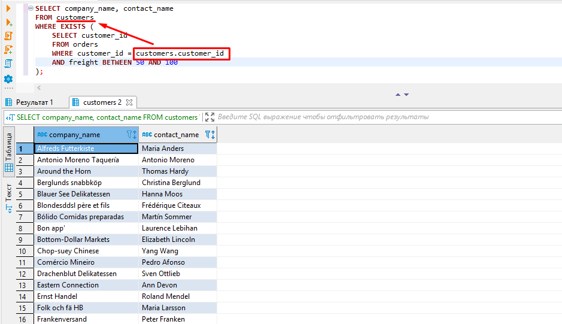

# 4-bo'lim

### 1-dars. Ost-so'rovlar.

Ba'zi paytlarda, proyektlarda anchagina murakkab so'rovlarni yozishga to'g'ri keladi. Shu paytgacha yozgan so'rovlarimiz esa unchalik ham murakkab emas edi.

Agar juda murakkab so'rov yozishga to'g'ri kelsa, uni ost-so'rovlarga ajratib yozishga harakat qilib ko'rish kerak. Chunki, bunda katta murakkab so'rovni butunicha tushunishdan ko'ra, uni mayda qismlarga bo'lib tushunish osonroq bo'ladi.

Ba'zi hollarda esa, ayrim so'rovlarni ost-so'rovlarga bo'lmay hal qilishning deyarli  iloji bo'lmaydi.

Ba'zi hollarda esa, ost-so'rovlardan foydalanmaslik ham kerak bo'ladi. Masalan, uning o'rniga bog'lanishlardan foydalanish mumkin bo'lsa.

Ost-so'rovlardan doim ham foydalanmagan ma'qulmi?

* Shart emas. Vaziyatga qarash kerak.
* Agar ost-so'rov bog'lanishlar bilan bir xilda samarador bo'lsa, qaysi birini o'qish oson bo'lsa, o'shanisidan foydalanish kerak.

Vazifa: mijozlar buyurtma bergan mamlakatlardagi barcha yetkazib beruvchi kompaniyalarni chiqarib bering.

Buning uchun avvalo, buyurtma beruvchi mijozlar joylashgan davlatlarni topamiz:

```bash
SELECT DISTINCT country
FROM customers;
```

Keyin esa, olingan ro'yxatdagi davlatlarda joylashgan yetkazib berish kompaniyalarini topamiz. Bunda filterlashda `IN` dan keyin qavs ichida yuqoridagi so'rovni beramiz:

```bash
SELECT company_name
FROM suppliers
WHERE country IN (
	SELECT DISTINCT country
	FROM customers
);
```

Bu so'rov quyidagi bilan bir xil hisoblanadi:

```bash
SELECT company_name
FROM suppliers
WHERE country IN ('Argentina', 'Spain', 'Switzerland', 'Italy', 'Venezuela');
```

Farqi, oldingi so'rovimizda qavs ichida berilgan davlat nomlarini so'rov bilan `customers` jadvalidan olamiz.

Endi oxirgi so'rovimizni `JOIN` bilan yozib ko'ramiz:

```bash
SELECT DISTINCT suppliers.company_name 
FROM suppliers
JOIN customers USING(country);
```

Keyingi vazifa. Mahsulotlar narxining yig'inidisini kategoriya bo'yicha guruhlab chiqarish kerak bo'lsin. Bunda chiquvchi ma'lumotlar soni `products` jadvalining eng kichik `product_id`-siga 4 qo'shilganidan oshmasin:

```bash
SELECT category_name, SUM(units_in_stock)
FROM products
INNER JOIN categories USING(category_id)
GROUP BY category_name
ORDER BY SUM(units_in_stock)  DESC
LIMIT (SELECT MIN(product_id) + 4 FROM products);
```

Vazifa: `products` jadvalida narxi barcha mahsulotlarning o'rtacha narxidan yuqori bo'lgan mahsulotlarni chiqaring.

```bash
SELECT product_name, units_in_stock 
FROM products
WHERE units_in_stock > (
	SELECT AVG(units_in_stock)
	FROM products
)
ORDER BY units_in_stock;
```

### 2-dars. Ost so'rovlar. WHERE EXISTS

Ost-so'rovlarni o'rganishni davom ettiramiz. Bu darsda **WHERE EXISTS** tuzilmasini ost so'rovlarda ishlatishini o'rganamiz. Tuzilmaning ishlashi quyidagicha: agar ost-so'rovdan hech bo'lmaganda bitta qator qaytsa `WHERE EXISTS` tuzilmasi true qaytaradi. Bu yerda `WHERE` so'rovda filter vazifasida kelmaydi.

Misol. 50-dan 100-gacha og'irlikdagi buyurtma qilgan kompaniya va buyurtmachi nomini olaylik:

```bash
SELECT company_name, contact_name 
FROM customers
WHERE EXISTS (
	SELECT customer_id 
	FROM orders
	WHERE customer_id = customers.customer_id 
	AND freight BETWEEN 50 AND 100
);
```



Misol. *'1995-02-01'* va *'1995-02-15'* sanalari orasida buyurtma qilinmagan kompaniya va buyurtmachi nomini chiqarish:

```bash
SELECT company_name, contact_name 
FROM customers
WHERE NOT EXISTS (
	SELECT customer_id 
	FROM orders
	WHERE customer_id = customers.customer_id 
	AND order_date BETWEEN '1995-02-01' AND '1995-02-15'
);
```

Misol.

```bash
SELECT product_name
FROM products
WHERE NOT EXISTS (
	SELECT orders.order_id FROM orders
	JOIN order_details USING(order_id)
	WHERE order_details.product_id = product_id 
	AND order_date BETWEEN '1995-02-01' AND '1995-02-15'
)
```

### 3-dars. Ost-so'rovlar darsi davomi. ANY, ALL

Misol. 40 tadan ko'p mahsulot buyurtma qilgan kompaniyalarni olish (kompaniyalar takrorlanmasdan chiqishi kerak). Buni `JOIN` bilan amalga oshiramiz:

```bash
SELECT DISTINCT company_name
FROM customers
JOIN orders USING(customer_id)
JOIN order_details USING(order_id)
WHERE quantity > 40;
```

Shu bilan birga ost-so'rov yordamida qilsa ham bo'ladi:

```bash
SELECT DISTINCT company_name
FROM customers
WHERE customer_id = ANY(
	SELECT DISTINCT customer_id
	FROM orders
	JOIN order_details USING(order_id)
	WHERE quantity > 40
);
```

Bu yerda `customers` jadvalidan `customer_id`-si ost-so'rovdan olingan `customer_id`-lar jadvalidan xohlagan `customer_id`-ga teng bo'lgan qatorlarni chiqarish bajarilyapti. Ixtiyoriy `customer_id`-ni olib berishni `ANY` operatori bajaradi.

Bu so'rovni quyidagi so'rov bilan almashtirish mumkin. Farqi, ost-so'rovdan olinadigan `customer_id`-lar statik beriladi:

```bash
SELECT DISTINCT company_name
FROM customers
WHERE customer_id IN ('OLDWO', 'WARTH', 'QUEEN', 'ANTON', 'RATTC', 'FRANK', 'FAMIA');
```

Misol. Soni buyurtma qilingan mahsulotlarning o'rtacha sonidan ko'p bo'lgan mahsulotlarni chiqarish:

```bash
SELECT DISTINCT product_name, quantity
FROM products
JOIN order_details USING(product_id)
WHERE quantity > (
	SELECT AVG(quantity) 
	FROM order_details
)
ORDER BY quantity ASC;
```

Misol. Buyurtma qilingan har bir mahsulot turining o'rtacha sonlaridan ham katta bo'lgan mahsulotlar sonini olish:

```bash
SELECT DISTINCT product_name, quantity
FROM products
JOIN order_details USING(product_id)
WHERE quantity > ALL(
	SELECT AVG(quantity) 
	FROM order_details
	GROUP BY product_id
)
ORDER BY quantity 
```

Bu yerda `ALL` operatori ost-so'rovdan chiqadigan barcha o'rtacha sonlar ro'yxatini filterga olib beradi.
