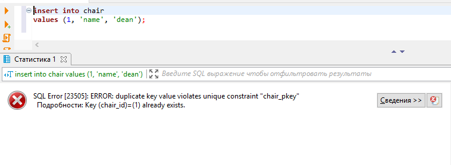
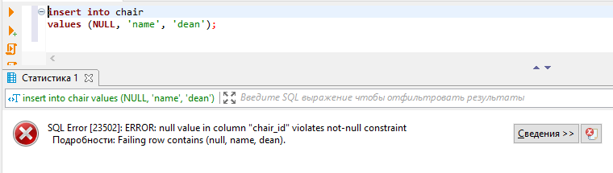
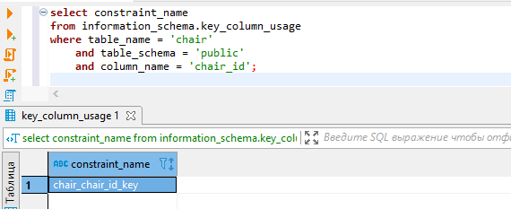
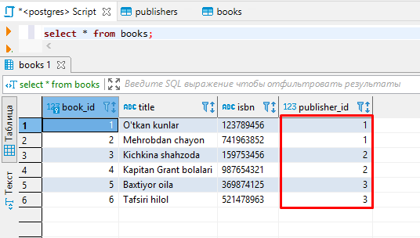
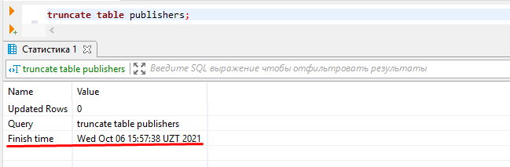
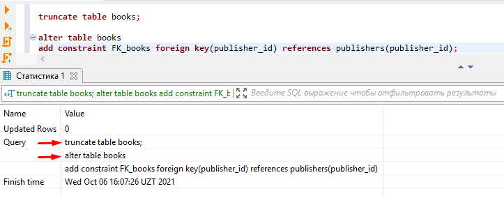
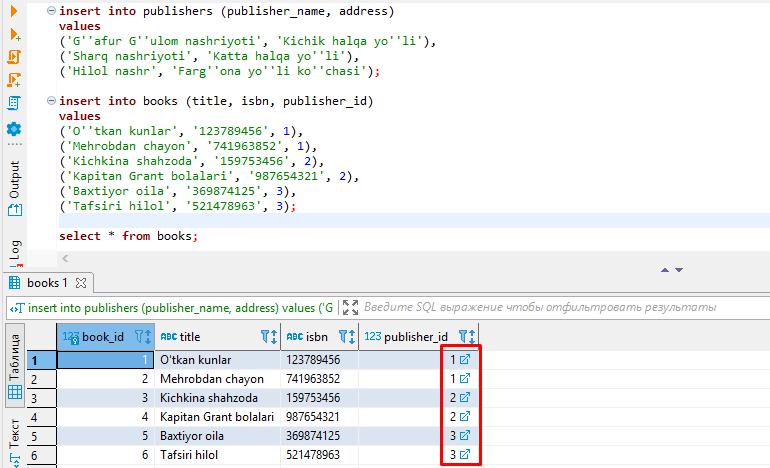
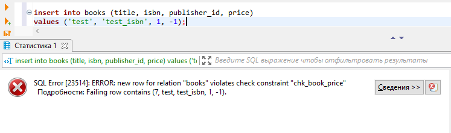
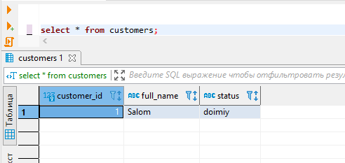

# 5-bo'lim

### 1-dars. DDL

**DDL - Data Defenition Language**. `DDL` - `SQL` tilining bir qismi bo'lib, u ma'lumotlarni yaratish, o'zgartirish va o'chirish kabi ishlarni bajarishda qo'llaniladi.

Bu darsda quyidagi tuzilmalarni o'rganamiz:

* **CREATE TABLE jadval_nomi** - jadval yaratish
* **ALTER TABLE jadval_nomi** - mavjud jadvalni o'zgartirish
  * **ADD COLUMN ustun_nomi malumot_tipi** - mavjud jadvalga ustun qo'shish
  * **RANAME TO jadvalning_yangi_nomi** - mavjud jadval nomini o'zgartirish
  * **RANAME ustunning_eski_nomi TO ustunning_yangi_nomi** - jadvaldagi ustun nomini o'zgartirish
  * **ALTER COLUMN ustun_nomi SET DATA TYPE malumot_tipi** - jadvaldagi ustun ma'lumotlarini o'zgartirish
* **DROP TABLE jadval_nomi** - jadvalni o'chirish
* **TRUNCATE TABLE jadval_nomi** - jadval ichidagi ma'lumotlarni tozalab tashalash. Bu yerda, agar jadvalda tashqi kalit (foreign key)li ustun mavjud bo'lsa, TRUNCATE jadvalni tozalay olmaydi.
* **DROP COLUMN ustun_nomi** - jadvaldagi ustunni o'chirish

**CREATE TABLE.**

Jadval yaratishni oldingi darslarda ko'rgan edik. Bu darsda ham misol ko'ramiz. *Talaba* va *kafedra* jadvallarini yaratamiz:

```bash
create table students
(
	student_id serial,
	first_name varchar,
	last_name varchar,
	birthday date,
	phone varchar
);

create table cathedra
(
	cathedra_id serial,
	cathedra_name varchar,
	dean varchar
);

create table faculty
(
	faculty_id serial,
	faculty_name varchar
); -- fakultetlarga ma'lumot kiritiladi. ma'lumot kiritishni keyingi darslarda ko'ramiz.
```

**ALTER TABLE.**

**ADD COLUMN.**

```bash
alter table students 
add column middle_name varchar;

alter table students 
add column rating float;

alter table students 
add column enrolled date;
```

**DROP COLUMN.**

```bash
alter table students 
drop column middle_name;
```

**RENAME TO.**

```bash
alter table cathedra 
rename to chair;
```

**RENAME ... TO**

```bash
alter table chair
rename cathedra_id to chair_id;

alter table chair
rename cathedra_name to chair_name;
```

**ALTER COLUMN**

```bash
alter table students 
alter column first_name set data type varchar(64);

alter table students
alter column last_name set data type varchar(64);

alter table students
alter column phone set data type varchar(30);
```

**TRUNCATE TABLE.**

```bash
truncate table faculty;
```

`TRUNCATE` bilan jadval tozalanganda,` serial` ketma-ketligini tozalamaydi. Shu sababli ham tozalangan jadvalga ma'lumot kiritilsa yangi `id`-lar oldingi kelib qolgan sondan boshlanib ketadi.

`id` qaytadan 1 bilan boshlanishi uchun, uni `RESTART` qilish kerak bo'ladi (odatiy holatda `CONTINUE` bo'lib tozalanadi):

```bash
truncate table faculty restart identity;
```

`truncate table faculty;` va `truncate table faculty continue identity;` so'rovlari bir xil amalni bajaradi.

**DROP TABLE.**

```bash
drop table faculty;
```

### 2-dars. PRIMARY KEY

**PRIMARY KEY** cheklovi jadvaldagi har bir yozuv (qator)ga takrorlanmas identifikatsiya berishda ishlatiladi.

> Primary key-lar UNIQUE qiymat qabul qilib, NULL qiymatiga ega bo'la olmaydi.

Shu bilan birga, jadvalda faqatgina bitta `PRIMARY KEY` bo'lishi mumkin. Bu `PRIMARY KEY` esa bir yoki bir nechta ustunlardan tashkil topgan bo'lishi mumkin.

Jadvalga `primary key` qo'shishni ko'raylik:

```bash
create table chair
(
	chair_id serial primary key,
	chair_name varchar,
	dean varchar
);
```

Endi jadvalga ma'lumot yozib ko'ramiz:

```bash
insert into chair (chair_name, dean)
values ('name', 'dean');
```

Bu yerda yangi yozuv jadvalga *1* `chair_id` bilan yoziladi. Agar, jadvalga yana *1* `chair_id`-li yangi yozuv qo'shmoqchi bo'lsak, tizim xatolik beradi:



Bundan tashqari, `chair_id`-ga `NULL` qiymat bersa ham xatolik beradi:




Chunki, `chair_id` `PRIMARY KEY` bilan e'lon qilingan.

Yuqorida `PRIMARY KEY` bilan jadval yaratish so'rovi quyidagi so'rov bilan deyarli bir xil:

```bash
create table chair
(
	chair_id serial unique not null,
	chair_name varchar, 
	dean varchar
);
```

Ularning farqi, jadvalda `PRIMARY KEY` faqatgina bitta bo'lishi mumkin bo'lsa, `UNIQUE NOT NULL` esa bir nechta bo'lishi mumkin.

> Yuqoridagi so'rovda berilgan `NOT NULL` ifodasi ham cheklov hisoblanadi. U o'zi berilayotgan ustunga `NULL` qiymati berib bo'lmasligini bildiriadi. Bu cheklovni jadvalda bir necha marotaba ham ishlatish mumkin.

`PRIMARY KEY`-dan foydalanishdan maqsad jadvalda tashqi kalit (`foreign key`)larni bog'lash hisoblanadi.

Umumiy qilib aytganda, odatda, `PRIMARY KEY`-dan jadvalda `UNIQUE` va `NOT NULL` bo'lgan, hamda `autoincrement` (qiymatni avto-oshishi) bo'lgan jadval identifikatsiyasini e'lon qilish uchun ishlatiladigan maydonga beriladi.

Barcha cheklovlarning o'zining nomi bo'ladi. Shu qatorda har bir jadvalga beriladigan `PRIMARY KEY`-ning ham nomi bor. Misol uchun yuqorida ochgan chair jadvalimizdagi `PRIMARY KEY` nomini olib ko'raylik:

```bash
select constraint_name
from information_schema.key_column_usage
where table_name = 'chair'
    and table_schema = 'public'
    and column_name = 'chair_id';
```



Demak chair jadvaliga `chair_chair_id_key` nomi berilgan. Agar, `PRIMARY KEY` nomini o'zimiz bermasak, buni tizimning o'zi amalga oshiradi.

Endi, `PRIMARY KEY`-ga nom berib e'lon qilaylik:

```bash
create table chair
(
	chair_id serial,
	chair_name varchar,
	dean varchar,

	constraint PK_chair_chair_id primary key (chair_id)
);
```

Jadvaldan `PRIMARY KEY` cheklovini o'chirib tashlash:

```bash
alter table chair
drop constraint chair_chair_id_key;
```

Jadvalga `PRIMARY KEY` o'rnatish:

```bash
alter table chair
add primary key (chair_id);
```

### 3-dars. FOREIGN KEY

**FOREIGN KEY** biror jadvaldagi bitta maydonni boshqa jadvaldagi `PRIMARY KEY` chekloviga ega maydonga havola bilan bog'laydi. `SQL`-da `FOREIGN KEY` cheklovi boshqa `SQL` amallariga jadvallar orasidagi havolali bog'lanishlarni uzishga yo'l qo'ymaydi.

`FOREIGN KEY` o'rnatilgan jadval **farzand jadval (child table)**, u bog'langan `PRIMARY KEY`-li jadval esa **ota jadval (parent table)** deyiladi.

Endi misol ko'raylik. Faraz qilaylik, `publishers` va `books` jadvallarimiz bor bo'lib, `books` jadvali `publishers` jadvaliga `publisher_id` maydoni orqali bog'lanadi:

```bash
create table publishers
(
	publisher_id serial,
	publisher_name varchar(128) not null,
	address text,

	constraint pk_publishers_publisher_id primary key (publisher_id)
);

create table books
(
	book_id serial,
	title text not null,
	isbn varchar (32) not null,
	publisher_id int,

	constraint pk_books_book_id primary key (book_id)
);
```

So'rovda ko'rganingizdek, `publisher_id` `FOREIGN KEY`-siz e'lon qilingan. Bu degani agar `books` jadvalidagi `publisher_id` maydoniga `publishers` jadvalidagi biror qatorning `publisher_id` maydoni qiymati yozilib, shu jadvalga bog'lansa, bu bog'lanish faqatgina mantiqiy bog'lanish bo'lib qoladi. Ya'ni, biz `books` jadvalidagi biror qatorning `publisher_id` maydoniga yozilgan qiymatga qarab turibgina qator shu qiymatga mos keluvchi `publishers` jadvalidagi qatorga bog'langan deb aytishimiz mumkin. Lekin, bunda ular orasida hech qanday bog'lovchi havola mavjud bo'lmaydi. Agar `books` jadvalida `publishers` jadvali qatorlariga bog'liq bo'lgan ma'lumot bo'lsa ham, `publishers` jadvalidan biror bir qator yoki qatorlarni o'chirsak, ular hech qanday xatoliksiz o'chib ketadi. Bunga sabab esa, albatta, ularning `FOREIGN KEY` yordamida bog'lanmaganligi bo'ladi.

Buni misolda ko'ramiz. Avval, jadvallarni ma'lumot bilan to'ldiramiz:

```bash
insert into publishers (publisher_name, address)
values 
('G''afur G''ulom nashriyoti', 'Kichik halqa yo''li'),
('Sharq nashriyoti', 'Katta halqa yo''li'),
('Hilol nashr', 'Farg''ona yo''li ko''chasi');

insert into books (title, isbn, publisher_id)
values 
('O''tkan kunlar', '123789456', 1),
('Mehrobdan chayon', '741963852', 1),
('Kichkina shahzoda', '159753456', 2),
('Kapitan Grant bolalari', '987654321', 2),
('Baxtiyor oila', '369874125', 3),
('Tafsiri hilol', '521478963', 3);
```

`books` jadvalini ochib ko'radigan bo'lsak, `publisher_id` ustunida hech qanday havola yo'q:



Agar `publishers` jadvalini o'chiradigan bo'lsak yoki uni tozalab tashlaydigan bo'lsak ham hech qanday xatoliksiz o'chib ketadi:



Lekin, `books` jadvalida `publisher` jadvaliga bog'liq bo'lgan qatorlar qoladi. Bu esa keyinchalik noto'g'ri ma'lumotlar olinishiga sabab bo'ladi. Buni oldini olish uchun `FOREIGN KEY`-dan foydalanamiz. Avval, `books` jadvalining ma'lumotlarini ham tozalab olib, keyin uning `publisher_id` ustuniga `FOREIGN KEY` cheklovini o'rnatamiz:

```bash
truncate table books;

alter table books 
add constraint FK_books foreign key(publisher_id) references publishers(publisher_id);
```




`books` jadvalini ham tozalab olishimizdan maqsad, hozirda `publishers` jadvali bo'shligi sababli, `books` jadvalining `publisher_id` ustuni yo'q ma'lumotlarga bog'lana olmay, xatolik kelib chiqmasligi uchun qilinadi.

Endi ikkala jadvalga ham ma'lumotlarni qaytadan kiritib, `books` jadvali ma'lumotlariga qaraydigan bo'lsak, `publisher_id` ustunida havolani ko'rishimiz mumkin bo'ladi:




Jadvalni yaratish paytida esa `FOREIGN KEY` cheklovi quyidagicha beriladi:

```bash
create table books
(
	book_id serial,
	title text not null,
	isbn varchar (32) not null,
	publisher_id int,

	constraint pk_books_book_id primary key (book_id),
	constraint FK_books_publisher_id_key foreign key (publisher_id) references publishers(publisher_id)
);
```

`FOREIGN KEY`-ni o'chirish esa quyidagicha bajariladi:

```bash
alter table books 
drop constraint FK_books_publisher_id_key;
```

### 4-dars. CHECK

CHECK cheklovi jadval ustuniga berilayotgan qiymat intervaliga cheklov o'rnatadi. Agar jadvalning biror ustuniga CHEKC cheklovi berilgan bo'lsa, u holda shu ustun maydoni faqatgina ma'lum qiymatlarnigina qabul qiladi. Agar, ushbu cheklov jadvalning o'ziga berilgan bo'lsa, qatordagi belgilangan ustunlar maydonlariga cheklov o'rnatiladi.

Misol. Oldingi darsimizda ko'rgan misolimizdagi books jadvaliga yangi price nomli ustun qo'shaylik. Bu ustun faqatgina 0 dan katta bo'lgan qiymatlarni qabul qila olsin:

```bash
alter table books 
add column price decimal constraint chk_book_price check (price > 0);
```

Endi, agar books jadvaliga yangi ma'lumot kiritishda price maydoniga 0 dan kichik qiymat beradigan bo'lsak, tizim berilgan cheklovning buzilgani haqida xatolik chiqarib beradi:

```bash
insert into books (title, isbn, publisher_id, price)
values ('test', 'test_isbn', 1, -1);
```



### 5-dars. DEFAULT

**DEFAULT** checklovi yangi kiritilayotgan yozuvning maydoniga odatiy(`default`) qiymatni beradi. `DEFAULT` cheklovini cheklov ham deb bo'lmaydi. Chunki u hech narsani cheklamaydi, balki, yangi kiritilayotgan yozuvda biror maydonga qiymat berilmagan bo'lsa, shu maydonga oldindan berib qo'yilgan odatiy qiymatni o'rnatadi.

Misol. Avval `customer` nomli jadval ochib olamiz:

```bash
create table customer
(
	customer_id serial,
	full_name text,
	status varchar(15) default 'doimiy',

	constraint pk_customers_customer_id_key primary key (customer_id),
	constraint chk_customers_status check (status = 'doimiy' or status = 'yangi')
);
```

Bu yerda `customers` jadvalidagi `status` ustuniga `DEFAULT` cheklovini o'rnatdik va odatiy qiymat qilib `'doimiy'` so'zini berdik. Bu degani, agar `customers` jadvaliga yangi yozuv qo'shishda `status` maydoniga qiymat berilmasa, tizim unga `'doimiy'` so'zini qiymat qilib beradi.

Bundan tashqari, `CHECK` cheklovi bilan status maydoniga faqat ikkita qiymat qilishi ta'minlanyapti.

Endi, jadval ustuniga berilgan `DEFAULT` cheklovining ishlashini tekshirib ko'ramiz. `customers` jadvaliga quyidagicha yozuv qo'shaylik:

```bash
insert into customers (full_name)
values ('Salom');
```

Ko'rib turganingzidek, `status` maydoniga hech qanday qiymat bermadik. Kiritilgan ma'lumotni olib ko'rsak, `DEFAULT` bilan odatiy qilib berilgan so'z `status` maydoniga saqlanganiga ko'ramiz:



`DEFAULT` cheklovini jadvaldan quyidagi so'rov bilan o'chirib tashlaymiz:

```bash
alter table customers 
alter column status drop default;
```

Mavjud jadvalning ustuniga `DEFAULT` checklovini o'rnatish:

```bash
alter table jadval_nomi 
alter column ustun_nomi set default 'qiymat';
```
