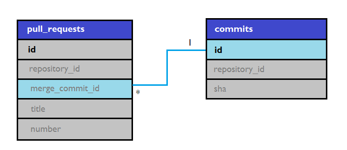

# PostgreSQL-da so'rovlarni qanday qilib 100 martagacha optimizatsiya qilish mumkin?

**LEFT JOIN**

SQL-da so'rov yozadigan har bir kishi `LEFT JOIN` va `INNER JOIN` orasidagi farqni bilishi kerak. Ko'pchilik darsliklarda join turlari, umumiy ustunlar o'zaro bog'liq bo'lganida, so'rov bajarilishiga qanchalik ta'sir qilishi aytib ketilmagan. Faraz qilyalik, ikkita jadvalimiz bor:



pull_requests jadvali commits jadvaliga merge_commit_id orqali bog'lanyapti

`pull_requests` jadvali Githubdagi pull request-lar haqidagi yozuvlarni o'zida saqlaydi. `commits` jadvali esa Githubdagi commitlar haqidagi ma'lumotlarni saqlaydi.

Quyidagicha `INNER JOIN` so'rovi berilgan:

```pgsql
SELECT pr.*, c.sha AS merge_commit_sha
FROM pull_requests pr
  INNER JOIN commits c ON pr.merge_commit_id = c.id
WHERE pr.repository_id IN (...)
```

PostgreSQLning planneri ozgina miqdordagi natijaviy qatorlarni va Nested Loop Join muammosini berishi mumkin. Bu muammo PostgreSQL bizning commit jadavalimiz `id`lari o'zaro bog'langan va birlashtirilgan qatorlar sonini hisoblash formulasida ularning tanlanishlarini ko'paytirib yuborishini bilmaganligi sababli kelib chiqadi. Shuning uchun ham agar taxminan 10mingta qator bilan ishlashga to'g'ri kelsa, yuqoridagi so'rov samaradorligi tushib ketib qoladi. Endi, `LEFT JOIN`ni ko'raylik:

```pgsql
SELECT pr.*, c.sha AS merge_commit_sha
FROM pull_requests pr
  LEFT JOIN commits c ON pr.merge_commit_id = c.id
WHERE pr.repository_id IN (...)
```

PostgreSQL planneri natijaviy qatorlarning bir xildagi sonini `pull_requests` jadvalidagi filterlangan qatorlar sifatida taxmin qiladi va ~10mingta qator bilan ishlashda Hash Left Joinni to'g'ri rejalashtirib oladi. Butun `commits` jadvali uchun xeshlashni amalga oshirmaslik uchun pull requestlar va commitlar doimo bitta repositoryda ekanligini belgilab qo'yamiz.

```pgsql
SELECT pr.*, c.sha AS merge_commit_sha
FROM pull_requests pr
  LEFT JOIN commits c ON pr.merge_commit_id = c.id
                         AND pr.repository_id = c.repository_id
WHERE pr.repository_id IN (...)
```

Oxirgi `LEFT JOIN` so'rovimiz natijaga hech qanday ta'sir ko'rsatmaydi. Biroq, so'rov tezligi ancha oshadi.

Bu yondashuvning haqiqiy foydasini ichma-ich JOINlarda ko'rish mumkin. PostgreSQL barch  oldindan filterlangan xesh jadvallarni keshlab qo'yadi va bu keshlangan xesh jadvallarni birlashtirish ancha oson. Nested Loopni esa keshlab bo'lmaydi. Yuqoridagi oxirgi so'rovda `INNER JOIN` dan `LEFT JOIN` ga o'tish orqali tezlikni 10x martadan 100x martagacha oshirdik.

**VALUESni xeshlash**

Juda ko'p miqdordagi `id`larni oluvchi `IN` so'rovini ko'rib chiqaylik (yoki "fat IN"):

```pgsql
SELECT *
FROM pull_requests
WHERE repository_id IN (... 9000tadan ko'p IDlar)
```

Bu so'rov odatda **Index** yoki **Bitmap** **Scan**ni ishlatadi. Bu so'rovni `VALUES` ni ishlatgan holda qaytib yozib chiqishimiz mumkin:

```pgsql
SELECT *
FROM pull_requests
WHERE repository_id = ANY(VALUES (101), (102), ...)
```

Agar taxmin qilingan qatorlar soni juda katta bo'ladigan bo'lsa, PostgreSQL Values Scan va, ehtimol, Hash Join orqali HashAggregate bilan boshqacha ishlaydi. Bu samardorlikka ham ta'sir qiladimi? Ha, ba'zan ta'sir qiladi.
