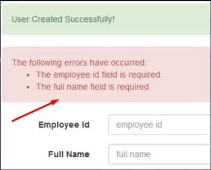

# Laravelda exceptionlar va error handling

Projectning business logic ustida ishlash jarayonida xatolik keltirib chiqaradigan holatlar bilan ham ishlashimizga to'g'ri keladi. Misol uchun, `PostRepository`dagi `update` metodini olaylik:

```php
//...
    public function update($post, array $attributes)
    {
        return DB::transaction(function () use ($post, $attributes) {
            $updated = $post->update([
                'title' => data_get($attributes, 'title', $post->title),
                'body' => data_get($attributes, 'body', $post->body)
            ]);

            if (!$updated) {
                throw new Exception('Failed to update'); // <== Xatolik qaytarish
            }

            if ($userIds = data_get($attributes, 'user_ids')) {
                $post->users()->sync($userIds);
            }

            return $updated;
        });
    }
//...
```

Lekin bunday ko'rinishda xatoliklar bilan ishlashdan ko'ra yaxshiroq usul bor. Laravelda xatoliklar bilan ishlash uchun maxsus joy mavjud. Bu - `app/Exceptions` papkasi. Bu papkada xatoliklar bilan ishlovchi `Handler` klasi joylashgan.

Odatda, Laravelda exception qaytarganimizda xatolik xabari quyidagi ko'rinishda bizga ko'rinadi:

`PostController` da yozilgan test exception:

```php
//...
    public function index(Request $request)
    {
        throw new Exception('Xatoli yuz berdi!');
        $page_size = $request->page_size ?? 20;
        $posts = Post::query()->paginate($page_size);

        return PostResource::collection($posts);
    }
//...
```

Natijasi quyidagicha bo'ladi:


# Custom Exception

Biz o'zimiz uchun ham exception klas yaratib, ishlatishimiz mumkin. Buning uchun `php artisan make:exception GeneralJsonException` buyrug'i yordamida o'zimizga kerakli exception klasini yaratib olamiz. Generatsiya qilingan exception class fayli `app/Exceptions` papkasiga tushadi:

```php
<?php

namespace App\Exceptions;

use Exception;

class GeneralJsonException extends Exception
{
    //
}

```

Exception classida odatda ikkita metod bo'ladi: `report` va `render`:

```php
<?php

namespace App\Exceptions;

use Exception;

class GeneralJsonException extends Exception
{
    /**
     * Report the exception
     *
     * @return void
     */
    public function report()
    {
    }


    /**
     * Render the exception as an HTTP response
     *
     * @param \Illuminate\Http\Request $request
     */
    public function render($request)
    {
    }
}

```

`report` metodining vazifasi xatolik haqida xabar berishga (report qilishga) bog'liq ishlarni bajaradi. Misol uchun, xatolik yuz berganda adminga bu haqida pochta orqali xabar yuborish kerak bo'lganda, bu ish report metodida amalga oshiriladi.

`render` metodi esa xatolik haqidagi xabarni kiruvchi HTTP so'rovga (request) HTTP javob (response) sifatida qaytaradi.

# Custom exception klasning render metodi

Biz frontend qismiga xatolik haqida xabar bermoqchi bo'lganimiz uchun, `render` metodini ishlatamiz:

```php
//...
    public function render($request)
    {
        return new JsonResponse([
            'errors' => [
                'message' => $this->getMessage(),
            ]
        ], $this->code);
    }
//...
```

Yozgan exception classimizni ishlatib ko'raylik:

```php
// PostController
//...
    public function index(Request $request)
    {
        throw new GeneralJsonException('Xatoli yuz berdi!', 422); // <== Exception classni ishlatib ko'ramiz
        $page_size = $request->page_size ?? 20;
        $posts = Post::query()->paginate($page_size);

        return PostResource::collection($posts);
    }
//...
```


# Custom exception klasning report metodi

Endi, yana `report` metodiga qaytaylik. Tepada aytilganiday, bu metod xatolik haqida tashqaridagi biror kishi/tizimga xabar berishda qo'llaniladi. Metod ichiga quyidagi kodni yozib, uning ishlashini tekshirib ko'raylik:

```php
//...
    public function report()
    {
        dump('Xabar adminga yuborildi');
    }
//...
```


Ko'rinib turibdiki, `report` metodi `render` metodidan avval ishlar ekan.

# HTTP response turini o'zgartirish

Bundan tashqari, xatolik turini bildiruvchi kodni ham klas ichida berib qo'yishimiz mumkin. Buning uchun, exception class meros olgan `ExceptionHandler` klasning `$code` xususiyatini klasimiz ichida qayta e'lon qilishimiz kerak:

```php
<?php

namespace App\Exceptions;

use Exception;
use Illuminate\Http\JsonResponse;

class GeneralJsonException extends Exception
{
    protected $code = 422; // <==
    //...
}

```

# Exceptionning asosiy Handler klasi bilan ishlash

Laravelning exceptionlar bilan ishlaydigan asosiy klasi - bu `app/Exceptions/Handler.php` faylida joylashgan `Handler` klasi hisoblanadi:

```php
<?php

namespace App\Exceptions;

use Illuminate\Foundation\Exceptions\Handler as ExceptionHandler;
use Throwable;

class Handler extends ExceptionHandler
{
    /**
     * A list of exception types with their corresponding custom log levels.
     *
     * @var array<class-string<\Throwable>, \Psr\Log\LogLevel::*>
     */
    protected $levels = [
        //
    ];

    /**
     * A list of the exception types that are not reported.
     *
     * @var array<int, class-string<\Throwable>>
     */
    protected $dontReport = [
    ];

    /**
     * A list of the inputs that are never flashed to the session on validation exceptions.
     *
     * @var array<int, string>
     */
    protected $dontFlash = [
        'current_password',
        'password',
        'password_confirmation',
    ];

    /**
     * Register the exception handling callbacks for the application.
     *
     * @return void
     */
    public function register()
    {
        $this->reportable(function (Throwable $e) {
            //
        });
    }
}

```

1. Bu klasdagi `$dontReport` xususiyati o'ziga berilgan boshqa exceptionlarning `report` metodi ishlashini to'xtatib qo'yadi:

```php
    protected $dontReport = [
        GeneralJsonException::class
    ];
```


Ko'rinib turganidek, bu yerda faqat `render` metodi ishlayapti.

2. `dontFlash` xususiyati esa, o'ziga berilgan input ma'lumotlarni, biror xatolik sodir bo'lganda frontend qismiga chiqarishni cheklaydi:

```php
//...
    protected $dontFlash = [
        'current_password',
        'password',
        'password_confirmation',
    ];
//...
```



3. `register` metodida ishlatilgan `reportable` metodi custom exception-dagi `report` metodi bilan bir xil ishni bajaradi:

```php
// Handler klasi
//...
    public function register()
    {
        $this->reportable(function (GeneralJsonException $e) {
            dump('1243');
        });
    }
//...
```


Bu metod ishlashi uchun, custom exception klasdagi `report` metodini o'chirib qo'yish kerak bo'ladi.

4. `register` metodidagi `renderable` metodi ham xuddi shunday ko'rinishda ishlaydi (xuddi `reportable` metodi kabi yoziladi. hozir u yozib qo'yilmagan).

# Qo'shimcha

Ba'zan, xatolik chiqishi bilan shunchaki oddiy HTTP xatolik qaytarishimiz kerak bo'ladi. Bunday hollarda `abort` funksiyasidan foydalansak bo'ladi:

```php
//...
abort(404);
//...
```

Yoki biror exception classning `report` metodini ishlatish kerak bo'lsa `report` funksiyasidan foydalanishimiz mumkin:

```php
//...
report(GeneralJsonException::class);
//...
```

# Yakun

Endi, yaratgan custom exception-imizni `PostRepository`da ishlatamiz:

```php
//...
    public function update($post, array $attributes)
    {
        return DB::transaction(function () use ($post, $attributes) {
            $updated = $post->update([
                'title' => data_get($attributes, 'title', $post->title),
                'body' => data_get($attributes, 'body', $post->body)
            ]);

            if (!$updated) {
                throw new GeneralJsonException('Failed to update'); // <==
            }

            if ($userIds = data_get($attributes, 'user_ids')) {
                $post->users()->sync($userIds);
            }

            return $updated;
        });
    }
//...
```

Yuqoridagi exception qaytarish qismini quyidagi kodga almashtirsak ham bo'ladi:

```php
//...
throw_if(!$updated, GeneralJsonException::class, 'Failed to update');
//...
```
