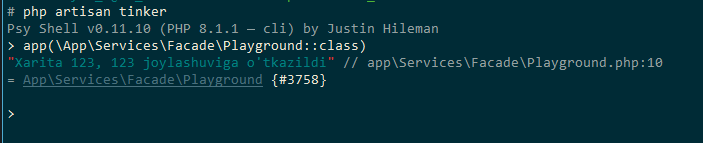
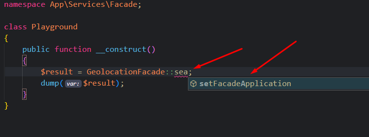
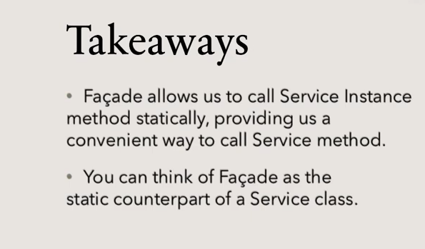

# Facade

Service Container mavzusida service container-dagi obyektlarni qanday olishni ko'rgan edik. Eslaydigan bo'lsak, service container-dan obyektlar `app(class_nomi::class)` ko'rinishida yoki **Auto** **Dependency Resoulution** orqali olish mumkin edi. 1-usul:

```php
<?php

namespace App\Services\Facade;

use App\Services\Geolocation\Geolocation;

class Playground
{
    public function __construct(Geolocation $geolocation) // <== 1-usul
    {
    }
}

```

2-usul:

```php
<?php

namespace App\Services\Facade;

use App\Services\Geolocation\Geolocation;

class Playground
{
    public function __construct()
    {
        $geolocation = app(Geolocation::class); // <== 2-usul
    }
}
```

Lekin, shu bilan birga service-lardan foydalanishning uchinchi usuli ham bor. Bunda facade-dan foydalaniladi. Facade service-larning metodlariga static ko'rinishda murojaat qilishi mumkin.

Endi facade-ni oldingi Geolocation class-lari misolida ko'rib chiqamiz.

Esingizda bo'lsa Geolocation class-ida search metodi bor edi. Shu metodni facade yordamida ishlatib ko'raylik. Avval, `app/Services/Facade` papkasida `GeolocationFacade.php` faylini yaratamiz va unda quyidagicha kod yozamiz:

```php
<?php

namespace App\Services\Facade;

use App\Services\Geolocation\Geolocation;
use Illuminate\Support\Facades\Facade;

class GeolocationFacade extends Facade // <==
{
    protected static function getFacadeAccessor()
    {
        return Geolocation::class; // <==
    }
}

```

Yuqoridagi kodda ko'rib turganingizdek, bu yerdagi eng asosiy jihat, class-ning `use Illuminate\Support\Facades\Facade;` class-idan meros olishi va uning `getFacadeAccessor()` static metodida facade qilinayotgan class-ning nomini qaytarishi bo'lyapti (izohda <== ko'rinishida belgilab ko'rsatilgan).

Nihoyat, yangi facade-imizning `search` metodini ishlatib ko'ramiz:

```php
<?php

namespace App\Services\Facade;

class Playground
{
    public function __construct()
    {
        $result = GeolocationFacade::search('a');
        dump($result);
    }
}

```

`Playground` class-ini `tinker` bilan ishlatib ko'ramiz:



Facade bo'yicha bizda faqat bitta kamchilik qoldi. Agar `GeolocationFacade` class-idan biror metodni chaqirmoqchi bo'lsak autocomplete (ya'ni IDE yoki text editor taklif qiladigan metod yoki xususiyatlar nomi. Ctrl + Space tugmalari bilan ham chiqarsa bo'ladi) ishlamaydi:



Rasmda ko'rinib turganidek, `Geolocation` class-idagi `search` metodini yozishni boshlasak, autocomplete mavjud metodni ko'rsatmayapti. Bu xususiyat bu facade class-da ishlashi uchun metodlarga `PHP documentation` yozishimiz kerak bo'ladi:

```php
//...
    /**
     * Search places by name
     *
     * @method static array search(string $string)
     * @see Geolocation
     * @param string $name
     * @return string
     */
    public function search(string $name)
    {
        //...

        $locationInfo = $this->map->findAddress($name);
        return $this->satellite->pinpoint($locationInfo);
    }
//...
```

Shu paytgacha service-larning obyektlarini chaqirishda `Dependency Injection` va `Facade` usullarini ko'rdik. Agar ulardan qaysi biri afzalroq deydigan bo'lsangiz, javob - ikkalasi ham yaxshi. Ikkalasi ham ishlatish qulay.


