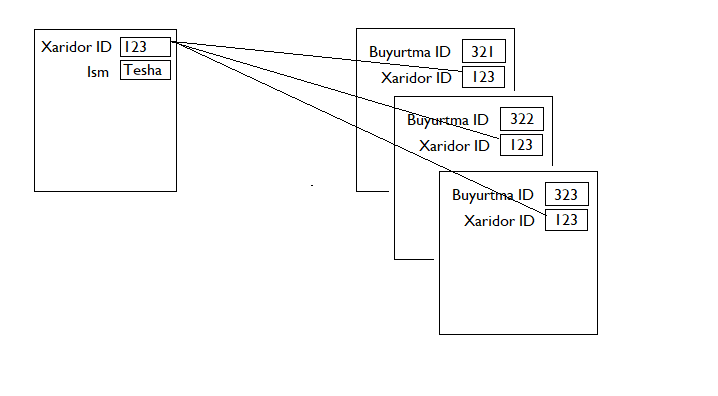

# One to One

One to One relationshipi databasedagi eng sodda relationship (bog'lanish) hisoblanadi. Misol uchun, bitta `User` modeli bitta `Phone` modeli bilan bog'langan bo'lishi mumkin.

Bu bog'lanishni model ichida ifodalash uchun `User` modeli ichida bitta `phone` degan metod ochamiz va bu metodda `Phone` modelini `hasOne`  metodiga argument qilib beramiz (`hasOne` metodi `Illuminate\Database\Eloquent\Model` ota klasida e'lon qilingan bo'ladi):

```php
<?php
 
namespace App\Models;
 
use Illuminate\Database\Eloquent\Model;
use Illuminate\Database\Eloquent\Relations\HasOne;
 
class User extends Model
{
    /**
     * Get the phone associated with the user.
     */
    public function phone(): HasOne
    {
        return $this->hasOne(Phone::class);
    }
}
```

Bog'lovchi metod e'lon qilinganidan keyin `User` modelidan oligan obyekt yordamida unga bog'langan `Phone` modeli ma'lumotlarini olishimiz mumkin bo'ladi. Buning uchun Eloquentning dinamik xususiyatlaridan foydalanamiz. Biz e'lon qilgan bog'lovchi metodga xuddi obyekt xususiyatiga murojaat qilgandek murojaat qilamiz. Eloquent esa bu dinamik xususiyat yordamida biz e'lon qilgan metodni chaqirib beradi:

```php
$phone = User::find(1)->phone;
```

`hasOne` metodi odatda ikkinchi parametr sifatida bog'lanayotgan jadvalining **foreign key**-ini oladi. Bizning misolda bog'lanayotgan jadvalimiz - bu phones jadvali, modeli esa `Phone` modeli. Misolimizda `hasOne` phones jadvalining `user_id` ustunini 2-parametr sifatida oladi.

```php
return $this->hasOne(Phone::class, 'foreign_key'); // Bu yerda foreign_key - bu Phone-ning user_id ustuni
```

Bundan tashqari, Eloquent `hasOne` metodida 3-parametr qilib, **foreign key** bog'lanadigan ota jadvalning (misolimizda users jadvali) `primary key` (odatda id ustuni primary key bo'ladi) bo'lgan ustuni `local_key` ko'rinishida beriladi. Ya'ni:

```php
return $this->hasOne(Phone::class, 'foreign_key', 'local_key'); // bu yerda local_key - bu User-ning id ustuni
```

**Teskari bog'lanishni amalga oshirish**
 Tepada User modeliga bog'langan Phone modelini ma'lumotlarini chaqirishni ko'rdik. Endi shuning teskarisi, Phone modeli bog'langan User modeli ma'lumotlarini chaqirishni ko'raylik. Bu ham xuddi oldingisi singari model klas ichida bog'lovchi metodni chaqirish orqali bajariladi. Endi, bola jadval uchun biz `belongsTo` metodini chaqirib ota jadvalga bog'lanamiz:

```php
<?php
 
namespace App\Models;
 
use Illuminate\Database\Eloquent\Model;
use Illuminate\Database\Eloquent\Relations\BelongsTo;
 
class Phone extends Model
{
    /**
     * Get the user that owns the phone.
     */
    public function user(): BelongsTo
    {
        return $this->belongsTo(User::class);
    }
}
```

Ko'rib turganingizdek, bu yerda ham xuddi oldingiga o'xshash usul, farqi bog'lovchi metod boshqa.

Odatda, agar `foreign key` va `owner key` larni Eloquentning o'zi jadval nomlariga `_id` qo'shish orqali aniqlab oladi. `Phone` modeli va `User` modeli bog'lanishida yuqoridagi `belongsTo` misoli uchun foreign key - `user_id` va owner key - `id`. Lekin, agar foreign key hamda local key nomlari standart kelishuvdagidan boshqacha nom bilan berilsa ular quyidagi ko'rinishda belgilab qo'yiladi:

```php
//...
/**
 * Get the user that owns the phone.
 */
public function user(): BelongsTo
{
    return $this->belongsTo(User::class, 'foreign_key', 'owner_key');
}
//...
```

# One To Many

One To Many bog'lanishda bitta jadvaldagi yozuvga boshqa jadvaldagi bir nechta yozuvlar bog'lanadi. Bu bog'lanishga misol qilib, onlayn do'konda bitta xaridorning bir nechta buyurtmalari (order-lari) bo'lishini keltirishimiz mumkin.



Laravelda One To Many bog'lanishni ota modelda `hasMany`, bola modelda `belongsTo` metodlari bilan amalga oshiriladi.

Ota modelda `hasMany`:

```php
<?php
 
namespace App\Models;
 
use Illuminate\Database\Eloquent\Model;
use Illuminate\Database\Eloquent\Relations\HasMany;
 
class Customer extends Model
{
    /**
     * Get the orders for the customer.
     */
    public function orders(): HasMany
    {
        return $this->hasMany(Order::class);
    }
}
```

Foreign keyni Laravelning o'zi jadval nomidan keyin `_id` qo'yish orqali avtomatik aniqlab oladi. Misol uchun, `customer_id`.

Endi, bitta xaridorning buyurtmalarini olish uchun yuqoridagi `order()` metodiga xususiyat ko'rinishida murojaat qilamiz:

```php
$orders = Customer::query()->find(1)->orders;

foreach($orders as $order) {
    //...
}
```

Barcha relationship metodlari query builder sifatida ishlaydi. Shu sababli ham relationship-larda kerakli query metodlarni ishlatish mumkin. Relationshipni metod ko'rinishida chaqirish kerak bo'ladi:

```php
$orders = Customer::query()->find(1)
                           ->orders()
                           ->where('status', '=', 'active')
                           ->first();

```

`hasOne`-ga o'xshab, `hasMany`-da ham foreign va local key-larni o'zimiz bersak ham bo'ladi:

```php
return $this->hasMany(Order::class, 'foreign_key', 'local_key');
```

**Teshkari bog'lanishni amalga oshirish**

Endi, `Order` klasida turib `Customer` klasga bog'lanishni ko'ramiz. Bunda ham bola modeldan ota modelga bog'lanishdagi kabi `belongsTo` metodidan foydalaniladi:

```php
<?php
 
namespace App\Models;
 
use Illuminate\Database\Eloquent\Model;
use Illuminate\Database\Eloquent\Relations\BelongsTo;
 
class Order extends Model
{
    /**
     * Get the customer that owns the order.
     */
    public function customer(): BelongsTo
    {
        return $this->belongsTo(Customer::class);
    }
}
```

Bola model (Order) orqali ota model (Customer) ma'lumotlarini olish:

```php
use App\Models\Order;
 
$order = Order::query()->find(1);
 
return $order->customer->name;
```

Foreign va owner keylarni qo'lda berish:

```php
public function customer(): BelongsTo
{
    return $this->belongsTo(Customer::class, 'foreign_key', 'owner_key');
}
```
