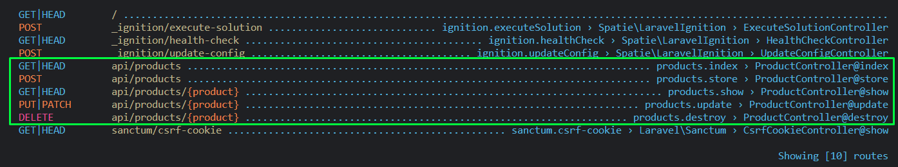

# Microservice-lar

**Kirish**

Ushbu misolda laravel, vuejs, angular va rabbitmq yordamida microservice texnologiyasi asosida ishlaydigan oddiy web dastur yaratib ko'ramiz. Dasturning tuzilishi quyidagi rasmda keltirilgan:


Proyektimiz Admin va Main qismlaridan tashkil topgan. Admin qismining frontida Angular freymvorki, backendida esa Dockerda ko'tarilgan Laravel freymvorki ishlaydi. Main qismining frontida esa Vue.js freymvorki, backendida Dockerda ko'tarilgan Laravel freymvorki bo'ladi. Ikkala qismning ham ma'lumotlar ombori uchun MySQL ishlatilgan. Admin va Main qismlari RabbitMQ yordamida ma'lumotlarini o'zaro moslashtirib oladi (sinxronlab oladi).

**O'rnatish**

Ishni boshlashdan avval kerakli dastur va freymvorklarni o'rnatib olamiz.

1. Avval docker dasturini o'rnatamiz.
2. Keyin esa laravel freymvorkini o'rnatamiz: `composer create-project laravel/laravel microservice-admin`
3. Admin qism uchun laravel freymvorkni o'rnatganimizdan so'ng, unga docker uchun `Dockerfile` qo'shamiz:

```apache
FROM  php:8.1 # proyekt asosini nima tashkil qilishini bildiradi

RUN apt-get update && apt-get install -y \ # proyekt ishlashi uchun kerak bo'ladigan extensionlarni o'rnatish
	libfreetype6-dev \
	libjpeg62-turbo-dev \
	libmcrypt-dev \
	libpng-dev \
	zlib1g-dev \
	libxml2-dev \
	libzip-dev \
	libonig-dev \
	graphviz \

     && docker-php-ext-configure gd \
     && docker-php-ext-install -j$(nproc) gd \
     && docker-php-ext-install pdo_mysql \
     && docker-php-ext-install mysqli \
     && docker-php-ext-install zip \
     && docker-php-ext-install sockets \
     && docker-php-source delete

RUN curl -sS https://getcomposer.org/installer | php -- \
      --install-dir=/usr/local/bin --filename=composer

WORKDIR /app # ishchi papka nomini berish
COPY . . # ushbu dastur papkasini (1-nuqta) ishchi papkaga (2-nuqta) nusxalaymiz
RUN composer install # composerni ishga tushirib install qilamiz

CMD php artisan serve --host=0.0.0.0 # proyektni ishga tushiramiz
EXPOSE 8000 # Docker containerda qaysi portda ishga tushishini ko'rsatamiz
```

4. `Dockerfile`ni yaratib kerakli sozlashlarni yozib bo'ldik. Endi docker uchun yana bitta fayl - `docker-compose.yaml`ni yaratib olamiz

```apache
version: '3.8' # docker compose faylni ishga tushirish uchun avval unga versiya beramiz
services:
  admin:
    build:
      context: .
      dockerfile: Dockerfile
    ports:
      - 8000:8000 # 1-port localhostda chiqishi kerak bo'lgan port, 2-si Dockerfileda ko'rsatgan Docker container porti
    depends_on: # admin servisi qaysi servislarni ishlatishi ko'rsatiladi
      - admin_db

  admin_db:
    image: mysql:5.7.22 # mysql 8.0 php 8 da yaxshi ishlay olmaydi
    environment:
      MYSQL_DATABASE: admin
      MYSQL_USER: root # agar Remove MYSQL_USER="root" bilan boshlanuvchi xato chiqib database run bo'lmasa shu qator olib tashlanadi
      MYSQL_PASSWORD: root
      MYSQL_ROOT_PASSWORD: root
    volumes: # mysqlning fayllari proyektning qaysi papkasida joylashishini ko'rsatadi
      - ./storage/dbdata:/var/lib/mysql
    ports:
      - 33061:3306 # 1-si mysqlning tashqariga chiqish porti, 2-si docker containerdagi mysql port

```

5. Endi `.env` faylda `docker-compose.yaml` faylda ko'rsatilgan mysql sozlamalarini yozib qo'yamiz:

```apache
# ...
# docker-compose.yaml fayldagi sozlamalar qo'yiladi
DB_CONNECTION=mysql
DB_HOST=admin_db # docker-compose.yaml fayldagi service nomi
DB_PORT=3306
DB_DATABASE=admin
DB_USERNAME=root
DB_PASSWORD=root
#...
```

6. Proyektni Dockerda ishga tushiramiz: `docker-compose up`

Shu yergacha dockerda laravel va mysqlni o'rnatib ishga tushirdik. Proyektni ishga tushganini bilish uchun browser-da `http://localhost:8000` manzilni ochib ko'rish kifoya. MySQLning ishlayotganini tekshirish uchun esa database bilan ishlovchi biror dasturda ochib ko'rsa bo'ladi. Masalan, DBeaver-da.

**Admin qismi backendi bilan ishlash**

1. `database/migrations` papkasida faqat users va failed_jobs migration fayllarini qoldirib (failed_jobs jadvali rabbitmq bilan ishlaganda kerak bo'ladi) qolganlarini o'chirib tashlaymiz.
2. `users` migration faylida faqat `id` yaratuvchi qatorni qoldiramiz:

```php
//...
    public function up(): void
    {
        Schema::create('users', function (Blueprint $table) {
            $table->id();
        });
    }
//...
```

3. Endi yangi `products` nomli jadval yaratamiz: `php artisan make:migration create_products_table`
4. `products` jadvaliga 3ta `title`, `image` va `likes` ustunlarini qo'shamiz:

```php
//...
    public function up(): void
    {
        Schema::create('products', function (Blueprint $table) {
            $table->id();
            $table->string('title');
            $table->string('image');
            $table->unsignedInteger('likes')->default(0);
            $table->timestamps();
        });
    }
//...
```

5. Keyin, migration-ni run qilamiz: `php artisan migrate`

> !!!Eslatma: proyektning artisan buyrug'i docker container muhitida ishlashi kerak. Buning uchun buyruqlar qatorida (terminal, cmd) `docker-compose exec container_name sh` buyrug'i ishga tushiriladi. Bizning misolda `container_name` `admin` bo'ladi. Yoki shunchaki, `docker-compose exec continer_name command_name` buyrug'i bilan ham artisan buyruqlarni ishlatsa bo'ladi. Masalan yuqoridagi migrate qilish buyrug'i quyidagicha bo'ladi: `docker-compose exec admin php artisan migrate`

5. Hozircha `UserFactory` klasning `defenition()` metodidagi qaytuvchi massivni bo'sh qilib turamiz:

```php
    public function definition(): array
    {
        return [];
    }
```

6. `products` uchun factaroy yozamiz. Buning uchun `docker-compose exec admin php artisan make:factory ProductFactory` buyrug'ini ishga tushiramiz. Lekin, `database\factories` papkasida hech qanday `ProductFactory.php` fayli paydo bo'lmadi! Nega? Chunki, yuqoridagi buyruqni ishga tushirganimizda, u docker containerda shu nomdagi factoryni yaratdi, lekin bu yaratilgan fayl bizning proyektimiz papkasiga tushmadi. Endi, bu muammoni hal qilish uchun `docker-compose.yml` fayldagi `admin` servisiga (containeriga) `volume` qo'shishimiz kerak bo'ladi:

```apache
#...
admin:
    build:
      context: .
      dockerfile: Dockerfile
    volumes: # <===
	# 1-da turgan nuqta biz ishlab turgan project, 2-da turgan /app esa dockerga yuklangan projectimiz (Dockerfiledagi WORKDIR: /app)
      - .:/app # <=== shu qatorlar qo'shiladi
    ports:
      - 8000:8000 # 1-port localhostda chiqishi kerak bo'lgan port, 2-si Dockerfileda ko'rsatgan Docker container porti
    depends_on: # admin servisi qaysi servislarni ishlatishi ko'rsatiladi
      - admin_db
#...
```

7. `docker-compose.yml` faylini o'zgartirganimizdan keyin dockerdagi proyektimizni qaytadan ishga tushiramiz. Buning uchun avval ishlab turgan containerni to'xtatib, `docker-compose up` buyrug'ini qaytadan ishlatamiz.
8. `docker-compose exec admin php artisan make:factory ProductFactory` buyruqni qayta ishga tushiramiz.
9. So'ngra `products` jadvali uchun model yaratamiz: `docker-compose exec admin php artisan make:model Product`
10. `ProductFactory` klasidagi `protected $model` xususiyatiga `Product` modelini berib qo'yamiz:

```php
//...
protected $model = Product::class;
//...
```

11. Endi, `ProductFactory` klasining `defenitions()` metodi qaytaradigan massivni to'ldirib qo'yamiz:

```php
//...
    public function definition(): array
    {
        return [
            'title' => $this->faker->text(30),
            'image' => $this->faker->imageUrl(),
        ];
    }
//...
```

12. `ProductFactory` va `UserFactory` uchun seederlar yozamiz: `docker-compose exec admin php artisan make:seeder ProductSeeder` va `docker-compose exec admin php artisan make:seeder UserSeeder`
13. `UserSeeder` va `ProductSeeder`ga kod yozamiz:

```php
//...
    public function run(): void
    {
        User::factory(20)->create();
    }
//...
```

```php
//...
    public function run(): void
    {
        Product::factory(10)->create();
    }
//...
```

14. `DatabaseSeeder`da esa barcha seeder klaslarni chaqirib qo'yamiz:

```php
//...
    public function run(): void
    {
        $this->call(UserSeeder::class);
        $this->call(ProductSeeder::class);
    }
//...
```

yoki

```php
//...
    public function run(): void
    {
        $this->call([
            UserSeeder::class,
            ProductSeeder::class,
        ]);
    }
//...
```

15. `DatabaseSeeder` klasni ishga tushiramiz: `docker-compose exec admin php artisan db:seed`. Buyruqni ishga tushirganimizda quyidagi xatolik kelib chiqdi:

```apache
SQLSTATE[42S22]: Column not found: 1054 Unknown column 'updated_at' in 'field list' (Connection: mysql, SQL: insert into `users` (`updated_at`, `created_at`) values (2023-03-28 12:20:11, 2023-03-28 12:20:11))
```

Bunga sabab, userning migrationidan ba'zi ustunlarni o'chirib, faqat id ustuni qoldirilgan edi. Endi, shu o'zgarishlarni modelda ham to'g'rilash kerak:

```php
<?php

namespace App\Models;

use Illuminate\Database\Eloquent\Factories\HasFactory;
use Illuminate\Foundation\Auth\User as Authenticatable;

class User extends Authenticatable
{
    use HasFactory;

    public $timestamps = false;
}
```

16. `docker-compose exec admin php artisan db:seed` buyrug'ini qayta ishga tushiramiz. Bu safar xatosiz ishlaydi.

**Controller qismi bilan ishlash**

Endi kontroller bilan ishlashni boshlaymiz.

17. `ProductController` yaratamiz: `docker-compose exec admin php artisan make:controller ProductController`
18. Product uchun CRUD yaratishni boshlaymiz. Avval, `ProductController`da barcha productlarni oluvchi `index()` metodini yozamiz:

```php
//...
    public function index()
    {
        return Product::all();
    }
//...
```

19. `ProductController`dagi `index()` metodi uchun `routes/api.php` faylida route yozamiz:

```php
//...
Route::get('products', [ProductController::class, 'index']);
//...
```

Postmanda (yoki insomnia, farqi yo'q) so'rov yuborib, ishlashini tekshirib ko'ramiz.

20. Keyingi metod `show()`:

```php
//...
    public function show(int $id): Product
    {
        return Product::query()->find($id);
    }
//...
```

21. Bu metod uchun ham route yozib qo'yamiz:

```php
//...
Route::get('products/{id}', [ProductController::class, 'show']);
//...
```

Bu APIni ham tekshirib ko'ramiz.

22. Har doim `routes/api.php` faylni ochib yurmaslik uchun product CRUDning qolgan API routelarini ham oldindan yozib qo'yamiz:

```php
//...
Route::get('products', [ProductController::class, 'index']);
Route::get('products/{id}', [ProductController::class, 'show']);
Route::post('products', [ProductController::class, 'store']);
Route::put('products/{id}', [ProductController::class, 'update']);
Route::delete('products/{id}', [ProductController::class, 'destroy']);
//...
```

Yuqoridagi 5 qator route uchun kodlarni yozib yurmaslik uchun, Laravelning tayyor `apiResource` route metodidan foydalanishimiz mumkin. Bu metod yuqoridagi 5 ta routeni yaratib beradi:

```php
//...
Route::apiResource('products', ProductController::class);
//...
```

Endi, `docker-compose exec admin php artisan route:list` buyrug'ini ishlatib ko'rsak oldingi 5 ta yozgan routimizni ko'rishimiz mumkin:



`ProductController`da qolgan metodlarni ham yozishni davom etamiz.

23. `store` metodi:

```php
//...
    public function store(Request $request)
    {
        $product = Product::query()->create($request->only('title', 'image'));

        return response($product, Response::HTTP_CREATED);
    }
//...
```

Yangi product qo'shishni tekshirib ko'rishdan avval `Product` model klasida biroz o'zgarish qilish kerak. Aniqrog'i, quyidagi kodni model klasga qo'shib qo'yish kerak:

```php
//...
class Product extends Model
{
    use HasFactory;

    protected $fillable = ['title', 'image']; <== shu qator qo'shiladi
}
```

`$fillable` xususiyatini qo'shishdan maqsad, agar biz birdaniga bir nechta ustunni modelning `create` metodi orqali qo'shmoqchi bo'lsak, model bunga ruxsat bermaydi. Bir nechta ustunni birdaniga qo'shish imkonini ochish uchun shu xususiyatni yozib, unga qaysi ustunlarni birdaniga qo'shish mumkinligini ko'rsatib qo'shimiz kerak bo'ladi.

Yoki, yana bir xususiyat `$guarded`ga qaysi ustunlarni birdaniga qo'shib bo'lmasligini ko'rsatsak ham bo'ladi. Bu xususiyatda ko'rsatilmagan ustunlarni birdaniga qo'shish mumkin:

```php
//...
protected $guarded = ['id'];
//...
```

Shundan keyin, bemalol yangi product qo'shishni test qilib ko'rsak bo'ladi.

24. `update` metodi:

```php
//...
    public function update(Request $request, $id)
    {
        $product = Product::query()->find($id);

        abort_if(!$product, Response::HTTP_NOT_FOUND, 'Product not found');

        $product->update($request->only('title', 'image'));

        return response($product, Response::HTTP_ACCEPTED);
    }
//...
```

APIni tekshirib ko'rishimiz mumkin.

25. `destroy` metodi:

```php
//...
    public function destroy($id)
    {
        Product::destroy($id);

        return response(null, Response::HTTP_NO_CONTENT);
    }
//...
```

Shu yergacha Laravelda CRUD qilishni ko'rib chiqdik!

Keyingi qismda, endi, microservicening keyingi qismini ko'taramiz.
