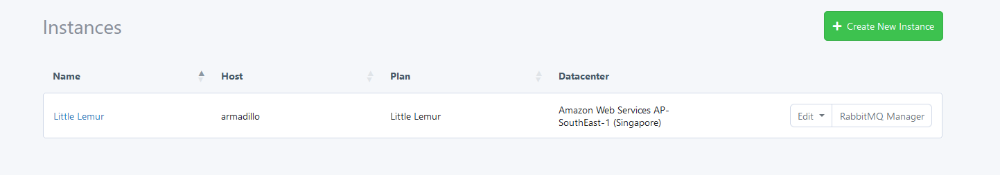
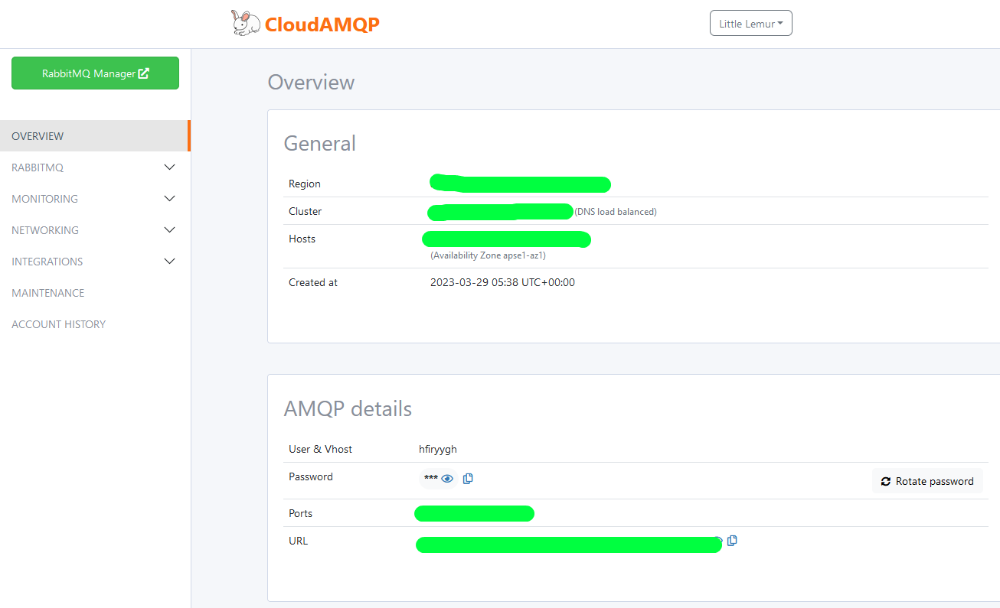

# Microservice-lar (2-qism)

**Kirish**

Oldingi qismda Admin microserviceni uchun Dockerda Laravel proyektini ko'tarib, unda Productlar uchun oddiy CRUD yozgan edik. Endi, bu qismda Main microserviceni ko'tarishni ko'ramiz.

1. Laravel proyektini o'rnatib olamiz: `composer create-project laravel/laravel main`
2. Admin microserviceda yozgan `Dockerfile` va `docker-compose.yml` fayllarini proyektimizning root papkasiga nusxalab olamiz (chunki backend qismlari bir xil bo'lyapti):

`Dockerfile`:

```apache
FROM  php:8.1-fpm

RUN apt-get update && apt-get install -y \
	libfreetype6-dev \
	libjpeg62-turbo-dev \
	libmcrypt-dev \
	libpng-dev \
	zlib1g-dev \
	libxml2-dev \
	libzip-dev \
	libonig-dev \
	graphviz \
     && docker-php-ext-configure gd \
     && docker-php-ext-install -j$(nproc) gd \
     && docker-php-ext-install pdo_mysql \
     && docker-php-ext-install mysqli \
     && docker-php-ext-install zip \
     && docker-php-ext-install sockets \
     && docker-php-source delete

RUN curl -sS https://getcomposer.org/installer | php -- \
      --install-dir=/usr/local/bin --filename=composer

WORKDIR /app
COPY . .
RUN composer install
CMD php artisan serve --host=0.0.0.0
EXPOSE 8000

```

Bu yerda hech narsani o'zgartirmaymiz.

`docker-compose.yml`:

```apache
version: '3.8'
services:
  main: # <== o'zgardi
    build:
      context: .
      dockerfile: Dockerfile
    volumes:
      - .:/app
    ports:
      - 8001:8000 # <== o'zgardi
    depends_on:
      - main_db # <== o'zgardi

  main_db: # <== o'zgardi
    image: mysql:5.7.22
    environment:
      MYSQL_DATABASE: main # <== o'zgardi
      MYSQL_PASSWORD: root
      MYSQL_ROOT_PASSWORD: root
    volumes:
      - ./storage/dbdata:/var/lib/mysql
    ports:
      - 33062:3306 # <== o'zgardi

```

Bu yerda faqat containerlarning nomlari va chiquvchi portlar o'zgardi (docker containerning ichidagi portlarini o'zgartirish shart emas).

3. `.env` faylda database sozlamalarini to'g'rilaymiz:

```apache
# ...
DB_CONNECTION=mysql
DB_HOST=main_db
DB_PORT=3306
DB_DATABASE=main
DB_USERNAME=root
DB_PASSWORD=root
#...
```

4. Dockerni ishga tushiramiz: `docker-compose up`
5. Xuddi oldingi qismdagidek, avval, keraksiz migration fayllarni o'chirib tashlaymiz. Main microserviceda faqat `failed_jobs` migrationi kerak bo'lgani uchun qolgan barcha migrationlarni o'chiramiz.
6. Migrationlarni ishga tushiramiz: `docker-compose exec main php artisan migrate`
7. Bu proyektda ham products jadvalini yaratamiz: `docker-compose exec main php artisan make:migration create_products_table`
8. Bu yerdagi `products` jadvalida faqat `title` va `image` ustunlari bo'ladi. Bundan tashqari `id` ustuni ham `auto increment` bo'lmaydi:

```php
//...
    public function up(): void
    {
        Schema::create('products', function (Blueprint $table) {
            $table->unsignedBigInteger('id')->primary();
            $table->string('title');
            $table->string('image');
            $table->timestamps();
        });
    }
//...
```

Yuqoridagi `products` tableda `id` ni `auto increment` qilmaganimizning sababi, asosiy products jadvali admin microserviceda bo'lib, ma'lumotlar o'sha jadvalda yaratiladi, bu yerdagi jadvalga esa rabbitmq yordamida mavjud productni yozib qo'yamiz.

9. Yana bir marta migrate qilamiz: `docker-compose exec main php artisan migrate`
10. `ProductController` yaratish: `docker-compose exec main php artisan make:controller ProductController`
11. `Product` modelini yaratish: `docker-compose exec main php artisan make:model Product`
12. `ProductController`da `index()` metodi:

```php
//...
    public function index()
    {
        return Product::all();
    }
//...
```

13. `routes/api.php`da `index()` metod uchun route:

```php
//...
Route::get('products', [ProductController::class, 'index']);
//...
```

Shu yergacha main microserviceda Product ma'lumotlarimizni olib beruvchi APIni yozdik. Faqat bu APIga murojaat qilsak, u hech qanday ma'lumot bermaydi. Chunki, `products` jadvalida hech qanday ma'lumot yo'q. Unga ma'lumotni admin microservicedagi `products` jadvalidan rabbitmq yordamida olib yozishimiz kerak bo'ladi.

**RabbitMQ bilan ishlash.**

14. RabbitMQ bilan ishlashdan avval, uni yuklab olib o'rnatish kerak bo'ladi. RabbitMQni yuklab olishdan boshlaylik. Buning uchun,
    1. https://cloudamqp.com saytiga kirib account ochiladi.
    2. Keyin, yangi team yaratiladi
    3. Yangi instance yaratiladi
    4. 1-qadamda instance nomi va plan tanlanadi. Biz Lemming (Free) bepul planini tanlaymiz
    5. 2-qadamda region tanlanadi. Misol uchun AWSdan *AP-SouthEast-1 (Singapore)* ni tanlaylik
    6. 3-qadamda create instance tugmasini bosib, instanceni yaratamiz



15. Proyektlarimiz rabbitmq bilan ishlashi uchun, ularga `laravel-queue-rabbitmq` paketini o'rnatamiz (https://github.com/vyuldashev/laravel-queue-rabbitmq):

    1. `docker-compose exec admin composer require vladimir-yuldashev/laravel-queue-rabbitmq`
    2. `docker-compose exec main composer require vladimir-yuldashev/laravel-queue-rabbitmq`

    Agar yuqoridagi buyruqlar orqali paketni o'rnatishda `curl error 60 while downloading https://repo.packagist.org/packages.json: SSL certificate problem: EE certificate key too weak` kabi xatolik chiqsa, avval `docker-compose exec main composer config -g -- disable-tls false` buyrug'ini ishga tushiring
16. Paket uchun kerakli sozlamalarni ikkala proyektning `config/queue.php` faylidagi `connections` arrayiga beramiz:

```php
//...
'connections' => [
    // ...

    'rabbitmq' => [
  
       'driver' => 'rabbitmq',
       'queue' => env('RABBITMQ_QUEUE', 'default'),
       'connection' => PhpAmqpLib\Connection\AMQPLazyConnection::class,
   
       'hosts' => [
           [
               'host' => env('RABBITMQ_HOST', '127.0.0.1'),
               'port' => env('RABBITMQ_PORT', 5672),
               'user' => env('RABBITMQ_USER', 'guest'),
               'password' => env('RABBITMQ_PASSWORD', 'guest'),
               'vhost' => env('RABBITMQ_VHOST', '/'),
           ],
       ],
   
       'options' => [
           'ssl_options' => [
               'cafile' => env('RABBITMQ_SSL_CAFILE', null),
               'local_cert' => env('RABBITMQ_SSL_LOCALCERT', null),
               'local_key' => env('RABBITMQ_SSL_LOCALKEY', null),
               'verify_peer' => env('RABBITMQ_SSL_VERIFY_PEER', true),
               'passphrase' => env('RABBITMQ_SSL_PASSPHRASE', null),
           ],
           'queue' => [
               'job' => VladimirYuldashev\LaravelQueueRabbitMQ\Queue\Jobs\RabbitMQJob::class,
           ],
       ],
   
       /*
        * Set to "horizon" if you wish to use Laravel Horizon.
        */
       'worker' => env('RABBITMQ_WORKER', 'default'),
       'after_commit' => false,
    ],

    // ...  
],
//...
```

17. `.env` fayllarni sozlab olamiz:

```apache
#...
RABBITMQ_HOST=
RABBITMQ_PORT=5672
RABBITMQ_USER=
RABBITMQ_PASSWORD=
RABBITMQ_VHOST=
#...
```

Bu sozlamalarga kerak bo'lgan qiymatlarni CloudAMQP saytidagi instancening nomidagi linkka o'tib, ochilgan sahifadan olish mumkin:



Oxirgi sozlashimiz kerak bo'lgan narsa - bu `.env` fayldagi `QUEUE_CONNECTION`ga `rabbitmq` qiymatini berish bo'ladi.

Docker containerlarimizni to'xtatib, qayta ishga tushiramiz.


Keyingi qismda rabbitmq bilan microservicelar orasida ma'lumot almashishni ko'ramiz
