1. RabbitMQ bilan ishlashdan avval, uni yuklab olib o'rnatish kerak bo'ladi. RabbitMQni yuklab olishdan boshlaylik. Buning uchun,
   1. https://cloudamqp.com saytiga kirib account ochiladi.
   2. Keyin, yangi team yaratiladi
   3. Yangi instance yaratiladi
   4. 1-qadamda instance nomi va plan tanlanadi. Biz Lemming (Free) bepul planini tanlaymiz
   5. 2-qadamda region tanlanadi. Misol uchun AWSdan *AP-SouthEast-1 (Singapore)* ni tanlaylik
   6. 3-qadamda create instance tugmasini bosib, instanceni yaratamiz

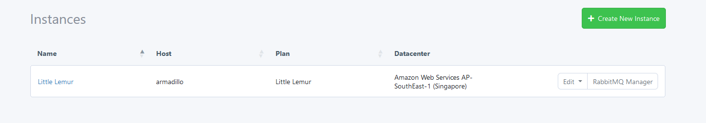

2. Proyektlarimiz rabbitmq bilan ishlashi uchun, ularga `laravel-queue-rabbitmq` paketini o'rnatamiz (https://github.com/vyuldashev/laravel-queue-rabbitmq):

   1. `docker-compose exec admin composer require vladimir-yuldashev/laravel-queue-rabbitmq`
   2. `docker-compose exec main composer require vladimir-yuldashev/laravel-queue-rabbitmq`

   Agar yuqoridagi buyruqlar orqali paketni o'rnatishda `curl error 60 while downloading https://repo.packagist.org/packages.json: SSL certificate problem: EE certificate key too weak` kabi xatolik chiqsa, avval `docker-compose exec main composer config -g -- disable-tls false` buyrug'ini ishga tushiring
3. Paket uchun kerakli sozlamalarni ikkala proyektning `config/queue.php` faylidagi `connections` arrayiga beramiz:

```php
//...
'connections' => [
    // ...

    'rabbitmq' => [
  
       'driver' => 'rabbitmq',
       'queue' => env('RABBITMQ_QUEUE', 'default'),
       'connection' => PhpAmqpLib\Connection\AMQPLazyConnection::class,
   
       'hosts' => [
           [
               'host' => env('RABBITMQ_HOST', '127.0.0.1'),
               'port' => env('RABBITMQ_PORT', 5672),
               'user' => env('RABBITMQ_USER', 'guest'),
               'password' => env('RABBITMQ_PASSWORD', 'guest'),
               'vhost' => env('RABBITMQ_VHOST', '/'),
           ],
       ],
   
       'options' => [
           'ssl_options' => [
               'cafile' => env('RABBITMQ_SSL_CAFILE', null),
               'local_cert' => env('RABBITMQ_SSL_LOCALCERT', null),
               'local_key' => env('RABBITMQ_SSL_LOCALKEY', null),
               'verify_peer' => env('RABBITMQ_SSL_VERIFY_PEER', true),
               'passphrase' => env('RABBITMQ_SSL_PASSPHRASE', null),
           ],
           'queue' => [
               'job' => VladimirYuldashev\LaravelQueueRabbitMQ\Queue\Jobs\RabbitMQJob::class,
           ],
       ],
   
       /*
        * Set to "horizon" if you wish to use Laravel Horizon.
        */
       'worker' => env('RABBITMQ_WORKER', 'default'),
       'after_commit' => false,
    ],

    // ...  
],
//...
```

4. `.env` fayllarni sozlab olamiz:

```apache
#...
RABBITMQ_HOST=
RABBITMQ_PORT=5672
RABBITMQ_USER=
RABBITMQ_PASSWORD=
RABBITMQ_VHOST=
#...
```

Bu sozlamalarga kerak bo'lgan qiymatlarni CloudAMQP saytidagi instancening nomidagi linkka o'tib, ochilgan sahifadan olish mumkin:

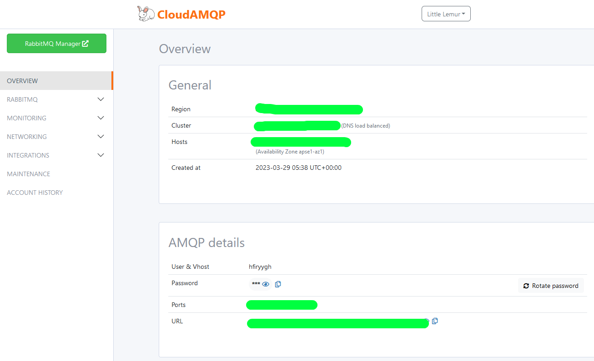

Oxirgi sozlashimiz kerak bo'lgan narsa - bu `.env` fayldagi `QUEUE_CONNECTION`ga `rabbitmq` qiymatini berish bo'ladi.

Docker containerlarimizni to'xtatib, qayta ishga tushiramiz.

5. Endi, admin microservicedagi ma'lumotlarni main ga yuboradigan job yaratamiz. Buning uchun, avval, eventni ishga tushiradigan command yaratamiz: `docker-compose exec admin php artisan make:command FireEvent`

```php
<?php

namespace App\Console\Commands;

use Illuminate\Console\Command;

class FireEvent extends Command
{
    /**
     * The name and signature of the console command.
     *
     * @var string
     */
    protected $signature = 'fire';

    /**
     * Execute the console command.
     */
    public function handle(): void
    {
        // job klasi endi qo'yiladi
    }
}

```

6. Ikkala proyekt uchun ham job yaratamiz:
   1. `docker-compose exec admin php artisan make:job TestJob`
   2. `docker-compose exec main php artisan make:job TestJob`
7. Admin microserviceda yaratgan commandimizning `handle` metodiga `JobTest`imizni chaqirib qo'yamiz: `app\Console\Commands\FireEvent.php`

```php
//...
    public function handle(): void
    {
        TestJob::dispatch();
    }
//...
```

8. Admin microserviceda fire qilingan jobni main microserviceda ushlab olish uchun main microservicedagi `app\Providers\EventServiceProvider.php` faylga quyidagicha kod yozamiz:

```php
//...
    public function boot(): void
    {
        App::bindMethod(TestJob::class.'@handle', fn ($job) => $job->handle());
    }
//...
```

9. Main microservicening `TestJob` klasida rabbitmq ishlayotganini tekshirib ko'rish uchun  biror ma'lumotni ekranga chiqarib qo'yaylik:

```php
//...
   public function handle(): void
    {
        echo 'Event has been handled'.PHP_EOL;
    }
//...
```

10. Main microserviceda queue workerni ishga tushirib qo'yamiz:

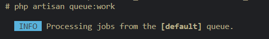

11. Admin microserviceda esa `php artisan fire` buyrug'i bilan `FireEvent` buyruq klasini ishga tushiramiz, u esa o'z navbatida `TestJob` jobni ishlatadi:

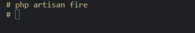

12. Endi, boya ishga tushirgan workerimizga qarasak bitta event sodir bo'lishini sezganini ko'rishimiz mumkin:

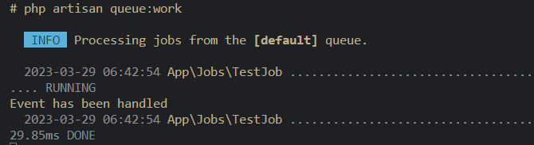

RabbitMQ dashboardida ham ma'lumot almashish yuz berganini ko'ramiz:

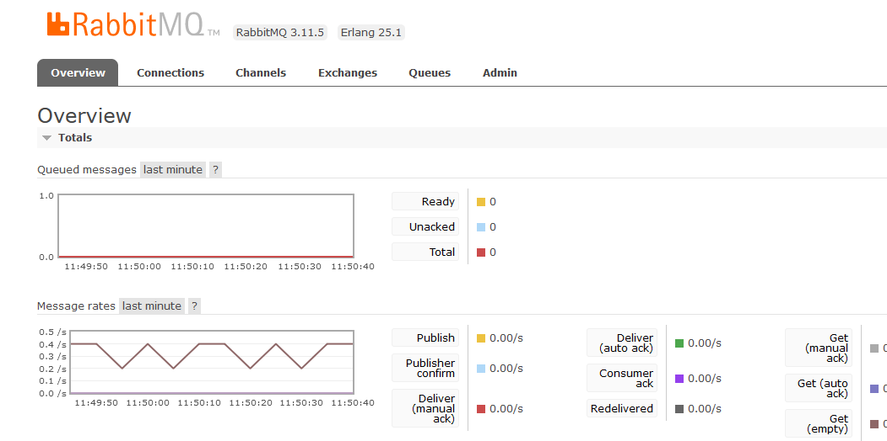

Shunday qilib, RabbitMQdan foydalangan holda bitta laravel proyektdan turib ikkinchisiga ma'lumot uzatishni ko'rdik.

RabbitMQ ishlayotganini tekshirib oldik. Endi, ishimizni kelgan joyidan davom ettiraylik.

13. Admin microserviceda Product yaratilganda ishga tushadigan event yaratamiz: `php artisan make:job ProductCreated`

```php
<?php
//...

class ProductCreated implements ShouldQueue
{
    use Dispatchable, InteractsWithQueue, Queueable, SerializesModels;

    /**
     * Create a new job instance.
     */
    public function __construct(private array $data)
    {
        //
    }

    /**
     * Execute the job.
     */
    public function handle(): void
    {
        //
    }
}

```

14. `ProductController`da product yaratilgan payt `ProductCreated` job klasini ishga tushiramiz (job klas bizga event vazifasini bajarib beryapti).

```php
//...
    public function store(Request $request)
    {
        $product = Product::query()->create($request->only('title', 'image'));

        ProductCreated::dispatch($product->toArray()); // <== eventni ishga tushirish

        return response($product, Response::HTTP_CREATED);
    }
//...
```

15. Main microserviceda ham xuddi yuqoridagiday `ProductCreated` jobni yaratamiz (`php artisan make:job ProductCreated`):

```php
<?php
//...

class ProductCreated implements ShouldQueue
{
    use Dispatchable, InteractsWithQueue, Queueable, SerializesModels;

    /**
     * Create a new job instance.
     */
    public function __construct(private array $data)
    {
        //
    }

    /**
     * Execute the job.
     */
    public function handle(): void
    {
        //
    }
}

```

16. Main microservicega qo'shgan `ProductCreated` jobni `EventServiceProdivder` provider klasida metodga bind qilib qo'yamiz:

```php
//...
    public function boot(): void
    {
        App::bindMethod(ProductCreated::class.'@handle', fn ($job) => $job->handle());
    }
//...
```

17. Main microservicedagi `ProductCreated` jobining `handle` metodiga admindan kelgan ma'lumotlarni jadvalga saqlab qo'yish kodini yozib qo'yaylik:

```php
//...
    public function handle(): void
    {
        Product::query()->create([
            'id' => $this->data['id'],
            'title' => $this->data['title'],
            'image' => $this->data['image'],
            'created_at' => $this->data['created_at'],
            'updated_at' => $this->data['updated_at']
        ]);
    }
//...
```

18. Ishlashini tekshirib ko'ramiz. Buning uchun Main microserviceda `php artisan queue:work` ni ishlatib, Admin microserviceda bitta yangi product yaratib ko'ramiz.

Mainda queue workerni ishga tushiramiz:

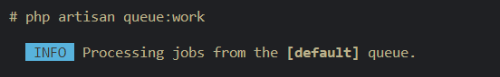

Adminda yangi product yaratamiz:

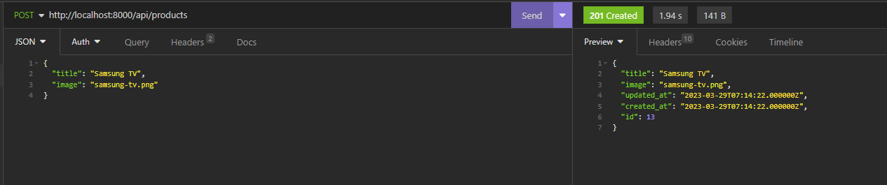

Maindagi `ProductCreated` job ishga tushib, kelgan ma'lumotni bazaga yozadi:

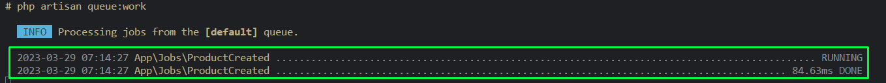

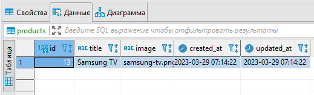

RabbitMQ manager dashboardida ham o'zgarish bo'lganini ko'rishimiz mumkin:

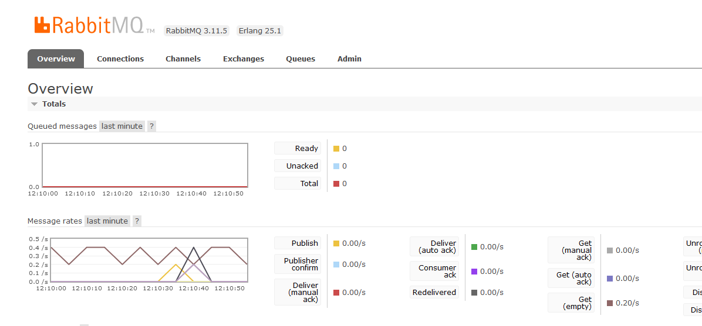

Agar mainda biror job ishlashida xatolik yuz bersa, bu job bazadagi `failed_jobs` jadvaliga tushadi:

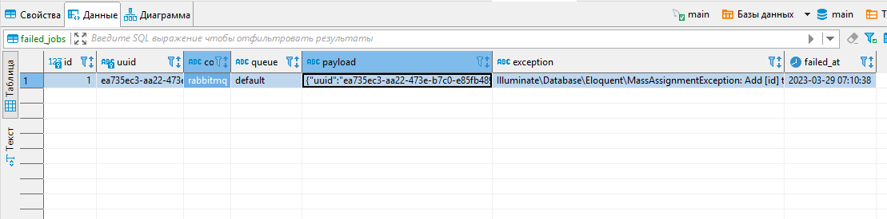

19. Admin microservicening qolgan APIlari uchun ham xuddi shunday eventlarni yozib chiqamiz.
    Admin `ProductUpdated`: `php artisan make:job ProductUpdated`

```php
<?php

//...

class ProductUpdated implements ShouldQueue
{
    //...
    public function __construct(private array $data)
    {
        //
    }
    //...
}

```

Admin `ProductController` ning `update` metodi:

```php
//...
    public function update(Request $request, $id)
    {
        $product = Product::query()->find($id);

        abort_if(!$product, Response::HTTP_NOT_FOUND, 'Product not found');

        $product->update($request->only('title', 'image'));

        ProductUpdated::dispatch(); // <====

        return response($product, Response::HTTP_ACCEPTED);
    }
//...
```

Admin `ProductDeleted`: `php artisan make:job ProductDeleted`

```php
<?php

//...

class ProductDeleted implements ShouldQueue
{
    //...
    public function __construct(private int $id)
    {
        //
    }
    //...
}
```

Admin `ProductController` ning `destroy` metodi:

```php
//...
    public function destroy($id)
    {
        Product::destroy($id);

        ProductDeleted::dispatch(); // <===

        return response(null, Response::HTTP_NO_CONTENT);
    }
//...
```

Main `ProductUpdated`: `php artisan make:job ProductUpdated`

```php
<?php

//...

class ProductUpdated implements ShouldQueue
{
    //...
    public function __construct(private array $data)
    {
        //
    }

    public function handle(): void
    {
        $product = Product::query()->find($this->data['id']);

        $product->update([
            'title' => $this->data['title'],
            'image' => $this->data['image'],
            'created_at' => $this->data['created_at'],
            'updated_at' => $this->data['updated_at'],
        ]);
    }
}

```

Main `ProductController` ning `update` metodi:

```php
//...
    public function update(Request $request, $id)
    {
        $product = Product::query()->find($id);

        abort_if(!$product, Response::HTTP_NOT_FOUND, 'Product not found');

        $product->update($request->only('title', 'image'));

        ProductUpdated::dispatch($product->toArray()); // <====

        return response($product, Response::HTTP_ACCEPTED);
    }
//...
```

Main `ProductDeleted`: `php artisan make:job ProductDeleted`

```php
<?php

//...

class ProductDeleted implements ShouldQueue
{
    //...
    public function __construct(private int $id)
    {
        //
    }

    public function handle(): void
    {
        Product::destroy($this->id);
    }
}
```

Main `ProductController` ning `destroy` metodi:

```php
//...
    public function destroy($id)
    {
        Product::destroy($id);

        ProductDeleted::dispatch($id); // <===

        return response(null, Response::HTTP_NO_CONTENT);
    }
//...
```

Mainda joblarni `EventServiceProvider`da bind qilib qo'yamiz:

```php
//...
    public function boot(): void
    {
        App::bindMethod(ProductCreated::class.'@handle', fn ($job) => $job->handle());
        App::bindMethod(ProductUpdated::class.'@handle', fn ($job) => $job->handle()); // <==
        App::bindMethod(ProductDeleted::class.'@handle', fn ($job) => $job->handle()); // <==
    }
//...
```
