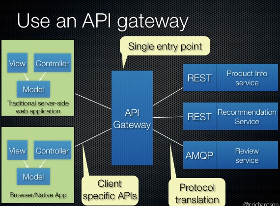

# Joining Data among different Microservices

Ma'lumki, Microservicelarda databaselar har bir microservice uchun alohida bo'ladi. Ba'zan, mana shu alohida holda ishlab turgan databaselardagi ayrim jadvallar bilan birgalikda ishlashga to'g'ri kelib qoladi. Misol uchun, `books` jadvalimiz bitta microservice bazasida, `authors` jadvalimiz esa boshqa microservice jadvalida joylashgan. Shunday vaziyat bo'lib qoldiki, bu ikkala jadval ma'lumotlarini `JOIN` yordamida birlashtirib olishimiz kerak. Shu holatda nima qilish kerak?

Tezlik yoki samaradorlik unchalik muhim bo'lmagan joyda kerakli qo'shimcha ma'lumotni Restful API yordamida so'rab olsa ham bo'ladi. Agar turli xil microservicelarga bir qancha so'rov yuborib, bitta natija olish kerak bo'ladigan holatda **API Gateway*** patternidan foydalaniladi.

**Polyglot persistence*** muhitlarida ortiqcha ish qilish zarar qilmaydi. Misol uchun, har safar biror o'zgarish bo'lganida bu haqida boshqa microservicelarga messaging queue yordamida xabar berish mumkin. Bitta microserviceda o'zgarish sodir bo'lganida, boshqa microservicelar kerakli eventni kuzatib turadi va o'zgargan ma'lumotlarni o'zida ham qayd qilib qo'yadi. Shunday qilib, microservicelarga so'rov yuborish o'rniga barcha kerakli ma'lumotlarni kerakli microservicelar uchun bitta maxsus joyda saqlab qo'ysak bo'ladi.

Shuningdek, ma'lumotlarni keshlashni ham unutmaslik kerak. Databasega tez-tez so'rov yuborishni oldini olish uchun Redis yoki Memcached keshlash texnologiyalaridan foydalanish mumkin.

---

**API GateWay**

Faraz qilaylik, microservice arxitekturasi asosida ishlaydigan onlayn do'kon dasturini yaratyapmiz. Dasturdagi product details sahifasini (mahsulot ma'lumotlari sahifasi) yaratish joyiga kelib qolganmiz. Mahsulot ma'lumotlari sahifasining turlicha ko'rinishini yatishimiz zarur bo'lyapti:

* HTML5/JavaScriptga asoslangan desktop va mobil browserlar uchun UI. HTML serverdagi web-dastur tomonidan generatsiya qilib beriladi.
* Android va iPhonelar uchun klent dasturlar. Bu dasturlar backend bilan REST APIlar yordamida aloqa qiladi.

Bundan tashqari, onlayn do'kon biror mahsuloti haqidagi ma'lumotlardan boshqa tashqi dasturlar foydalanishi uchun REST API ham chiqarib berishimiz kerak.

Mahsulot ma'lumotlari sahifasi mahsulot haqida ko'plab ma'lumotlarni ko'rsatishi kerak. Masalan, Amazon.com saytining POJOs in Action ma'lumot sahifasi quyidagi ma'lumotlarni ko'rsatadi:

* Kitob haqidagi kitob nomi, muallifi, narxi va hokazo kabi asosiy ma'lumotlar.
* Kitobga aloqador bo'lgan xaridlaringiz.
* Do'konda mavjudligi.
* Ushbu kitob bilan birgalikda tez-tez xarid qilingan boshqa mahsulotlar
* Xarid qilish usullari
* Ushbu kitobni sotib olgan boshqa xaridorlaning sotib olgan boshqa mahsulotlari.
* Xaridorlarning kitob haqidagi izohlari.
* Sotuvchining reytingi.
* ...

Bu onlayn do'kon microservice arxitekturasi asosida yaratilgani uchun mahsulot ma'lumotlari turli xil servicelarga ajralgan holda ishlaydi. Misol uchun:

* Product Info Service - mahsulot haqidagi nomi, muallifi kabi asosiy ma'lumotlar.
* Pricing Service - mahsulot narxi.
* Order Service - mahsulot xaridi tarixi
* Inventory Service - mahsulotning sotuvda mavjudligi
* Review Service - xaridorlarning izohlari.

Shunday qilib, bu sahifa barcha ma'lumotlarini turli xildagi servicelardan olib keladi.

**Muammo**

Kliyentlar (UI dasturlar) qanday qilib har bir microservicega murojaat qiladi?

* Microservicelar tomonidan chiqarib berilgan APIlarning turli xil microservicelarda joylashganligi kliyentga ko'p hollarda kerak bo'ladigan ko'rinishdan ko'ra boshqacha bo'ladi. Microservicelar odatda faqat kliyentlar ma'lumotlarni olishlari uchun alohida-alohida APIlarni chiqarib beradi xolos. Misol uchun, yuqorida aytilganidek, kliyent mahsulot ma'lumotlarini turlicha microservicelardan oladi.
* Har xil kliyentlar har xil ma'lumotni so'raydi. Masalan, desktop browserdagi mahsulot ma'lumotlari sahifasi mobil versiyanikidan ko'ra ancha murakkabroq bo'ladi.
* Har xil kliyentlar uchun internet (yoki umuman tarmoq) tezligi har xil bo'ladi. Masalan, mobil internet boshqa internet turlariga qaraganda odatda sekonroq ishlaydi. Va albatta, har qanday WAN tarmog'i LAN tarmog'idan sekinroq ishlaydi. Bu esa mobil dastur LAN ishlatayotgan serverda generatsiya qilinadigan web sayt ko'rinishidagi dasturiga nisbatan umuman boshqacha samaradorlikka ega tarmoqni ishlatishini anglatadi. Serverda generatsiya qilinadigan web sayt dasturi mobil dasutrdan farqli ravishda hech qanday qiyinchiliksiz  backend servicelarga ko'p sondagi so'rovlarni yuborishi mumkin.
* Servicelarning miqdori va ularning joylashgan joylari (host + port) dinamik o'zgaradi.
* Servicelarga ajratib chiqish vaqt o'tishi bilan o'zgarishi mumkin va bu o'zgarishlar kliyentlarga bilinmasligi (ta'sir qilmasligi) kerak.
* Servicelar turli xildagi protokollardan foydalanishi, bu protokollar esa har doim ham webga to'g'ri kelmasligi mumkin.

**Yechim**

Yuqoridagi muammolarni hal qilish uchun barcha kliyentlar murojaat qiladigan yagona kirish nuqtasi - API gateway dan foydalanish mumkin. API gateway so'rovlar bilan ikki usuldan biri bilan shlaydi. Ayrim so'rovlar shunchaki o'ziga mos servicega proxy qilinadi yoki yo'naltiriladi. U esa boshqa so'rovlarni boshqa servicelarga tarqatadi.

Barchasi bittaga mos keluvchi API usulidan ko'ra API gateway har bir kliyent uchun turli xildagi APIlarni chiqarib berishi mumkin.

API gatewayda xavfsizlikni ham ta'minlash mumkin. Masalan, so'rov yuboruvchi kliyent shu so'rovni yuborish huquqiga egaligini tekshirish.

**Variation (turi): Frontendlar backendlar uchun.**

Frontendlar uchun backendlar patterni API gateway patternning bir turi hisoblanadi. Bu pattern bo'yicha haq qaysi turgagi kliyent uchun alohida API gateway yaratiladi. Misol uchun, web uchun alohida, mobil dasturlar alohida kabi.

Yuqoridagi rasmda keltirilgan misolda uch xil turdagi kliyentlar uchun alohida API gateway yaratilgan: web dasturlar uchun, mobil dasturlar uchun va tashqi kliyent dasturlar uchun.

API gatewayning quyidagicha afzalliklari mavjud:

* Kliyentlar backend dastur qanday ko'rinishda microservicelarga ajratilgani haqida bilishi shart bo'lmaydi.
* Kliyentlarni microservicelar qayerda joylashgani haqida bilishi shart bo'lmaydi.
* Har bir kliyent uchun optimal API chiqarib beriladi.
* Bir qancha so'rovlarning qisqarishiga sabab bo'ladi. Masalan, API gateway kliyentga bitta so'rov orqali bir nechta microservicedan ma'lumot olishga imkon beradi. API gateway mobil dasturlar uchun muhim hisoblanadi.
* Ko'p sonli servicelarni API gatewayga o'tkazish orqali kliyent qismini soddalashtirib beradi.

API gatewayning kamchiliklari:

* Dastur arxitekturasi juda murakkab bo'lib ketadi. API gateway uchun ham kod yozish, uni boshqarish kerak bo'ladi.
* So'rovga javob qaytish vaqti ortadi. Chunki, API gateway qo'shilishi natijasida so'rov yuradigan "yo'li" ortadi.

Muammolar:

* API gatewayni qanday ishlatish kerak? Agar yuqori yuklanish bilan ishlaydigan dasturlarni kengaytirish kerak bo'lsa, event-driven/reactive yondashuvi eng mos tushadi.

Bu patternga aloqador boshqa patternlar:

* Microservice arxitektura patterni bu patterndan foydalanishi mumkin.
* API gateway so'rovlarni mavjud servicelarga yo'naltirish uchun yoki Client-side discovery patternidan yoki Server-side discovery patternidan foydalanadi.
* API gateway servicelarni ishga tushirish uchun Circuit Breaker patternidan foydalanadi.
* API gateway API Composition patternidan ham ko'p foydalanadi.

---

2006-yil Neal Ford dasturlashga Polyglot dasturlash atamasini kiritdi. Polyglot dasturlash - bu dasturlarni turli xildagi dasturlash tillarida yozish.
