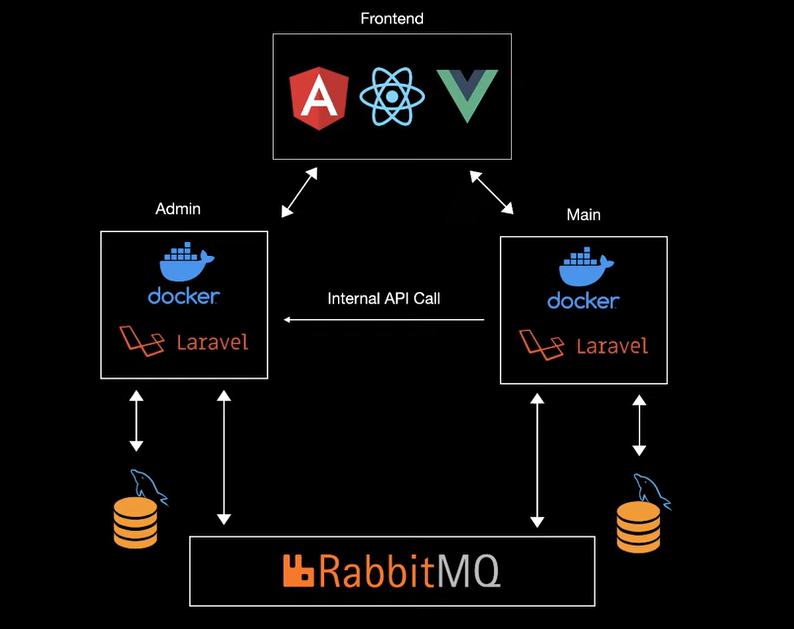

# Microservice-lar

**Kirish**

Ushbu misolda laravel, vuejs, angular va rabbitmq yordamida microservice texnologiyasi asosida ishlaydigan oddiy web dastur yaratib ko'ramiz. Dasturning tuzilishi quyidagi rasmda keltirilgan:



Proyektimiz Admin va Main qismlaridan tashkil topgan. Admin qismining frontida Angular freymvorki, backendida esa Dockerda ko'tarilgan Laravel freymvorki ishlaydi. Main qismining frontida esa Vue.js freymvorki, backendida Dockerda ko'tarilgan Laravel freymvorki bo'ladi. Ikkala qismning ham ma'lumotlar ombori uchun MySQL ishlatilgan. Admin va Main qismlari RabbitMQ yordamida ma'lumotlarini o'zaro moslashtirib oladi (sinxronlab oladi).

**O'rnatish**

Ishni boshlashdan avval kerakli dastur va freymvorklarni o'rnatib olamiz.

1. Avval docker dasturini o'rnatamiz.
2. Keyin esa laravel freymvorkini o'rnatamiz: `composer create-project laravel/laravel microservice-admin`
3. Admin qism uchun laravel freymvorkni o'rnatganimizdan so'ng, unga docker uchun `Dockerfile` qo'shamiz:

```apache
FROM  php:8.1 # proyekt asosini nima tashkil qilishini bildiradi

RUN apt-get update && apt-get install -y \ # proyekt ishlashi uchun kerak bo'ladigan extensionlarni o'rnatish
	libfreetype6-dev \
	libjpeg62-turbo-dev \
	libmcrypt-dev \
	libpng-dev \
	zlib1g-dev \
	libxml2-dev \
	libzip-dev \
	libonig-dev \
	graphviz \

     && docker-php-ext-configure gd \
     && docker-php-ext-install -j$(nproc) gd \
     && docker-php-ext-install pdo_mysql \
     && docker-php-ext-install mysqli \
     && docker-php-ext-install zip \
     && docker-php-ext-install sockets \
     && docker-php-source delete \
     && curl -sS https://getcomposer.org/installer | php -- \
      --install-dir=/usr/local/bin --filename=composer

WORKDIR /app # ishchi papka nomini berish
COPY . . # ushbu dastur papkasini (1-nuqta) ishchi papkaga (2-nuqta) nusxalaymiz
RUN composer install # composerni ishga tushirib install qilamiz

CMD php artisan serve --host=0.0.0.0 # proyektni ishga tushiramiz
EXPOSE 8000 # Docker containerda qaysi portda ishga tushishini ko'rsatamiz
```

4. `Dockerfile`ni yaratib kerakli sozlashlarni yozib bo'ldik. Endi docker uchun yana bitta fayl - `docker-compose.yaml`ni yaratib olamiz

```apache
version: '3.8' # docker compose faylni ishga tushirish uchun avval unga versiya beramiz
services:
  admin:
    build:
      context: .
      dockerfile: Dockerfile
    ports:
      - 8000:8000 # 1-port localhostda chiqishi kerak bo'lgan port, 2-si Dockerfileda ko'rsatgan Docker container porti
    depends_on: # admin servisi qaysi servislarni ishlatishi ko'rsatiladi
      - admin_db

  admin_db:
    image: mysql:5.7.22 # mysql 8.0 php 8 da yaxshi ishlay olmaydi
    environment:
      MYSQL_DATABASE: admin
      MYSQL_USER: root # agar Remove MYSQL_USER="root" bilan boshlanuvchi xato chiqib database run bo'lmasa shu qator olib tashlanadi
      MYSQL_PASSWORD: root
      MYSQL_ROOT_PASSWORD: root
    volumes: # mysqlning fayllari proyektning qaysi papkasida joylashishini ko'rsatadi
      - ./storage/dbdata:/var/lib/mysql
    ports:
      - 33060:3306 # 1-si mysqlning tashqariga chiqish porti, 2-si docker containerdagi mysql port

```

5. Endi `.env` faylda `docker-compose.yaml` faylda ko'rsatilgan mysql sozlamalarini yozib qo'yamiz:

```apache
# ...
# docker-compose.yaml fayldagi sozlamalar qo'yiladi
DB_CONNECTION=mysql
DB_HOST=admin_db # docker-compose.yaml fayldagi service nomi
DB_PORT=3306
DB_DATABASE=admin
DB_USERNAME=root
DB_PASSWORD=root
#...
```

6. Proyektni Dockerda ishga tushiramiz: `docker-compose up`


Shu yergacha dockerda laravel va mysqlni o'rnatib ishga tushirdik. Proyektni ishga tushganini bilish uchun browser-da `http://localhost:8000` manzilni ochib ko'rish kifoya. MySQLning ishlayotganini tekshirish uchun esa database bilan ishlovchi biror dasturda ochib ko'rsa bo'ladi. Masalan, DBeaver-da.

**Admin qismi backendi bilan ishlash**

1. `database/migrations` papkasida faqat users va failed_jobs migration fayllarini qoldirib (failed_jobs jadvali rabbitmq bilan ishlaganda kerak bo'ladi) qolganlarini o'chirib tashlaymiz.
2. `users` migration faylida faqat `id` yaratuvchi qatorni qoldiramiz:

```php
//...
    public function up(): void
    {
        Schema::create('users', function (Blueprint $table) {
            $table->id();
        });
    }
//...
```

3. Endi yangi `products` nomli jadval yaratamiz: `php artisan make:migration create_products_table`
