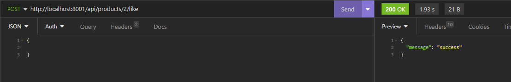
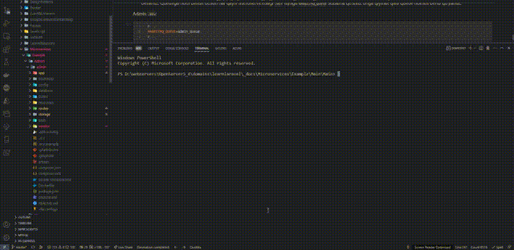

# Like funksiyasini ishlatish

1. Admin microserviceda `UserController` controllerini yaratamiz: `php artisan make:controller UserController`
2. `UserController`da tasodifiy bitta userni olib beradigan `random()` metodini yozamiz:

```php
//...
    public function random()
    {
        $user = User::query()->inRandomOrder()->first();

        return [
            'id' => $user->id,
        ];
    }
//...
```

3. Routega bu metodni ko'rsatib qo'yamiz:

```php
//...
Route::get('user', [UserController::class, 'random']);
//...
```

4. Main microservicedagi `ProductController`da esa `like()` metodini yaratamiz:

```php
//...
    public function like(Request $request, $id)
    {
        $response = Http::get('http://docker.for.win.localhost:8000/api/user');

        return $response->json();
    }
//...
```

Biror tasodifiy userni olish uchun yuqoridagi kodni yozdik. Ya'ni likeni simulyatsiya qilish uchun.

5. Mainda Productga beriladigan likelarni saqlash uchun yangi jadval yaratamiz: `php artisan make:migration create_product_users_table`

```php
//...
        Schema::create('product_users', function (Blueprint $table) {
            $table->id();
            $table->unsignedBigInteger('user_id');
            $table->unsignedBigInteger('product_id');
            $table->timestamps();

            $table->unique(['user_id', 'product_id']);
        });
//...
```

6. Mainda migrationni ishlatamiz: `php artisan migrate`
7. Mainda `ProductUser` modelini yaratamiz:

```php
<?php
//...

class ProductUser extends Model
{
    use HasFactory;

    protected $guarded = ['id'];
}
```

8. Maindagi `ProductController`ning `like()` metodini quyidagicha o'zgartiramiz:

```php
//...
    public function like(Request $request, $id)
    {
        $response = Http::get('http://docker.for.win.localhost:8000/api/user');

        $user = $response->json();

        try {
            ProductUser::query()->create([
                'user_id' => $user['id'],
                'product_id' => $id,
            ]);

            return response([
                'message' => 'success',
            ]);
        } catch (\Exception $e) {
            return response([
                'error' => 'Bu mahsulotga like bosgansiz!',
            ], Response::HTTP_BAD_REQUEST);
        }
    }
//...
```

9. Postmanda like funksiyasini tekshirib ko'rsak bo'ladi:



10. Endi, Mainda productga bosilgan likeni Admin microserviceda ham saqlaydigan qilishimiz kerak. Bu ishni ham xuddi oldin ProductControllerda qilgan CRUDimizday bajaramiz. Buning uchun ishni Mainda `ProductLiked` nomli job yaratishdan boshlaymiz: `php artisan make:job ProductLiked`
11. Main `ProductController`ning `like` metodida `ProductLiked` jobimizni dispatch qilamiz (ishga tushiramiz):

```php
//...
    public function like(Request $request, $id)
    {
        $response = Http::get('http://docker.for.win.localhost:8000/api/user');

        $user = $response->json();

        try {
            $productUser = ProductUser::query()->create([ // <=== o'zgarish
                'user_id' => $user['id'],
                'product_id' => $id,
            ]);

            ProductLiked::dispatch($productUser->toArray()); // <=== o'zgarish

            return response([
                'message' => 'success',
            ]);
        } catch (\Exception $e) {
            return response([
                'error' => 'Bu mahsulotga like bosgansiz!',
            ], Response::HTTP_BAD_REQUEST);
        }
    }
//...
```

12. Main `ProductLiked` jobi boshlanishiga quyidagicha ko'rinishda bo'ladi:

```php
<?php

//...

class ProductLiked implements ShouldQueue
{
    use Dispatchable, InteractsWithQueue, Queueable, SerializesModels;

    /**
     * Create a new job instance.
     */
    public function __construct(private array $data)
    {
        //
    }

    /**
     * Execute the job.
     */
    public function handle(): void
    {
        //
    }
}

```

13. Xuddi shunday jobni Admin microserviceda ham yaratamiz: `php artisan make:job ProductLiked`

```php
<?php

//...

class ProductLiked implements ShouldQueue
{
    use Dispatchable, InteractsWithQueue, Queueable, SerializesModels;

    /**
     * Create a new job instance.
     */
    public function __construct(private array $data)
    {
        //
    }

    /**
     * Execute the job.
     */
    public function handle(): void
    {
        $product = Product::query()->find($this->data['product_id']);

        $product->likes++;
        $product->save();
    }
}

```

14. Admindagi `ProductLiked` jobini `EventServiceProvider`da bind qilib qo'yamiz:

```php
//...
    public function boot(): void
    {
        App::bindMethod(ProductLiked::class.'@handle', fn ($job) => $job->handle());
    }
//...
```

15. Like funksionalligi Adminga ham ta'sir qilishini tekshirish uchun, avval admin microserviceda `php artisan queue:work` buyrug'i bilan queue workerni ishga tushirib qo'yishimiz kerak bo'ladi.
16. Bizda hozir bitta muammo bor. Bu har bir microservice o'zining queuesi bilan ishlashini ta'minlash kerakligi. Ya'ni, hozir ikkala microservice ham `default` nomli standart queue bilan ishlayapti. Agar, misol uchun biz, har ikkala microserviceda ham queue workerni ishga tushirib qo'yib, admin microserviceda biror jobni queuega bersak, bu jobni ham main, ham admin microservicelari ishga tushirib qo'yadi. Aslida, adminda fire qilingan eventning jobini faqat main ushlab olib unga mos jobni ishga tushirishi kerak edi. Bunga sabab esa, ikkala microserviceda ham queuening nomi bir xil ekanligida. Shuning uchun queue nomini har bir microservice uchun alohida qilib beramiz. Queuega nom berish uchun har qaysi microservicedagi `.env` fayliga `RABBITMQ_QUEUE` sozlama qo'shib, unga qiymat qilib queue nomini berib qo'yamiz:

Admin `.env`:

```apache
#...
RABBITMQ_QUEUE=admin_queue
#...
```

Main `.env`:

```apache
#...
RABBITMQ_QUEUE=main_queue
#...

```

Endi, barcha dispatch qilingan joblarni qaysi queue bilan ishlashini ko'rsatib qo'yishimiz kerak. Buni quyidagi misol bilan ko'rsatamiz:

```apache
//...
ProductCreated::dispatch($product->toArray())
	->onQueue('main_queue'); // <=== shunday qilib beriladi
//...
```

Barcha dispatch qilingan job eventlari xuddi shu ko'rinishda o'zgartirib chiqiladi.

> Eslatma: admin microservice mainning queuesini tinglaydi, main esa adminnikini. Shuning uchun ham mainda dispatch qilingan job eventiga adminning queue nomi beriladi, va aksincha

17. Shu paytgacha laravelning barcha buyruqlarini docker containerning muhitiga kirib bajarishimiz kerak bo'ldi (`docker-compose exec admin sh` ko'rinishida). Jumladan queue workerni ishlatib qo'yish ham shular sirasiga kiradi. Lekin, productionda bu biroz noqulay va noto'g'ri hisoblanadi. Queue workerni docker ishga tushganda avtomatik ishlab ketishi uchun `docker-compose.yml` faylda qo'shimcha service (container) yozib qo'yamiz:

```apache
#...
  admin_queue:
    build:
      context: .
      dockerfile: Dockerfile
    command: 'php artisan queue:work'
    depends_on:
      - admin_db # job failslar uchun db kerak bo'ladi
#...
```

Yana bitta qilinadigan o'zgarish, `Dockerfile` dagi oxirgi ikkiqatorni o'chirib tashlab:

```apache
#...
CMD php artisan serve --host=0.0.0.0 # <== o'chiriladi
EXPOSE 8000 # <== o'chiriladi
```

 `admin` servicega `command: 'php artisan serve --host=0.0.0.0'` qatori qo'shiladi:

```apache
#...
services:
  admin:
    build:
      context: .
      dockerfile: Dockerfile
    command: 'php artisan serve --host=0.0.0.0' # <== qo'shiladi
    volumes:
      - .:/app
    ports:
      - 8000:8000
    depends_on:
      - admin_db
#...
```

Main uchun ham xuddi shunday qilinadi

# Natija


