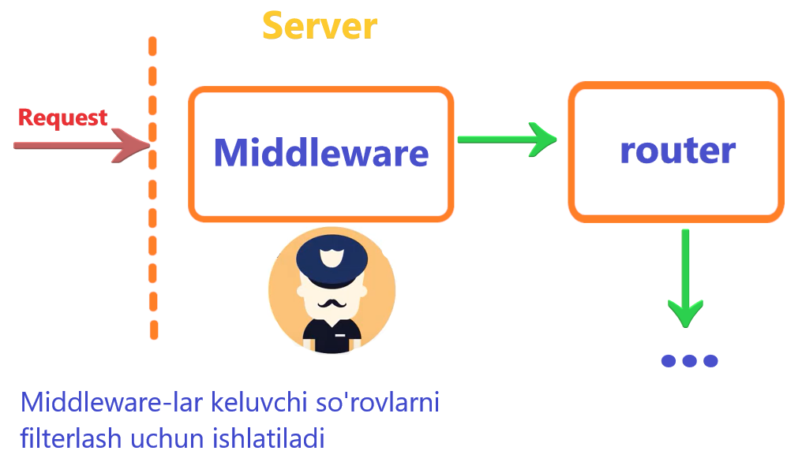

# Middleware

Middleware-ning maqsadi kiruvchi HTTP so'rovlarni tekshirish hisoblanadi. Ikki xil middleware bor: global va route middleware.

Middleware oddiy class bo'lib hisoblanadi. Unda asosan `handle` metodi ishlaydi. Masalan:

```php
<?php
 
namespace App\Http\Middleware;
 
use Closure;
 
class EnsureTokenIsValid
{
    /**
     * Handle an incoming request.
     *
     * @param  \Illuminate\Http\Request  $request
     * @param  \Closure  $next
     * @return mixed
     */
    public function handle($request, Closure $next)
    {
        if ($request->input('token') !== 'my-secret-token') {
            return redirect('home');
        }
 
        return $next($request);
    }
}
```

Odatda middleware so'rov kirishidan oldin ishlaydi. Ya'ni kirayotgan so'rovni ushlab olib, uni kerakli shartlarga tekshiradi:

```php
<?php
 
namespace App\Http\Middleware;
 
use Closure;
 
class BeforeMiddleware
{
    public function handle($request, Closure $next)
    {
        // Perform action
 
        return $next($request);
    }
}
```

Lekin, middleware so'rov kirib kelganidan so'ng ham u bilan ishlay oladi:

```php
<?php
 
namespace App\Http\Middleware;
 
use Closure;
 
class AfterMiddleware
{
    public function handle($request, Closure $next)
    {
        $response = $next($request);
 
        // Perform action
 
        return $response;
    }
}
```

Middleware-ga parametr berish. Middleware:

```php
<?php
 
namespace App\Http\Middleware;
 
use Closure;
 
class EnsureUserHasRole
{
    /**
     * Handle the incoming request.
     *
     * @param  \Illuminate\Http\Request  $request
     * @param  \Closure  $next
     * @param  string  $role
     * @return mixed
     */
    public function handle($request, Closure $next, $role)
    {
        if (! $request->user()->hasRole($role)) {
            // Redirect...
        }
 
        return $next($request);
    }
 
}
```

Ishlatish:

```php
Route::put('/post/{id}', function ($id) {
    //
})->middleware('role:editor');
```



