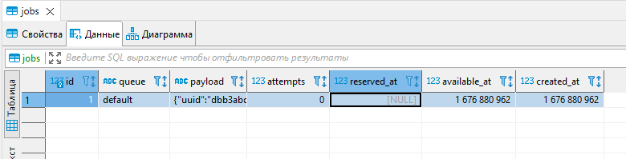
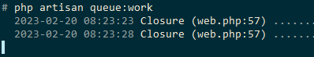
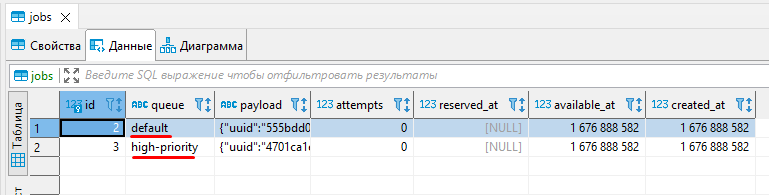

# Laravel queue-lar

Ko'pchilikni odatda web dasturlarning tez ishlashini xohlashadi va bu albatta tabiiy hol. Lekin web dasturlarda shunday jarayonlar bo'ladiki, ular biz xohlaganimizday tez ishlay olmaydi. Misol uchun, avtomatik emial jo'natish yoki juda katta ma'lumotlar asosida statistika chiqarish kabi holatlarni olayli.

Lekin, deyarli barcha holatlarda web dasturlarda email yuborganingizda yoki katta hajmdagi ma'lumotga ega statistikani chiqarishda dastur oynasi yuklanib turgan holda sizni kutib turishga majbur qilmaydi. Chunki, bunda uzoq vaqt oladigan yuqoridagi kabi jarayonlar background-da asinxron (nomutanosib, mos ravishda emas) ravishda ishlaydi. Laravel freymvorkida bunday jarayonlarni backgroundda ishlashini Laravel queue-lar ta'minlab beradi.

# Bugungi darsda o'rganiladigan ma'lumotlar

* Laravelda  queue-lar va worker-lar
  * Job-lar, Queue-lar va worker-lar
  * Queue driverlar
  * Queue worker-lar
  * Job klaslari va dispatch mode.
  * Dispatch mode-lar
  * Queue-lar va queue-ga bog'lanish (connection)
  * Bir nechta bog'lanishlar bilan ishlash
  * Bir nechta queue-lar bilan ishlash
  * Sozlamalar bilan ishlash
  * Job-larning ishlashida xatolik yuzaga kelishi va joblarni qayta ishga tushirish
  * Avtomatik qayta ishga tushirish
  * Avtomatik qayta ishga tushirishning oraliq vaqtlari
  * Job ishlashida yuzaga kelgan xatoliklar bilan ishlash
  * Zanjirlar (chains) va to'plamlar (batches)
  * Zanjirlar
  * To'plamlar
  * Laravel Horizon
  * Worker-larni production-da ishlatish
  * Laravel Horizon-ni production-da ishlatish
  * Yakun


# Job-lar, Queue-lar va Worker-lar

Kod yozishdan oldin jarayonlarni asinxron ishlashini misollar ko'rish orqali tushunib olaylik. Faraz qiling, siz online oziq-ovqat sotish do'koni egasisiz. Sizning do'koningiz telefon orqali buyurtmalar qabul qilib, ularni egalariga yetkazib berish bilan shug'ullanadi.

Endi, tasavvur qiling, mijoz qo'ng'irog'iga javob berib, buyurtma qabul qildingiz. Keyin, omborga kirib, buyurtmada ko'rsatilgan mahsulotlarni olasiz, ularni qutiga joylaysiz va oxirida uni yetkazib beruvchiga topshirasiz. Mana shu holatda, ya'ni olgan buyurtmangizni qutiga solib, yetkazib beruvchiga jo'natayotgan vaqtingizda (tahminan yarim yoki bir soat ichida deylik) boshqa yangi buyurtmani qabul qila olmaysiz. Chunki bu vaqtda siz band bo'lasiz. Bunday ishlashni sinxron ishlash deyiladi. Ya'ni, siz ish bajarish paytingizda, yangi kirish yoki chiqish amallarini bloklab qo'yasiz (buyurtma qabul ham qila olmaysiz, yoki biror narsani jo'nata olmaysiz ham, chunki siz omborda mahsulotlarni yig'ib, qutiga joylayotgan bo'lasiz).

Bunaqa sinxron ishlash o'rniga, siz omborga bitta ishchi (**worker**) yollaysiz. O'zingiz telefon oldida turib, yangi buyurtmalarni qabul qilib olaverasiz, qabul qilingan buyurtmalarni qog'ozga yozib qo'yib (bu yozuvlarni **job** deb nomlaylik), ularni navbatga (**queue**-ga) qo'yib qo'yaveramiz. 

Bunda siz yollagan ishchi (worker) qog'ozga yozib qo'ygan bajarilishi kerak bo'lgan buyurtmalarni (job-larni) navbat bilan (queue-dan olib) bajarib boradi. Mana shu holatda, sizda yangi buyurtmalarni qabul qilishda va ularni egalariga jo'natishda hech qanday uzilish bo'lib qolmaydi. Bunday ishlashni asinxron ishlash desak bo'ladi.

Shu job, worker va queue g'oyasini Laravelda ishlashini ko'raylik:

`routes/web.php` fayliga quyidagicha route yozaylik:

```php
Route::get('/queue', function () {
    dispatch(function () {
        sleep(5);
        logger('job done!');
    });

    return view('queue.index');
});

```

`resources/views/queue/index.blade.php`:

```php
<!DOCTYPE html>
<html lang="en">
<head>
    <meta charset="UTF-8">
    <meta name="viewport" content="width=device-width, initial-scale=1.0">
    <meta http-equiv="X-UA-Compatible" content="ie=edge">
    <title>Queue</title>
</head>
<body>
    <h1>Queue page!!!</h1>
</body>
</html>

```

Laravel-dagi `dispatch()` helper funksiyasi queue-ga yangi job yuboradi. Bu yerda, job oddiy PHP-dagi closure yoki class ko'rinishidagi kod. Yuqoridagi misolda, job sifatda closure-ni ishlatdik. Lekin, keyingi asosiy misollarda job qilib klas ishlatamiz.

Uzoq vaqt talab qiladigan jarayonni o'xshatish uchun yuqoridagi php kodda `sleep` funksiyasi bilan 5 soniya kutib turishni ta'minlaydigan closure funksiya yozib qo'ydik (dispatch helper funksiyasi ichiga). 5 soniya kutishdan keyin kod ishini davom ettirib, `logger()` helper funksiyasi bilan log filega `job done!` yozuvini yozishini ko'rsatib qo'ydik.

Endi, shu `http://project_url.loc/queue` URLini ochganimizda, avval browser 5 soniya yuklanib turadida, keyin bizga `resource/views/queue/index.blade.php` sahifasini chiqarib beradi. Agar, `storage/logs/laravel.log` fayliga qarasak, "job done!" yozuvi yozilganini ko'rishimiz mumkin:

```apache
[2023-02-20 07:45:49] local.DEBUG: job done!
```

Bu esa, job 5 soniyadan so'ng bajarilganini anglatadi. Lekin, bu yerda bitta muammo bor. Ya'ni, biz URLni ishga tushirganimizda browser 5 soniya yuklanib turdi. Bu yerda job asinxron ishlab, hech qanday kirish yoki chiqishni bloklagan bo'lmasada, mana shu 5 soniya ichida biz hech qanday ish qilmasdan browser sahifani yuklab bo'lishini kutib turishga majbur bo'ldik.

Nimaga bunday bo'lganini tushunish uchun, `.env` faylini ochib, `QUEUE_CONNECTION` o'zgaruvchisiga qaraymiz. Bu o'zgaruvchi backend ishlatadigan queue service bog'lanishini (connection-ni) belgilab beradi. Laravel birinchi marta o'rnatilganida bu o'zgaruvchining boshlang'ich qiymati `sync` bo'lib turadi. Bu esa, freymvork barcha job-larni sinxron ishlatishini anglatadi.

# Queue driverlar

Freymvork job-larni asinxron ishlatishi uchun queue-ga boshqa turdagi driverni belgilashimiz kerak bo'ladi. Queue uchun berilishi mumkin bo'lgan driverlarning sozlamalari `config/queue.php` faylida berilgan:

```php
'connections' => [

        'sync' => [
            'driver' => 'sync',
        ],

        'database' => [
            'driver' => 'database',
            'table' => 'jobs',
            'queue' => 'default',
            'retry_after' => 90,
            'after_commit' => false,
        ],

        'beanstalkd' => [
            'driver' => 'beanstalkd',
            'host' => 'localhost',
            'queue' => 'default',
            'retry_after' => 90,
            'block_for' => 0,
            'after_commit' => false,
        ],

        'sqs' => [
            'driver' => 'sqs',
            'key' => env('AWS_ACCESS_KEY_ID'),
            'secret' => env('AWS_SECRET_ACCESS_KEY'),
            'prefix' => env('SQS_PREFIX', 'https://sqs.us-east-1.amazonaws.com/your-account-id'),
            'queue' => env('SQS_QUEUE', 'default'),
            'suffix' => env('SQS_SUFFIX'),
            'region' => env('AWS_DEFAULT_REGION', 'us-east-1'),
            'after_commit' => false,
        ],

        'redis' => [
            'driver' => 'redis',
            'connection' => 'default',
            'queue' => env('REDIS_QUEUE', 'default'),
            'retry_after' => 90,
            'block_for' => null,
            'after_commit' => false,
        ],

    ],
```

Ko'rib turganingizdek, Laravelda 5 ta oldindan sozlab berilgan driverlar mavjud. Bu driverlarning barchasini ko'rib chiqamiz. Boshlanishiga, faqat `database` connection-ni birinchi ko'ramiz. Buning uchun `.env` fayldagi `QUEUE_CONNECTION` o'zgaruvchisiga `database` qiymatini berib qo'yamiz:

```apache
QUEUE_CONNECTION=database
```

Keyin, `php artisan queue:table` buyrug'ini ishga tushiramiz. Bu buyruq databaseda `jobs` jadvalini yaratib beradigan migration faylni generatsiya qilib beradi. Migration faylni `php artisan migrate` buyrug'i bilan databaseda yaratib olamiz. Bu jadvalda worker bajarishini kutib navbatda turadigan joblar saqlanadi.

Endi, `storage/logs/laravel.log` faylini tozalab tashlab, yuqoridagi `/queue`  route-ini yana qayta ishlatib ko'ramiz.

Bu safar, sahifani yuklashda hech qanday kutib turishni ko'rmaymiz. Sahifa, URLni ishga tushirishimiz bilan darrov ochiladi. Bu esa, bergan jobimiz backgroundda ishlaganini anglatadi. Sahifani ochganimizdan 5 soniya o'tib, `storage/logs/laravel.log` faylini ochsak, unda hech qanday yozuvni ko'rmaymiz.

# Queue worker-lar

Mana shu nuqtaga kelganda, garchi hamma narsa xatosiz ishlagan bo'lsada, nimadir noto'g'ri ishladi deb o'ylashingiz mumkin. Agar database-dagi jobs jadvalini ochib qarasangiz freymvork queue-ga yangi job qo'shganini ko'rasiz:



Lekin, bu jobni bajaradigan worker-imiz yo'q. Shuning uchun, bu job queue-da bajarilishini kutib yotadi (bu yerda jobs jadvali queue ro'yxati vazifasini bajaryapti). Bu joblarni bajaradigan yangi workerni ishga tushirish uchun `php artisan queue:work` buyrug'ini ishlatamiz. Bunda, worker ishga tushadida, jobs jadvalida navbat kutib turgan barcha joblarni ketma-ket bajarib chiqadi:



Endi, `storage/logs/laravel.log` fayliga qarasak, "job done!" yozuvini ko'rishimiz mumkin. Keyinchalik, yangi qo'shiladigan joblarni avtomatik bajarilib turishi uchun workerning doimiy ishlab turishini ta'minlashimiz kerak bo'ladi. Buni esa keyinroq ko'ramiz.

# Job klaslari va Dispatch mode

Shu yergacha job, queue va worker-lar haqida asosiy tushunchaga ega bo'ldik. Yuqorida ko'rgan misolimizda job sifatida closure funksiya ishlatgan bo'lsak, endi buning uchun alohida klas yaratamiz. Buning uchun `php artisan make:job job_name` buyrug'i yordamida job klasini yaratib olamiz. Job bilan ishlashni ko'rish uchun foydalanuvchi tizimdan ro'yxatdan o'tish paytida uning pochtasiga verification kod jo'natishni misol sifatida ko'ramiz. `SendVerificationEmail` jobini yarataylik:

`php artisan make:job SendVerificationEmail`

Yaratilgan `SendVerificationEmail` job klasi `App\Jobs` papkasiga borib tushadi. Yaratgan job klasimizni ochib ko'ramiz:

```php
<?php

namespace App\Jobs;

use Illuminate\Bus\Queueable;
use Illuminate\Contracts\Queue\ShouldBeUnique;
use Illuminate\Contracts\Queue\ShouldQueue;
use Illuminate\Foundation\Bus\Dispatchable;
use Illuminate\Queue\InteractsWithQueue;
use Illuminate\Queue\SerializesModels;

class SendVerificationEmail implements ShouldQueue
{
    use Dispatchable, InteractsWithQueue, Queueable, SerializesModels;

    /**
     * Create a new job instance.
     *
     * @return void
     */
    public function __construct()
    {
        //
    }

    /**
     * Execute the job.
     *
     * @return void
     */
    public function handle()
    {
        //
    }
}

```

Barcha job klaslari `ShouldQueue` interfeysini ishlatadi. Shuningdek, barchasida `constructor` va `handle` metodlari mavjud bo'ladi. Bundan tashqari, job klaslari `Dispatchable`, `InteractWithQueue`, `Queueable` va `SerializesModels` traitlarini ishlatadi.

Taxmin qilganingizdek, jobning asosiy ishi `handle` metodi ichida yoziladi. Shu sababli, shartli email jo'natish kodimizni shu metod ichiga yozib qo'yamiz:

```php
//...
    /**
     * Execute the job.
     *
     * @return void
     */
    public function handle()
    {
        sleep(5);
        logger('Email sent!');
    }
//...
```

Endi `/queue` ning route-ini quyidagicha o'zgartiramiz:

```php
//...
Route::get('/queue', function () {
    dispatch(new \App\Jobs\SendVerificationEmail()); // <== Job klas obyektini beramiz

    return view('queue.index');
});
//...
```

`dispatch()` helper funksiyasiga job klasi obyektini berish o'rniga job klasning static `dispatch()` metodini ishlatsak ham bo'ladi:

```php
//...
Route::get('/queue', function () {
    \App\Jobs\SendVerificationEmail::dispatch();

    return view('queue.index');
});
//...
```

Job klasidagi `dispatch()` metodi `Dispatchable` traitidan olinadi. Bu trait `dispatch()` metodidan tashqari jobni turli xil yo'llar bilan ishga tushirishga yordam beruvchi quyidagicha boshqa metodlarni ham beradi:

* `dispatchIf()` - berilgan shart bo'yicha jobni ishga tushirish (shart true bo'lganda job ishga tushadi)
* `dispatchUnless()` - berilgan shart bo'yicha jobni ishga tushirish (shart false bo'lganda job ishga tushadi)
* `dispatchSync()` - ishlayotgan jarayondagi handlerga mos keluvchi buyruqni ishga tushiradi.
* `dispatchAfterResponse()` - ishlab turgan jarayond bajarilganidan keyin handlerga mos keluvchi buyruqni ishga tushiradi.
* `withChain()` - bitta job bajarilganidan keyin qolgan joblarni ketma-ket ishga tushirish

Bu metodlar haqidagi qisqacha ma'lumotlar traitning kodidan ko'rib yozilgan. Endi shu metodlarning ba'zilarining ishlashini ham ko'raylik.

# Dispatch mode

Biror jobni biror shart bo'yicha ishlatib ko'raylik. Bunda `dispatchIf()` metodidan foydalanamiz.

```php
//...
Route::get('/', function () {
    $userSignedUp = false;

    \App\Jobs\SendVerificationEmail::dispatchIf($userSignedUp);

    return view('welcome');
});
//...
```

> Job kodida qanaqadir biror o'zgarish qilinsa, albatta queue workerni qaytadan ishga tushirish kerak bo'ladi. Aks holda, o'zgarishlar ishga ta'sir qilmaydi.

`dispatchSync()` va `dispatchAfterResponse()` metodlari joblarni sinxron holda bajaradi. Bu ikkala metod orasidagi farq - `dispatchSync()` metodi jobni darhol ishga tushirsa, `dispatchAfterResponse()` esa avval responseni foydalanuvchiga qaytarib, keyin bog'lanish uzilishidan avval jobni ishga tushiradi. Bu ikkala metod uchun worker backgroundda ishlayotgan bo'lishi shart emas. Bu metodlar qisqa muddatda bajariladigan joblar uchun ishlatiladi.

`withChain()` metodi bitta job bajarilganidan keyin boshqa qo'shimcha joblar ketma-ketligini bajarish uchun ishlatiladi.


# Queue-lar va queue-ga bog'lanish

Oldinroq aytib o'tilganidek, Laravel-da oldindan sozlangan bog'lanishlar mavjud. Shu paytgacha esa `database` bog'lanishlarni ishlatib ham ko'rdik. Endi, barcha bog'lanish turlarini batafsilroq ko'rib chiqamiz.

Agar, `config/queue.php` faylidagi `connections` arrayiga qaraydigan bo'lsak, unda turli xildagi sozlamalarga ega bog'lanishlar mavjud. Sozlamar turli xil bo'lsada, ularda umumiy `driver`, `queue` va `after_commit` sozlamalari bor.

Dasturchilar ko'pincha `connection` nomi va `driver` nomini chalkashtirib yuborishadi. `connection` nomiga xohlagan narsani yozish mumkin, lekin `driver` nomi o'zgarmas bo'ladi.

Sizda "aynan shu beshta queue driverdan boshqa turdagi bog'lanishdan foydalana olmaymanmi", degan savol paydo bo'lishi mumkin. Misol uchun, RabbitMQ-dan. Albatta yo'q, Laravelda boshqa turdagi bog'lanishlardan ham foydalansa bo'ladi. Faqat buning uchun, o'sha bog'lanishni o'rnatish kerak bo'ladi.

# Bir nechta bog'lanishdan foydalanish

`.env` faylidagi `QUEUE_CONNECTION` yordamida dastlabki (default) holatdagi bog'lanishni qanday o'rnatish haqida aytib o'tdik. Faraz qilaylik, bizga bir nechta turdagi bog'lanishdan foydalanishga to'g'ri kelib qoldi. Unda nima qilamiz? Bu juda oson! Buning uchun `onConnection()` metodidan foydalanamiz. Odatda, jobni dispatch qilganda `.env` fayldagi `QUEUE_CONNECTION` ga berilgan bog'lanish ishlatiladi. Lekin, agar `onConnection()` metodini beradigan bo'lsak, endi shu metodda ko'rsatgan bog'lanishimiz ishlatiladi. Misol uchun, default bog'lanish `database` bo'lsayu, biz `redis` ishlatmoqchi bo'lsak, quyidagicha kod yozamiz:

```php
//...
Route::get('/queue', function () {
    \App\Jobs\SendVerificationEmail::dispatch()
        ->onConnection('redis'); // <==

    return view('queue.index');
});
//...
```

# Bir nechta queue-lar bilan ishlash

Birdaniga bir nechta bog'lanishlar bilan ishlashdan tashqari, bir nechta queue-lar bilan ham ishlay olamiz. Bog'lanishlar (`connections`) sozlamalaridagi `queue` sozlamasi default queue-ni beradi. Agar, qaysi queue-ni ishlatishni ko'rsatmasdan jobni dispatch qilsak, laravel default queue-ni ishlatadi. Faraz qilaylik, joblarning qaysi tartibda kelishidan qat'iy nazar qaysidir bitta jobni eng birinchi ishlatishingiz kerak bo'lib qoldi. Buning uchun quyidagicha kod yoziladi:

```php
//...
Route::get('/queue', function () {
    \App\Jobs\SendVerificationEmail::dispatch();
    \App\Jobs\SendVerificationEmail::dispatch()
        ->onQueue('high-priority');

    return view('queue.index');
});
//...
```

Yozilgan kod bo'yicha, bir xildagi jobni ishga tushiryapmiz: default queue va high priority queue. `high-priority` nomini o'zimiz yozdik. Unga xohalagan nomimizni berishimiz mumkin. Avval, `/queue` URLga o'tib joblarni ishga tushiraylik. Keyin esa, `jobs` jadvaliga qaraylik:



Ko'rib turganingizdek, queue-dagi birinchi job `default`, ikkinchisi esa `high-priority`. Endi, avval high-priority joblar ishga bajarilishini ko'rsatish uchun `config/queue.php` faylidagi `queue `sozlamasiga `high-priority,default` ni berib qo'yishimiz kerak:

```php
    'connections' => [

       //...

        'database' => [
            //...
            'queue' => 'high-priority,default', // <==
            //...
        ],

        //...

    ],
```

`php artisan queue:work` buyrug'i bilan workerni ishga tushiramiz.

`php artisan queue:work --queue="high-priority,default"`

# Sozlamalar bilan ishlash

Uchinchi o'rindagi eng ko'p ishlatiladigan sozlama - bu `after_commit` sozlamasi. Agar jobni database transaction ichida ishlatadigan bo'lsak, freymvork hali bazaga o'zgarishlarni commit qilmasdan turib, joblar ishlab ketishi mumkin. Bunday holatlarda, ayniqsa job databasedagi qiymatga bog'liq bo'lsa, proyektning noto'g'ri ishlashiga olib kelishi. `after_commit` sozlamasiga `true` berish orqali mana shu muammo hal qilinadi, ya'ni bunda freymvork jobni aynan o'zgarishlarni databasega commit qilgandan keyin ishlashini ta'minlab beradi. Bu sozlamani barcha joblar uchun yoki faqat tanlangan job uchun o'rnatish ham mumkin.

`retry_after` sozlamasi Amazon SQS driveridan boshqa barchasida ishlatiladi. Amazon SQS SQS Visibility Settingsni ishlatadi. Bu sozlamaga 90 soniyani qiymat qilib berib, siz freymvorkka job shu vaqt ichida bajarilmasa yoki xatolik kelib chiqsa, o'sha jobni to'xtatishni va uni qayta ishga tushirishni aytasiz.

Bundan tashqari workerlarning ham o'zining timeouti bor. Buning uchun workerni `php artisan queue:work --timeout=60` deb ishga tushirish kerak. Bu buyruq agar job 60 soniya ichida bajarilmasa yoki xatolik kelib chiqsa, worker xatolik chiqarib beradida, ishini to'xtatadi.

Ko'pchilik  `retry_after` va `timeout` sozlamalarini chalkashtirib yuboradi. Lekin, ularni bir necha marta ishlatgandan keyin oson tushunib olsa bo'ladi. Endi, `redis` bog'lanishning ikkita sozlamasi haqida gaplashamiz.

Birinchi sozlama - bu `block_for`. Bu sozlamaga 5 qiymatini berib qo'ysak, worker avval Redis-ga bog'lanib, keyin bajarilmagan job-larni tekshiradi. Agar birorta ham bajarilmagan job-ni topmasa, yana qaytadan tekshirishni boshlashdan avval 5 soniya kutadi. Bu sozlama, agar undan to'g'ri foydalanilsa, CPU resurslarini tejab beradi.

Ikkinchi sozlama `connection` sozlamasi. Bu yerda qiymat sifatida `default`ning turishi dasturchilarni chalkashtiradi. Bunday paytda bir nechta queue bog'lanish qilsa ham bo'ladimi kabi savollar paydo bo'lishiga olib keladi. Bu sozlamani tushunish uchun avval `config/database.php` fayliga qaraylik:

```php
//...
'redis' => [

        'client' => env('REDIS_CLIENT', 'phpredis'),

        'options' => [
            'cluster' => env('REDIS_CLUSTER', 'redis'),
            'prefix' => env('REDIS_PREFIX', Str::slug(env('APP_NAME', 'laravel'), '_').'_database_'),
        ],

        'default' => [ // <==
            'url' => env('REDIS_URL'),
            'host' => env('REDIS_HOST', '127.0.0.1'),
            'username' => env('REDIS_USERNAME'),
            'password' => env('REDIS_PASSWORD'),
            'port' => env('REDIS_PORT', '6379'),
            'database' => env('REDIS_DB', '0'),
        ],

        'cache' => [
            'url' => env('REDIS_URL'),
            'host' => env('REDIS_HOST', '127.0.0.1'),
            'username' => env('REDIS_USERNAME'),
            'password' => env('REDIS_PASSWORD'),
            'port' => env('REDIS_PORT', '6379'),
            'database' => env('REDIS_CACHE_DB', '1'),
        ],

    ],
//...
```

Ko'rib turganingizdek, ikkita redis bog'lanishining sozlamalari berilgan. Bittasi, `default` bo'lsa, boshqasi `cache` bog'lanish. Boshlang'ich holatda, freymwork queue uchun `default` sozlamani ishlatadi. Ammo, keyinchalik zaruratga qarab boshqasini tanlash ham mumkin. Shuning uchun ham `config/queue.php` dagi `redis`ning `connection` sozlamasi redis uchun database bog'lanish berib qo'yiladi.

# Job-larning ishlashida xatolik yuzaga kelishi va joblarni qayta ishga tushirish

Shu paytgacha, xatosiz ishlagan joblarni ko'rib chiqdik. Endi esa, joblarni bajarish paytida chiqadigan xatolar bilan ishlashni ko'ramiz. Jobni bajarishda xatolik chiqadigan bo'lsa, yoki jobni qaytadan ishga tushirishimiz yoki bunga e'tibor bermasdan o'tkazib yuborishimiz mumkin. Joblarni bajarishda xato yuz berishiga yoki timeout yoki exceptionlar sabab bo'lishi mumkin. Shularga qarab ko'raylik.

Xatoli holatlarni ko'rish uchun, `app/Jobs/SendVerificationEmail.php` fayliga qaytib, uni quyidagicha o'zgartiraylik:

```php
<?php

namespace App\Jobs;

use Illuminate\Bus\Queueable;
use Illuminate\Contracts\Queue\ShouldQueue;
use Illuminate\Foundation\Bus\Dispatchable;
use Illuminate\Queue\InteractsWithQueue;
use Illuminate\Queue\SerializesModels;

class SendVerificationEmail implements ShouldQueue
{
    use Dispatchable, InteractsWithQueue, Queueable, SerializesModels;

    public $timeout = 1;

    // ...

    /**
     * Execute the job.
     *
     * @return void
     */
    public function handle()
    {
        sleep(5);
        logger('email sent!');
    }
}
```

`$timeout` public xususiyati queue worker qancha vaqt davomida ishlashi kerakligini ko'rsatib beradi. Tepadagi koddagi `$timeout`ning 1 qiymati bajarilayotgan job 1 soniyadan ko'p ishlamasligini bildiradi. `handle()` metodi ichidagi `sleep()` metodiga tegmadik. Shuning uchun, nazariy jihatdan, 1 soniyadan so'ng job bajarilishi to'xtatiladi va jobni bajarishda xatolik yuz bergani haqida xabar beradi. Endi, ishlatib ko'rish uchun, queue workerni qayta ishga tushirib, `/queue` URLga o'tamiz. Workerdan chiqadigan natija esa quyidagicha bo'ladi:

```apache
[2021-09-13 06:42:22][2] Processing: App\Jobs\SendVerificationEmail
[2021-09-13 06:42:22][2] Failed:     App\Jobs\SendVerificationEmail
fish: Job 1, 'php artisan queue:work' terminated by signal SIGKILL (Forced quit)
```
