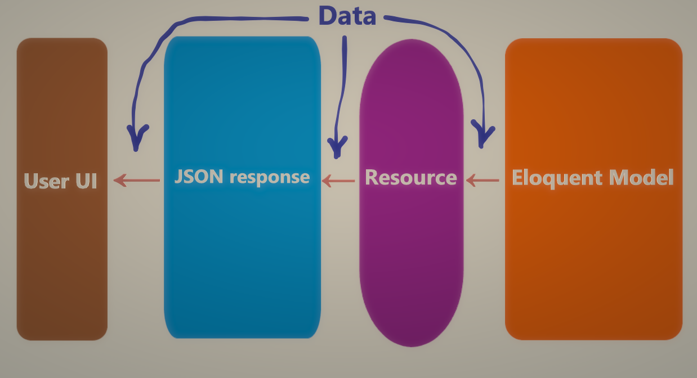

# Resource-lar

API yaratishda, Eloquent model va Json response-lar orasida ma'lumot uzatish paytida, model-dan olingan ma'lumotni frontend-dagi userga jo'natiladigan Json response-ga o'zgartirilgan holda berish kerak bo'ladi. Buning uchun esa, ular orasida ma'lumotlarni o'zgaritirsh qatlamini qo'shish kerak. Laravel-da bu "qatlam" nomi `resource` deyiladi. `Resource` qabul qilib olgan ma'lumotini o'ziga berilgan ko'rsatma bo'yicha o'zgartirib uzatadi.



# Resource yaratish

`php artisan make:resource ResourceName`

Yaratilgan resource klasi `app/Http/Resources` papkasida joylashadi.

# Resource turlari

Resource orqali ikki xil ko'rinishdagi ma'lumotlarni yuborish mumkin: oddiy model obyekti yoki model collection.

Misol uchun, `Post` modeli uchun `PostResource` nomli oddiy model obyektini beruvchi resource yarataylik: `php artisan make:resource PostResource`

`app/Http/Resources/PostResource.php` fayl:

```php
<?php

namespace App\Http\Resources;

use Illuminate\Http\Resources\Json\JsonResource;

class PostResource extends JsonResource
{
    /**
     * Transform the resource into an array.
     *
     * @param  \Illuminate\Http\Request  $request
     * @return array|\Illuminate\Contracts\Support\Arrayable|\JsonSerializable
     */
    public function toArray($request)
    {
        return [
            'id' => $this->id,
            'title' => $this->title,
            'body' => $this->body
        ];
    }
}

```

Ishlatilishi. Misol uchun `PostController` ichida:

```php
//...
    /**
     * Display the specified resource.
     *
     * @param  \App\Models\Post  $post
     * @return \Illuminate\Http\Response
     */
    public function show(Post $post)
    {
        return new PostResource($post);
    }
//...
```

Oddiy resource yaratish buyrug'ini ko'rdik. Endi, bir nechta post modelini collection ko'rinishida yuborishni ko'raylik.

Buning uchun yuqorida yaratgan `PostResource` klasimizning `collection` static metodini chaqirishimiz yetarli:

```php
//...
    /**
     * Display a listing of the resource.
     *
     * @return ResourceCollection
     */
    public function index()
    {
        $posts = Post::query()->get();

        return PostResource::collection($posts);
    }
//...
```

Lekin, ba'zan json response ichidagi biror maydonning o'ziga collection-ni berib yuborish kerak bo'ladi. Bunday paytda, oddiy resource klasi o'rniga collection resource ishlatiladi.

Collection resource yaratish buyrug'i: `php artisan make:resource Post --collection` yoki `php artisan make:resource PostCollection`

Misol:

```php
<?php
 
namespace App\Http\Resources;
 
use Illuminate\Http\Resources\Json\ResourceCollection;
 
class UserCollection extends ResourceCollection
{
    /**
     * Transform the resource collection into an array.
     *
     * @param  \Illuminate\Http\Request  $request
     * @return array
     */
    public function toArray($request)
    {
        return [
            'data' => $this->collection,
            'links' => [
                'self' => 'link-value',
            ],
        ];
    }
}
```

```php
use App\Http\Resources\UserCollection;
use App\Models\User;
 
Route::get('/users', function () {
    return new UserCollection(User::all());
});
```


# Qo'shimcha ma'lumotlar

1. Relationship-larning ishlatilishi:

```php
use App\Http\Resources\PostResource;
 
/**
 * Transform the resource into an array.
 *
 * @param  \Illuminate\Http\Request  $request
 * @return array
 */
public function toArray($request)
{
    return [
        'id' => $this->id,
        'name' => $this->name,
        'email' => $this->email,
        'posts' => PostResource::collection($this->posts), // <==
        'created_at' => $this->created_at,
        'updated_at' => $this->updated_at,
    ];
}
```

2. Shart bo'yicha maydonlarni berib yuborish

```php
/**
 * Transform the resource into an array.
 *
 * @param  \Illuminate\Http\Request  $request
 * @return array
 */
public function toArray($request)
{
    return [
        'id' => $this->id,
        'name' => $this->name,
        'email' => $this->email,
        'secret' => $this->when($request->user()->isAdmin(), 'secret-value'), // <==
        'created_at' => $this->created_at,
        'updated_at' => $this->updated_at,
    ];
}
```

`when` ikkinchi parametrga callback funksiya ham qabul qiladi:

```php
'secret' => $this->when($request->user()->isAdmin(), function () {
    return 'secret-value';
}),
```

Qolgan shart metodlari:

```php
'name' => $this->whenHas('name'), // berilgan qiymat mavjud bo'lsa ishlaydi

'name' => $this->whenNotNull($this->name), // qiymat null bo'lmaganda ishlaydi
```

3. Bitta shart asosida response-ga qo'shilishi kerak bo'lgan attributelar:

```php
/**
 * Transform the resource into an array.
 *
 * @param  \Illuminate\Http\Request  $request
 * @return array
 */
public function toArray($request)
{
    return [
        'id' => $this->id,
        'name' => $this->name,
        'email' => $this->email,
        $this->mergeWhen($request->user()->isAdmin(), [ // ikkalasi ham admin bo'lganda qo'shiladi
            'first-secret' => 'value',
            'second-secret' => 'value',
        ]),
        'created_at' => $this->created_at,
        'updated_at' => $this->updated_at,
    ];
}
```

4. Shart asosida ishlovchi relationshiplar:

```php
use App\Http\Resources\PostResource;
 
/**
 * Transform the resource into an array.
 *
 * @param  \Illuminate\Http\Request  $request
 * @return array
 */
public function toArray($request)
{
    return [
        'id' => $this->id,
        'name' => $this->name,
        'email' => $this->email,
        'posts' => PostResource::collection($this->whenLoaded('posts')),
        'created_at' => $this->created_at,
        'updated_at' => $this->updated_at,
    ];
}
```

`whenLoaded` metodi relationship yuklab bo'lingandan keyin uni resource-ga qo'shib beradi. Bu esa N+1 muammosini oldini oladi.

5. Shart asosida olinuvchi relationship count:

```php
new UserResource($user->loadCount('posts'));
```

```php
/**
 * Transform the resource into an array.
 *
 * @param  \Illuminate\Http\Request  $request
 * @return array
 */
public function toArray($request)
{
    return [
        'id' => $this->id,
        'name' => $this->name,
        'email' => $this->email,
        'posts_count' => $this->whenCounted('posts'),
        'created_at' => $this->created_at,
        'updated_at' => $this->updated_at,
    ];
}
```

Yuqoridagi kodda `whenCounted` metodi posts relationshipining count-ini hali yuklab bo'lmagan bo'lsa, `posts_count` kaliti response jo'natilishidan oldin o'chirib tashaladi.

6. Shart asosida olinuvchi pivot ma'lumotlar

```php
/**
 * Transform the resource into an array.
 *
 * @param  \Illuminate\Http\Request  $request
 * @return array
 */
public function toArray($request)
{
    return [
        'id' => $this->id,
        'name' => $this->name,
        'expires_at' => $this->whenPivotLoaded('role_user', function () {
            return $this->pivot->expires_at;
        }),
    ];
}
```

```php
'expires_at' => $this->whenPivotLoaded(new Membership, function () {
    return $this->pivot->expires_at;
}),
```

```php
/**
 * Transform the resource into an array.
 *
 * @param  \Illuminate\Http\Request  $request
 * @return array
 */
public function toArray($request)
{
    return [
        'id' => $this->id,
        'name' => $this->name,
        'expires_at' => $this->whenPivotLoadedAs('subscription', 'role_user', function () {
            return $this->subscription->expires_at;
        }),
    ];
}
```

7. Metadata qo'shish

```php
/**
 * Transform the resource into an array.
 *
 * @param  \Illuminate\Http\Request  $request
 * @return array
 */
public function toArray($request)
{
    return [
        'data' => $this->collection,
        'links' => [
            'self' => 'link-value',
        ],
    ];
}
```


```php
<?php
 
namespace App\Http\Resources;
 
use Illuminate\Http\Resources\Json\ResourceCollection;
 
class UserCollection extends ResourceCollection
{
    /**
     * Transform the resource collection into an array.
     *
     * @param  \Illuminate\Http\Request  $request
     * @return array
     */
    public function toArray($request)
    {
        return parent::toArray($request);
    }
 
    /**
     * Get additional data that should be returned with the resource array.
     *
     * @param  \Illuminate\Http\Request  $request
     * @return array
     */
    public function with($request)
    {
        return [
            'meta' => [
                'key' => 'value',
            ],
        ];
    }
}
```

8. Resourceni yaratilishi paytida metadata qo'shish

```php
return (new UserCollection(User::all()->load('roles')))
                ->additional(['meta' => [
                    'key' => 'value',
                ]]);
```

9. Resource response-lar

```php
use App\Http\Resources\UserResource;
use App\Models\User;
 
Route::get('/user/{id}', function ($id) {
    return new UserResource(User::findOrFail($id));
});
```

```php
use App\Http\Resources\UserResource;
use App\Models\User;
 
Route::get('/user', function () {
    return (new UserResource(User::find(1)))
                ->response() // <== JsonResponse-ni qaytaradi. Unga esa header ma'lumotlarni qo'shish mumkin
                ->header('X-Value', 'True');
});
```

yoki `->response()` metodi o'rniga resource class-da `withResponse` metodini qo'shish mumkin:

```php
<?php
 
namespace App\Http\Resources;
 
use Illuminate\Http\Resources\Json\JsonResource;
 
class UserResource extends JsonResource
{
    /**
     * Transform the resource into an array.
     *
     * @param  \Illuminate\Http\Request  $request
     * @return array
     */
    public function toArray($request)
    {
        return [
            'id' => $this->id,
        ];
    }
 
    /**
     * Customize the outgoing response for the resource.
     *
     * @param  \Illuminate\Http\Request  $request
     * @param  \Illuminate\Http\Response  $response
     * @return void
     */
    public function withResponse($request, $response)
    {
        $response->header('X-Value', 'True');
    }
}
```
