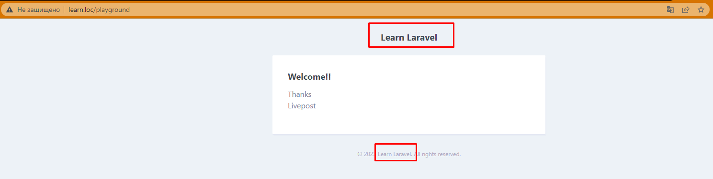

# Sending Email

Email jo'natishni oldin qilingan misol yangi user yaratilganda `UserCreated` eventi ishga tushiradigan `SendWelcomeEmail` listenerida amalga oshiramiz.

1. Email class yaratamiz: `php artisan make:mail WelcomeMail`. Yangi email classi `app/Mail` papkasiga tushadi:

```php
<?php

namespace App\Mail;

use Illuminate\Bus\Queueable;
use Illuminate\Contracts\Queue\ShouldQueue;
use Illuminate\Mail\Mailable;
use Illuminate\Mail\Mailables\Content;
use Illuminate\Mail\Mailables\Envelope;
use Illuminate\Queue\SerializesModels;

class WelcomeMail extends Mailable
{
    use Queueable, SerializesModels;

    /**
     * Create a new message instance.
     *
     * @return void
     */
    public function __construct()
    {
        //
    }

    /**
     * Get the message envelope.
     *
     * @return \Illuminate\Mail\Mailables\Envelope
     */
    public function envelope()
    {
        return new Envelope(
            subject: 'Wellcome Mail',
        );
    }

    /**
     * Get the message content definition.
     *
     * @return \Illuminate\Mail\Mailables\Content
     */
    public function content()
    {
        return new Content(
            view: 'view.name',
        );
    }

    /**
     * Get the attachments for the message.
     *
     * @return array
     */
    public function attachments()
    {
        return [];
    }
}

```

2. `resources/views/mail/welcome-email.blade.php` faylini yaratamiz:

```php
<h1>Welcome</h1>
```

3. `WelcomeMail` classimizdagi `content` metodini o'zgartiramiz:

```php
//...
    public function content()
    {
        return new Content(
            view: 'mail.welcome-email',
        );
    }
//...
```

4. Ushbu klasning ishlashini tekshirib ko'ramiz. `routes/web.php` faylda quyidagi routeni yozamiz:

```php
//...
if (\Illuminate\Support\Facades\App::environment('local')) { // Bu route faqat dev modeda ishlaydi
    Route::get('/playground', function () {
        return (new \App\Mail\WelcomeMail())->render(); // berilgan view-ni render qilib ko'ramiz
    });
}
//...
```


Ishladi!!!

5. Endi, mail uchun markdown yordamida `welcome-email.blade.php` fayl ichida email template-ini yozamiz:

```php
@component('mail::message')

# Welcome!!


Thanks <br>
Livepost


@endcomponent

```

6. Yuqorida template-ni markdown yordamida yozganimiz uchun, endi `WelcomeMail` clasida template render qilish usulini `view `dan `markdown`ga o'zgartiramiz:

```php
//...
    public function content()
    {
        return new Content(
            markdown: 'mail.welcome-email',
        );
    }
//...
```


Email ko'rinishini ancha yaxshi holga keltirdik. Lekin, bu template-dagi kamchilik - bu laravel logosi va pastdagi laravel litsenziya haqidagi yozuvlari. Endi navbat, shularni o'zgartirishga.

7. `.env` faylga o'tib `APP_NAME` ni xohlagan boshqa nomga o'zgartiramiz. Masalan, `Learn Laravel` ga:



Lekin, agar template-ni to'lig'icha o'zim xohlagan ko'rinishga keltirmoqchiman desangiz, u holda mail layout template-ini o'zgartirish kerak bo'ladi. Buning uchun ...

8. Avval, mail layout template-ni `resources/views` papkasiga publish qilib olamiz: `php artisan vendor:publish --tag=laravel-mail`. Shundan so'ng, mail layout fayllar `resources/views/vendor/mail` papkasiga kelib tushadi.
   Bu papkada turli xil komponentlar uchun templatelar mavjud. Misol uchun, button, table kabilar.
   Misol tariqasida, quyidagi ko'rinishda yozilgan template-larni keltiramiz:

```php
@component('mail::message')
# Welcome!!

@component('mail::button', ['url' => 'https://google.com'])
Google
@endcomponent

@component('mail::panel')
Bu oddiy panel
@endcomponent

## Table component:
@component('mail::table')
| Laravel   | Table         | Example   |
| --------- |:-------------:| ---------:|
| Col 2 is  | Centered      | $10       |
| Col 3 is  | Right-Aligned | $20       |
@endcomponent

@component('mail::subcopy')
This is a subcopy component
@endcomponent

Thanks <br>
Livepost


@endcomponent
```


Kodda ko'rib turganingizdek, `@component` ichidagi barcha kontent qator boshidan joy tashlanmay yozilgan. Bu juda muhim. Chunki, qator boshida bo'sh joy (space) qolib ketsa, natija kutilganidek chiqmaydi.


Yoki, `@component` o'rnida, Laravel 9 dagi componentlardan foydalanish ham mumkin:

```php
<x-mail::message>
# Xush kelibsiz!!

Saytimizga tashrif buyuring!

<x-mail::button :url="'https://laravel.com'">
Saytga o'tish
</x-mail::button>

<x-mail::panel>
O'z fikringizni bildiring
</x-mail::panel>

<x-mail::table>
| Xizmatlar     | Table         | Example  |
| ------------- |:-------------:| --------:|
| Col 2 is      | Centered      | $10      |
| Col 3 is      | Right-Aligned | $20      |
</x-mail::table>

Rahmat,<br>
{{ config('app.name') }} jamoasi!
</x-mail::message>
```


Edni, `Welcome!!` yozuvi o'rniga user-ning nomini chiqadigan qilamiz

9. `app/Mail/WelcomeMail.php` faylga o'tib kodda quyidagicha o'zgarish qilamiz:

```php
<?php

namespace App\Mail;

use App\Models\User;
use Illuminate\Bus\Queueable;
use Illuminate\Contracts\Queue\ShouldQueue;
use Illuminate\Mail\Mailable;
use Illuminate\Mail\Mailables\Content;
use Illuminate\Mail\Mailables\Envelope;
use Illuminate\Queue\SerializesModels;

class WelcomeMail extends Mailable
{
    use Queueable, SerializesModels;

    private $user; // <== user uchun property e'lon qilamiz

    /**
     * Create a new message instance.
     *
     * @return void
     */
    public function __construct(User $user)
    {
        $this->user = $user; // <== userni konstructor orqali olamiz
    }

    /**
     * Get the message envelope.
     *
     * @return \Illuminate\Mail\Mailables\Envelope
     */
    public function envelope()
    {
        return new Envelope(
            subject: 'Welcome Mail',
        );
    }

    /**
     * Get the message content definition.
     *
     * @return \Illuminate\Mail\Mailables\Content
     */
    public function content()
    {
        return new Content(
            markdown: 'mail.welcome-email',
            with: [ // <== with yordamida templatega berib yuboramiz
                'name' => $this->user->name
            ]
        );
    }

    /**
     * Get the attachments for the message.
     *
     * @return array
     */
    public function attachments()
    {
        return [];
    }
}

```

10. `routes/web.php` da `WelcomeMail` klasiga birorta userni berib yuboramiz va ishlatib ko'ramiz:

```php
if (\Illuminate\Support\Facades\App::environment('local')) {
    Route::get('/playground', function () {
        return (new \App\Mail\WelcomeMail(\App\Models\User::query()->find(1)))->render(); // <== bazadagi 1-userni berib yuboraylik
    });
}
```

11. Templateda `WelcomeMail` klasda berib yuborgan `name` o'zgaruvchisini chiqaramiz:

```php
@component('mail::message')
# Welcome {{ $name }}!!
{{-- ... --}}
```


Shu yergacha, faqat emailning ko'rinishi bilan ishladik. Endi, uni pochtaga yuborishni ko'rib  chiqamiz. 

12. Buning uchun, fake SMTP server kerak bo'ladi. Test qilish uchun [mailtrap](https://mailtrap.io) xizmatidan foydalanamiz. Bu xizmat individual foydalanish uchun bo'lsa, bepul hisoblanadi. Xizmatdan foydalanish uchun, avval ro'yxatdan o'tiladi, so'ngra kerakli sozlamalar olinib, `.env` fayliga qo'yiladi:

```apache
MAIL_MAILER=smtp
MAIL_HOST=sandbox.smtp.mailtrap.io
MAIL_PORT=2525
MAIL_USERNAME=44444a4444a4a4
MAIL_PASSWORD=4aa4aaaa44aaa4
MAIL_ENCRYPTION=null # <== open server da test qilishda null qoldirish kerak!!!
```

Eslatma: OpenServer-ga ham kerakli sozlamalarni qo'shish kerak:


13. Xabar yuborish uchun, `routes/web.php` faylda email yuborish kodini yozamiz:

```php
//...
if (\Illuminate\Support\Facades\App::environment('local')) { // Bu route faqat dev modeda ishlaydi
    Route::get('/playground', function () {
        $user = \App\Models\User::query()->find(1);
        \Illuminate\Support\Facades\Mail::to($user)
            ->send(new \App\Mail\WelcomeMail($user));

        return null;
    });
}
//...
```

14. `app/Mail/WelcomeMail.php` da `envelope` metodiga subject yozamiz:

```php
//...
    public function envelope()
    {
        return new Envelope(
            subject: 'LearnLaravel saytiga xush kelibsiz', // <== shu qatorda
        );
    }
//...
```

15. Va nihoyat ishlatib ko'ramiz. `localhost:8000/playground` URLni ishga ochamiz. Keyin pochtani tekshiramiz:


16. Oxirgi ishimiz, `WelcomeMail` klasini `routes/web.php` dan `app/Listeners/User/SendWelcomeEmail` classiga o'tkazish bo'ladi (`routes/web.php` dan email yuborishni olib tashlaymiz):

```php
<?php

namespace App\Listeners;

use App\Events\User\UserCreated;
use App\Mail\WelcomeMail;
use Illuminate\Support\Facades\Mail;

class SendWelcomeEmail
{
    /**
     * Create the event listener.
     *
     * @return void
     */
    public function __construct()
    {
        //
    }

    /**
     * Handle the event.
     *
     * @param  object  $event
     * @return void
     */
    public function handle(UserCreated $event)
    {
        Mail::to($event->user)
            ->send(new WelcomeMail($event->user)); // <== shu yerda ishlatamiz
    }
}

```
