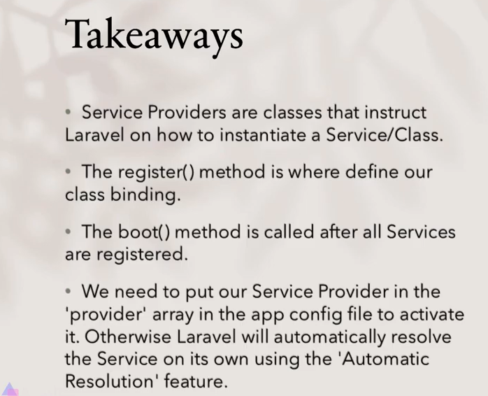

# Laravel Service Container

Service Container - bu Laravel project-idagi serice-lardan (class-lar Laravel-da service-lar deyiladi) qanday qilib obyekt olishni belgilab beruvchi class.

# Muammo

Faraz qilaylik, bizda `Geolocation` nomli class bor. Bu class-ning vazifasi biror location-ning ma'lumotlarni olib berish hisoblanadi. Bu class ishlashi davomida boshqa qaysidir class-lardan ham ma'lumot oladi. Misol uchun, `Map` class-idan location-ni aniqlab olish uchun, `Satellite` class-idan esa kerakli location-ga pin qo'yish uchun foydansin. Demak, shunda `Geolocation` class-i `Map` va `Satellite` class-lariga bog'liq bo'lib qoladi. `Geolocation` class-i o'zida bu class-lardan foydalanishi uchun, ulardan obyekt olib, constructor-ida parametr ko'rinishida qabul qilib olishi kerak.

Shu yerga kelganda, bizda muammo paydo bo'ladi. Ya'ni, har safar `Geolocation` class-idan obyekt olgandan keyin, `Map` va `Satellite` class-laridan ham obyekt olib, ularni `Geolocation`-ning constructor-iga berib yuborishimiz kerak:

```php
//...
$map = new Map();
$satellite = new Satellite();

new Geolocation($map, $satellite);
//...
```

Bu muammoni Service Container hal qiladi. 

> Service Provider boshqa class-lardan obyekt olib beruvchi class hisoblanadi.

Service Provider Map va Satellite class-laridan avtomatik holda obyekt olib, ularni Geolocation class-iga inject qilib beradi.

> Dasturlashda bitta obyektga boshqa bir yoki bir nechta obyektning kiritilishi `Dependency Injection` deyiladi. Bunda kiritilishi zarur bo'lgan obyektlarning class-lari injection-ni talab qilgan obyekt-ning class-i constructor-iga parametr ko'rinishida beriladi.

Shunday qilib, Geolocation class-i Map va Satellite class-lariga bog'liq.

# Yechim

1. `App` papkasida `Services` papkasini, uning ichida esa `Geolocation`, `Map` va `Satellite` papkalarini ochamiz.
2. Har bir ochilgan papkada mos ravishda `Geolocation.php`, `Map.php` va `Satellite.php` fayllari, ularning ichida esa `Geolocation`, `Map`, `Satellite` class-larini yaratamiz:

`Geolocation.php`:

```php
<?php

namespace App\Services\Geolocation;

use App\Services\Map\Map;
use App\Services\Satellite\Satellite;

class Geolocation
{
    private $map;

    private $satellite;

    public function __construct(Map $map, Satellite $satellite)
    {
        $this->map = $map;
        $this->satellite = $satellite;
    }

    public function search(string $name)
    {
        //...

        $locationInfo = $this->map->findAddress($name);
        return $this->satellite->pinpoint($locationInfo);
    }
}
```

`Map.php`:

```php
<?php

namespace App\Services\Map;

class Map
{
    public function findAddress(string $address)
    {
        //...

        return [
            123,
            123
        ];
    }
}
```

`Satellite.php`:

```php
<?php

namespace App\Services\Satellite;

class Satellite
{
    public function pinpoint(array $info)
    {
        // ...
        $result = implode(", ", $info);

        return "Xarita {$result} joylashuviga o'tkazildi";
    }
}
```

Endi, `Map` va `Satellite` class-larini avtomatik `Geolocation` class-iga inject qilish uchun `GeolocationServiceProvider` nomli service provider yaratamiz: `php artisan make:provider GeolocationServiceProvider`

ServiceProvider class-ida asosiy ikkita metod bo'ladi: `register` va `boot`.

1. `register` metodi ichida odatda, class-lardan obyekt olish, class uchun zarur bo'lgan auto-configiration-larni project-ga yuklash va class-larni service container-ga bind qilish kabi amallar bajariladi.
2. `boot` metodida esa asosan Event Listenerlar yoki boshqa service-larga so'rov yuboruvchi kodlar ishlatilishi mumkin. Misol uchun, agar agar `Satellite` service-da biror o'zgarish haqida adminga mail service orqali xabar berish funsiyasi mavjud bo'lsa, bu ishni boot metodida qilinadi.

Endi, `Geolocation` service-ni (class-ni) service container-ga bind qilib ko'raylik. Bunin uchun asosiy service provider class-ning xususiyatlaridan biri bo'lgan `$app` obyektidan foydalanamiz:

```php
<?php

namespace App\Providers;

use App\Services\Geolocation\Geolocation;
use App\Services\Map\Map;
use App\Services\Satellite\Satellite;
use Illuminate\Support\ServiceProvider;

class GeolocationServiceProvider extends ServiceProvider
{
    /**
     * Register services.
     *
     * @return void
     */
    public function register()
    {
        $this->app->bind(Geolocation::class, function ($app) {
            $map = new Map();
            $satellite = new Satellite();

            return new Geolocation($map, $satellite);
        });
    }

    /**
     * Bootstrap services.
     *
     * @return void
     */
    public function boot()
    {
        //
    }
}
```

Endi `GeolocationServiceProvider` class-ni project-ga yuklanishi uchun `app/config.php` fayl sozlamasidagi `providers` massiv xususiyatiga element sifatida beramiz:

```php
<?php

//...
'providers' => [
	//...
	App\Providers\GeolocationServiceProvider::class,
	//...
],
//...
```

Endi, yuqorida bajarganlarimizni ishlatib ko'ramiz:

```php
<?php

$geolocation = app(\App\Services\Geolocation\Geolocation::class);
// yoki
$geolocation = app()->make(\App\Services\Geolocation\Geolocation::class)

$geolocation-search('abc'); // "Xarita 123, 123 joylashuviga o'tkazildi"
```

**Qo'shimcha ma'lumot:** agar `GeolocationServiceProvider`-da `Geolocation`-ga `Map` va `Satellite` service-larini bind qilishda callback funksiyada oddiy string qaytarsak, service container-dan `Geolocation` class-ini chaqirganda shu string qaytariladi:

```php
<?php
//...
public function register()
{
     $this->app->bind(Geolocation::class, function ($app) {
         return "Salom";
     });
}
//...

app()->make(\App\Services\Geolocation\Geolocation::class); // "Salom"
```


Bundan tashqari, agar yuqoridagi kodimizda Map va Satellite service-larini Geolocation service-iga bind qilmasak ham, bu ikkala service Laravel tomonidan Geolocation-ga avtomatik inject qilinadi (Automatic Dependency Resolution). Lekin bu xususiyat constructor-da faqat class-lar argument qilib berilgandagina ishlaydi. Agar constructor-da string, number yoki boshqa biror turdagi ma'lumot turi ishlatilganda, avtomatik inject qilish ishlamaydi.


