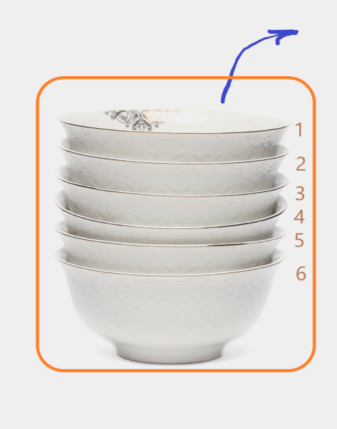
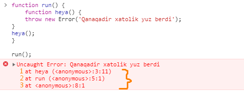
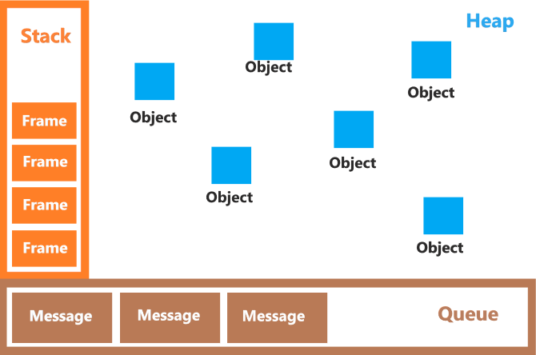
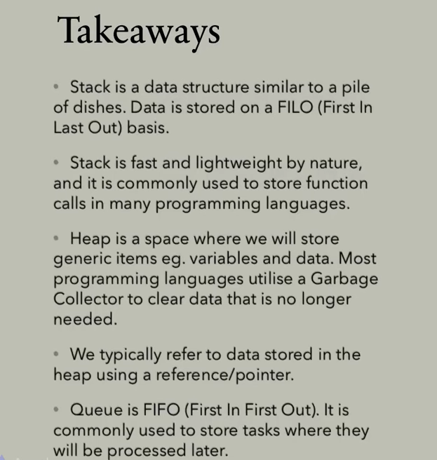

# Stack vs Heap vs Queue

`Stack`, `heap` va `queue`-lar ma'lumotlar tuzilmasi (qisqacha MT. ingliz tilidagi **data structures**) hisoblanadi.

# Stack

Stack MT-ning ishlashi quyidagicha bo'ladi. Stack-ni tasavvur qilish uchun ustma-ust qo'yilgan kosalarni tasavvur qilaylik. Dasturxonga ovqat tortishdan oldin, ovqat kosalarga suzib olinadi. Ovqat suzish paytida esa ustma-ust qo'yilgan kosalarning eng yuqorida turgani, ya'ni eng oxirida qo'yilgani birinchi olinadi. Stack ham xuddi shunday ishlaydi. Stack-ka eng avval kiritilgan ma'lumot eng oxirida, eng oxirida kiritlgan ma'lumot esa eng birinchi olinadi:

Stack-ning boshqacha nomi LIFO (Last in First out - birinchi kirgan oxirgi chiqadi). Stackoverflow atamasi esa stack-ka ma'lumot kiritish paytida stack-ning to'lib qolishini anglatadi. Ya'ni har bir stack-da o'zining belgilangan sig'imi bo'ladi. Sig'imi to'lganidan keyin, stack boshqa ma'lumotni qabul qila olmaydi. 

Odatda, dasturlash tillari o'zidagi o'zgaruvchilar va qiymat kabilarni kompuyter xotirasida saqlaydi. Ularni ishlatishda esa, MT-lardan foydalanadi. Ko'pgina dasturlash tillarida stack funksiya chaqiruvlarini saqlashda foydalaniladi. Misol uchun, javascript-da biror xatolik sodir bo'lganda, funskiyalarni stack-dan quyidagi ketma-ketlikda chaqirayotganini ko'rishimiz mumkin:

JavaScript metodlarni bajarishda, har bir metod duch kelganda uni stack-ka kiritib ketadi. Biror xatolik yuz berganda esa, xatolik qaysi ketma-ketlikda ichma-ich joylashgan funksiyalar ichida sodir bo'lganini ko'rsatish uchun teskari ketma-ketlikda stack-da ko'rsatib chiqadi (stack trace deyiladi).

# Heap

Heap o'zbekchasiga to'da yoki uyum deyiladi. Nomidan ko'rinib turibdiki, bu MT ma'lumotlarni uyum, to'da ko'rinishida saqlaydi. Osonroq faraz qilish uchun oddiy lego bo'laklari solinadigan qutini tasavvur qilaylik. Bu quti ichida lego o'yinchog'i bo'laklari aralash holda uyum bo'lib yotadi. Dasturlashda ham ma'lumotlar xotiraning bir qismida shunday ko'rinishda betartib joylashtirilgan bo'lishi mumkin. Ularga murojaat qilish uchun esa ma'lumotlarni xotiraga yozish paytida shu ma'lumotlar uchun olingan reference-lardan foydalaniladi. Reference-ning boshqacha nomi ko'rsatkich (ing. pointer) deyladi. Ya'ni heap-da joylashgan ma'lumotni heap-ning qaysi qismida joylashganini ko'rsatib turadi.

Agar biror o'zgaruvchini yaratadigan bo'lsak, dasturlash tilining enjini 

* heap-dan joy qidirib topadi
* qiymatini oladi
* va yangilashni amalga oshiradi

bun amal uchun ko'proq ish bajarilgani sababli, heap stack-dan ko'ra sekinroq ishlaydi.

Yana, bizga foydalanilmaydigan o'zgaruvchilarni xotiradan o'chirib tashlashimiz kerak bo'ladi. Chunki, xotirada turgan har bir ortiqcha ma'lumot dasturimiz ishlashini og'irlashtiradi. Ko'pchilik dasturlash tillari xotirani Garbage Collector yordamida avtomatik o'zi keraksiz ma'lumotlardan tozlab turadi. Garbage Collector murakkab mexanizm hisoblanganligi uchun ham heap uchun qaysidir ma'noda "ortiqcha yuk" hisoblanadi.

Yuqorida sanab o'tilgan kamchiliklar tufayli ham heap ancha murakkab va sekin ishlasada, anchagina kuchli MT hisoblanadi.

# Queue

Queue o'zbek tiliga "navbat" deb tarjima qilinadi. Nomidan bilish mumkinki, queue-da ma'lumotlar xuddi stack-dagiday ketma-ket joylashadi. Stack-dan farqli ravishda, queue-da birinchi kirgan ma'lumot birinchi chiqib ketadi, xuddi haqiqiy hayotdagi navbat singari. Queue-ning boshqacha nomi FIFO (ing. First input First output - birinchi kirgan birinchi chiqadi).

Queue juda ham foydali MT bo'lib, ko'plab dasturlarda qo'llaniladi. Ayniqsa asinxron ishlaydigan dasturlarda uning ishlatilishi muhim.

Queue dasturda quyidagicha ishlatiladi. Agar dasturda bajarilishiga ko'proq vaqt sarflaydigan vazifa mavjud bo'lsa, bu task bajarilishini kutib dasturning qolgan qismini to'xtatib qo'ymaslik uchun, bu vazifa queue-ga kiritib qo'yilib qolgan ishlar bajarilaveradi. Queue-dagi vazifa esa o'ziga kerakli resurs bo'shashini kutib turadi va resurs bo'shashi bilan, vazifa queue-dan chiqarib olinib resursga bajarish uchun beriladi.

# Umumlashtirish

