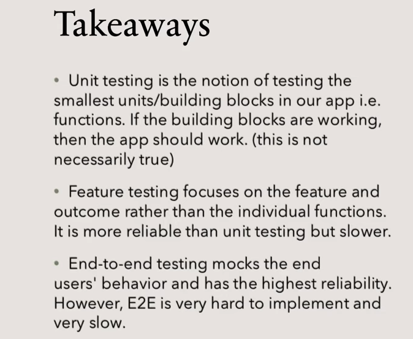
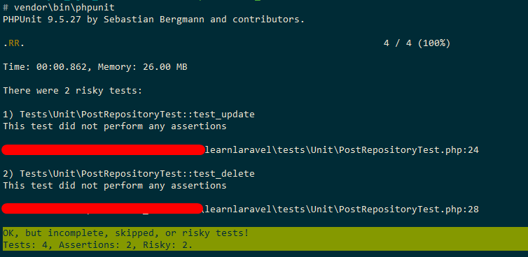
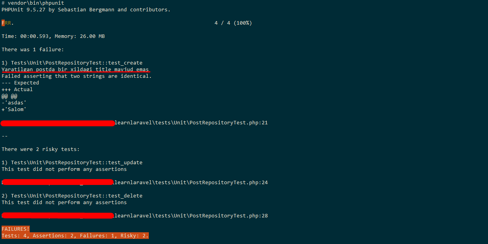
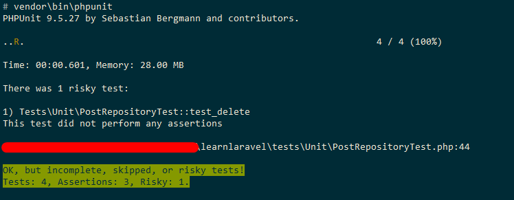
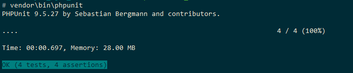

# conLaravelda testlash

Dasturni yaratish, uni keyinchalik support qilish jarayoni ancha murakkab jarayon hisoblanadi. Shuning uchun ham, bu jarayonda dasturdagi kamchiliklarni oldini olish va bartaraf etishda testlash muhim.

Quyidagicha testlash usullari mavjud:

* Manual testing
* Unit testing
* Feature testing
* End to End (E2E)

Ro'yxatdagi testlashning eng keng tarqalgan usuli - bu manual testing, ya'ni qo'lda testlash. Bunda dasturchining o'zi kod bo'ylab bitta bitta yurib, tekshirib chiqadi.

Qolgan uchta testlash esa auto-testing hisoblanib, ularda dasturchi qatnashmaydi.

 Auto-testing-ning asosiy foydali tomoni tez bajarilshi va inson omilining pastligida. Bu foyda ayniqsa katta projectlarda bilinadi.

Auto-testing-ning mohiyati har safar project-ga biror xususiyat (feature yoki funksionallik) qo'shganda dasturchi auto-testing script-ini ishga tushirib kod ishlashini tekshirib oladi. Dasturchi anchagina kod yozganidan keyin, qaytib kelib dastlabki yozgan kodini qo'lda qaytadan tekshirib o'tirishi shart bo'lmaydi.

##### Unit testing

Unit testing-da kodning eng kichik qismlari test-lanadi. Dastudagi kodning eng kichik qismi esa **function** hisoblanadi. Ya'ni, dasturga qo'shilgan xususiyat ko'plab function-lardan tashkil topgan bo'ladi. Dasturning biror xususiyatini (funsionalligini) unit test-dan o'tkazganda shu xususiyatga tegishli barcha function-lar testlab chiqiladi.

Ammo auto-testing yaxshi o'tdi degani, shu test qilingan funksionallik kutilganidek to'g'ri ishlayapti degani emas. Chunki dasturdagi biror funksionallik xatosiz ishlashi mumkin, lekin biz kutgan natijani bermasligi mumkin. Ya'ni unda biror mantiqiy xato chiqishi mumkin.

Unit testing tez ishlashi mumkin, lekin juda ham ishonchli testlash usuli emas.

##### Feature testing

Feature testing unit testing-ga solishtirganda test-lashga yuqori darajadagi yondashuv hisoblanadi. Feature testing ko'proq e'tiborni har bir function-ga emas, butun funksionallikka qaratadi. Shu sababli ham ushbu testlash unit testing-ga nisbatan ancha ishonchli hisoblanadi.

Misol uchun, maqola yaratish funksiyasini ko'rib chiqaylik.

Unit testing holatida, misol uchun, quyidagi qismlarni ko'rib chiqishimiz mumkin:

* maqolaning title-ini kiritib bilamizmi?
* maqolaning asosiy matnini kiritib bilamizmi?
* bu maydon matn yoki son yoki massiv qabul qiladimi?
* Noto'g'ri ma'lumot turi (data type) bersak, xatolik (Exception) qaytaradimi?
* va shu kabilar

Feature testing-da esa umuman boshqa narsalarni ko'rib chiqamiz. Ushbu turdagi testni qiziqtiradigan yagona narsa maqolani database-ga yozib bildikmi yoki yo'q. Feature testing-da ma'lumotni database-ga yozib, yangi yaratilgan record-ni qaytarib oladi va undan title hamda body maydonlari to'g'ri kiritilganligini tekshiradi.

##### End to End (E2E)

E2E testing - bu butun dasturni boshlanishidan oxirigacha tekshiruvchi testlash. E2E testing-da dasturdaning boshqa tizimlarga bog'liqliklari, aloqalari va ma'lumotlarning integratsiyasini testlanadi. Bu testlash turi feature testing-dan ham yuqoriroq darajada hisoblanadi. Bunda test o'zini xuddi oddiy foydalanuvchiday tutib, foydalanuvchilar bajarib ko'radigan barcha amallarni boshdan oyoq bajarib chiqadi.

E2E testing feature testing-ga o'xshab, alohida function-larni emas, dasturdan chiquvchi natijaga e'tibor beradi.

E2E testing ancha ishonchli test-lash turi hisoblansada, ishlatish juda qiyin.

# Test-lash turlari bo'yicha umumiy xulosa

|                 | Ishonchlilik | Tezlik     |
| --------------- | ------------ | ---------- |
| Manual testing  | ?            | juda sekin |
| Unit testing    | o'rtacha     | tez        |
| Feature testing | yaxshi       | sekinroq   |
| E2E testing     | juda yaxshi  | sekin      |



Ushbu darsda, Laravel-da unit testing va feature testing yozishni ko'ramiz.

# Amaliyot

Laravel-da barcha testlash uchun mo'ljallangan fayllar `tests` papkasida joylashadi.

Laravel phpunit paketidan foydalanib test-lashni bajaradi. Testlashning asosiy sozlamalari `root` papkasidagi `phpunit.xml` faylida berilgan.

`test/TestCase.php` faylidagi `TestCase` abstract klasi testni yaratib beradi. Bu klas har bir alohida test klasga ota klas qilib berilishi kerak.

`tests/CreateApplication.php` fayldagi `CreateApplication` trait-i mock app-ni yaratib beradi.

Ishni avval, unit test-ni ko'rishdan boshlaymiz. Buning uchun unit test yozib ko'ramiz:

`php artisan make:test --unit PostRepositoryTest`

Bu buyruq `tests/Unit` papkasida `PostRepositoryTest.php` faylini yaratib beradi:

```php
<?php

namespace Tests\Unit;

use PHPUnit\Framework\TestCase;

class PostRepositoryTest extends TestCase
{
    /**
     * A basic unit test example.
     *
     * @return void
     */
    public function test_example()
    {
        $this->assertTrue(true);
    }
}

```

`app/Repositories/PostRepository.php` ni test qilishdan boshlaymiz. Test qilishda eng muhim narsa - bu nimani test qilayotganimiz. Bizning `PostRepository` klasimizda uchta metod bor - `create`, `update` va `forceDelete`. Endi, shu uchta metodning har biri uchun test yozamiz. Kelishuv bo'yicha har bir test qilish metodi nomi `snake_case` bilan yozilishi va `test` bilan boshlanishi kerak:

```php
<?php

namespace Tests\Unit;

use PHPUnit\Framework\TestCase;

class PostRepositoryTest extends TestCase
{
    public function test_create()
    {
    }

    public function test_update()
    {
    }

    public function test_delete()
    {
    }
}
```

`PostRepository` klasni test qilish uchun boshlang'ich holatdagi klasni yozdik (yuqoridagi kod). Xo'sh, end qanday qilib testlashni boshlaymiz?

1. Bunig uchun avval maqsadimizni aniqlab olamiz, ya'ni bu funsionallikning maqsadi nima, nimani test qilmoqchiligimizni aniqlashtiramiz. Hozirgi holatimizda, bizda post `create` metod yordamida yaratiladi.
   Maqsad: `create()` metodi databaseda record yozishini tekshirish.
2. Keyin environment replicate qilinadi. Misol uchun, agar shopping cart-ni test qiladigan bo'lsak, shopping cart muhitini yaratishimiz kerak bo'ladi. Ya'ni, buning uchun, user tizimga kiradi (login qilib), so'ng mahsulotlarni tanlab, savatchaga o'tkazadi. Mana shu holat environment (muhitni) replicate qilish bo'ladi.
   Environmentga talab: `PostRepository` obyektiga murojaat qila olish. Bunda biz service container-dan `PostRepository`ning obyektini olamiz.
3. Yakunda qanaqa natija olish kerakligini aniqlashtirib qo'yish. misol uchun biror post create qilishda, unga biror title va body ni berib yuborsak, metod bizga xuddi shunday title va bodyni qaytarishi kerak.
4. Testdan chiqqan natijani va (3-qadamda) biz kutgan natijani solishtiramiz. Shunga qarab testdan o'tgan o'tmaganlikni aniqlab olamiz.

Endi, amaliyotga o'tamiz. Testni boshlashdan avval, test clasimizni `PHPUnit\Framework\TestCase` classidan emas, balki laravelning `Tests\TestCase` clasidan meros qilib olamiz. Chunki, bu klas PHPUnit clasidan ko'ra yengil ishlaydi.

1. Endi, yuqoridagi 2-qadam bo'yicha, `PostRepository`dan obyekt olamiz:

```php
//...
$repository = $this->app->make(PostRepository::class);
//...
```

2. 3-qadam bo'yicha yuboriladigan ma'lumotni e'lon qilamiz:

```php
//...
$payload = [
            'title' => 'Salom',
            'body' => []
        ];
//...
```

3. Keyin, post yaratib, natijani solishtiramiz. Olingan natija yaratilgan post modelining ma'lumotlari bilan bir xil bo'lishi kerak. Buning uchun `TestCase` klasning `assertSame()` metodidan foydalanish kerak:

```php
//...
$result = $repository->create($payload);

$this->assertSame($payload['title'], $result->title, 'Yaratilgan postda bir xildagi title mavjud emas');
//...
```

4. Testni ishlatib ko'ramiz. Buning uchun `vendor\bin\phpunit` buyrug'ini ishga tushiramiz:



Test muvaffaqiyatli o'tdi. Faqat ikkita bo'sh test metodlarimiz (test_update va test_delete) borligi uchun `...2 risky tests` xabarini chiqaryapti. Lekin bunga berish shart emas.

Agar test muvaffaqiyatsiz tugasa quyidagi ko'rinishda chiqishi mumkin edi:



Endi, qolgan ikkita metod uchun testlarni yozib chiqamiz.

5. `test_update` metodi:

```php
//...
    public function test_update()
    {
        // Maqsad: update metodi yordamida maqolani yangilash

        // env
        $repository = $this->app->make(PostRepository::class);

        $dummyPost = Post::factory(1)->create()[0]; // <== create collection qaytargani uchun

        // source of truth
        $payload = [
            'title' => 'abc123'
        ];

        // natijani solishtirish
        $updated = $repository->update($dummyPost, $payload);
        $this->assertSame($payload['title'], $updated->title, "Yangilangan postda bir xildagi title mavjud emas");
    }
//...
```



Bu testimiz ham muvaffaqiyatli o'tdi!!!

6. `test_delete` metod

```php
//...
    public function test_delete()
    {
        // Maqsad: forceDelete metodi ishlashini tekshirish

        // env
        $repository = $this->app->make(PostRepository::class);
        $dummy = Post::factory(1)->create()->first();

        // natijani solishtirish
        $deleted = $repository->forceDelete($dummy);

        // o'chirilganini tasdiqlash
        $found = Post::query()->find($dummy->id);

        $this->assertSame(null, $found, 'Post o\'chirilmagan');
    }
//...
```



Va nihoyat barcha testlar muvaffaqiyatli bajarildi.

`UserRepository` va `CommentRepository` lar uchun ham test xuddi shunday ko'rinishda yozib, bajariladi.
